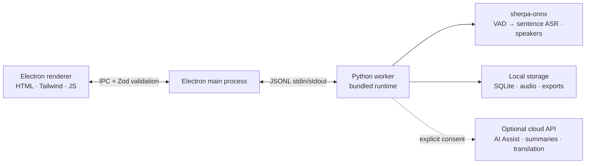

<p align="center"></p>

<p align="center"><strong>A minimal, local-first AI meeting assistant.</strong><br />AI Notes · live transcription · multilingual · speaker identification · reviewable summaries — no audio leaves your device.</p>

<p align="center">
  <a href="https://github.com/zerolovesea/Brevia/releases"></a>
  <a href="https://github.com/zerolovesea/Brevia/blob/main/LICENSE"></a>
  <a href="https://github.com/zerolovesea/Brevia/releases"></a>
  
  
  
</p>

<p align="center"><strong>English</strong> · <a href="docs/README.zh-CN.md">简体中文</a> · <a href="docs/README.es.md">Español</a> · <a href="docs/README.ja.md">日本語</a> · <a href="docs/README.ko.md">한국어</a> · <a href="docs/README.fr.md">Français</a> · <a href="docs/README.de.md">Deutsch</a> · <a href="docs/README.ru.md">Русский</a></p>

---

## About

Brevia is a desktop AI meeting assistant that hands the most time-consuming part of any meeting — capturing, organizing, and revisiting — off to on-device AI. It records microphone and system audio at the same time, streams live captions, and turns the finished conversation into structured notes. AI Notes can surface useful moments while the meeting is still happening. All speech recognition runs locally; recordings, transcripts, and speaker profiles stay on your machine by default.

The design is deliberately quiet: an interface that doesn't get in the way of the meeting, a feature set that follows a single arc — **capture → understand → retrieve** — and a firm rule that anything that can happen locally should.

<p align="center"></p>

## Features

### AI Notes that stay reviewable

AI Notes watches the live transcript and can surface decisions, action items, key numbers, risks, questions, and topic changes. Choose request-only, gentle prompts, or automatic organization. Suggestions remain reviewable: add only the useful ones to your notes, and write alongside them in rich text or Markdown.

Configure AI Notes and AI Meeting Summary independently: each can use its own provider, model, and API key. With a remote provider, only transcript text and current note context are sent; audio never leaves your device. Local models are loaded on demand, so separate preferences do not keep two models resident at once.


### Choosing the recognition model

The first-run setup lists the download-able speech models and pre-checks the one Brevia suggests for your interface language (Silero VAD, speaker diarization, and voiceprint models are bundled and always installed); you can uncheck the rest before downloading.

For each meeting Brevia then picks a default recognition model from the **meeting language**, declared per model in `backend/models.json`:

| Meeting language | Default recognition model | Why |
| --- | --- | --- |
| Chinese, Cantonese | FunASR Nano int8 | Highest accuracy on Chinese and its dialects |
| Japanese, Korean | Qwen3-ASR 0.6B int8 | The only selectable model covering both |
| English, Spanish, French, German, Russian, mixed languages | Parakeet TDT 0.6B v3 | 25 European languages in one model, adds punctuation and timestamps |
| Anything else | Qwen3-ASR 0.6B int8 | Widest language coverage among the remaining models |

If the declared default is not downloaded yet, Brevia uses an installed model that supports that language instead of asking you to download another one. The meeting setup screen shows a **recognition model** selector (including models you have not downloaded, listed with their size), and the same selector appears on the live screen and switches the model mid-meeting through `meeting.reconfigure`. `Settings → Advanced → Live recognition` (`live_asr.max_speech_seconds`) can cap how long a single live sentence segment may grow; the effective cap is always the smallest of that value, the per-language VAD setting, and the model's own capacity.

On lower-performance machines, prefer a 2B local AI-notes model or an online provider.

### A quiet meeting screen with live transcription and translation

Open it, press record, see complete captions after each speech pause. Brevia captures your microphone and system audio at once, so both sides of a remote call land in the same transcript. Optional live translation renders next to the caption stream for cross-language conversations.


### 30+ transcription languages and meeting summaries

Brevia transcribes speech in 30+ languages — including English, Chinese, Japanese, Korean, French, German, Spanish, Russian, Arabic, Thai, Vietnamese, and Indonesian. Once a meeting ends, plug in any LLM provider and Brevia will draft a summary, key decisions, and action items from your reviewed transcript.

Built-in AI runs a bundled model on your own machine, or plug in Claude, OpenAI, OpenRouter, or any service that speaks the OpenAI or Anthropic chat format. Only text is sent, never audio.

### Voiceprint enrollment and cross-meeting speaker identification

Enroll a short voice sample per teammate and Brevia will recognize them by name in every future meeting — not as "Speaker 1, Speaker 2," but as the people they are. Recognition works across recordings, so browsing back through last week's meetings to find "what did Alice say?" is a single click.

Powered by Pyannote segmentation plus speaker-embedding models, all running on-device.


### A curated local model library

Downloadable models cover sentence transcription, offline refinement, voice activity detection, speaker diarization, speaker embedding, AI notes and meeting summaries, and caption translation. Mix and match by language and precision — everything runs on your device.


### And more

- **Audio import** — bring in existing recordings for offline transcription through the same speech pipeline.
- **Rich exports** — transcript and notes as Markdown, TXT, JSON, SRT, DOCX, or PDF; audio as FLAC, WAV, or M4A.
- **Reviewable notes** — write in rich text or Markdown, then accept only the AI suggestions that help.
- **Meeting library and workspaces** — search titles, transcripts, speakers, and tags; organize work into workspaces and restore recently deleted meetings for 30 days.
- **Focused viewing** — light and dark themes, inline transcript/summary editing, and an optional floating-caption window keep the meeting view uncluttered.
- **Multilingual UI** — English, Simplified Chinese, Spanish, Japanese, Korean, French, German, and Russian.

## Install

Download the latest release from [GitHub Releases](https://github.com/zerolovesea/Brevia/releases):

| Platform | Installer |
| --- | --- |
| macOS (Apple Silicon) | `Brevia-<version>-arm64.dmg` |
| Windows (x64) | `Brevia-<version>-x64-setup.exe` |
> Windows may show a **Microsoft Defender SmartScreen** prompt on first run. Click **"More info" → "Run anyway"** after verifying the download came from the official Releases page.

On first launch, grant microphone and screen-recording permissions, then open **Settings → Model Library** to download the models you need.

## Architecture



Brevia follows a strict local-first design:

- **The renderer opens no network ports**, and every IPC message is validated by the Electron main process against a Zod schema.
- **The main process is a thin shell.** It launches a single Python worker over JSONL stdin/stdout; the worker owns model management, audio processing, speaker profiles, local storage, and exports.
- **Data lives in `~/brevia`** by default — SQLite, raw audio, exports, cached models, and voice profiles.
- **Cloud calls are opt-in.** AI Assist, LLM summaries, and translation require the user to configure a provider explicitly, and only text is sent upstream.

## Tech stack

| Layer | Technology |
| --- | --- |
| Desktop shell | Electron 43 — preload bridge, context isolation, sandboxed renderer |
| Frontend | Vanilla HTML/CSS/JS, Tailwind CSS 4, built-in i18n (8 locales) |
| Backend | Python 3.10+, JSONL worker protocol, SQLite storage |
| Speech engine | [sherpa-onnx](https://github.com/k2-fsa/sherpa-onnx) 1.13.2, ONNX Runtime |
| Speaker processing | Pyannote segmentation + 3D-Speaker ERes2Net Base embeddings |
| LLM client | Built-in llama.cpp (GGUF) plus OpenAI- / Anthropic-compatible chat APIs |
| Audio I/O | ffmpeg (bundled in releases) |
| Build & packaging | electron-builder, PyInstaller (bundled Python runtime) |
## Supported models

Sentence transcription, post-meeting refinement, AI notes, and caption translation models are downloaded on demand from **Settings → Model Library**; voice activity detection, speaker diarization, and speaker-embedding models ship with the app. The manifest lives in [`backend/models.json`](backend/models.json).

| Category | Representative models | Languages |
| --- | --- | --- |
| Sentence transcription / post-meeting refinement | FunASR Nano int8, Qwen3-ASR 0.6B, Parakeet TDT 0.6B v3 | Chinese / multilingual / 25 European languages |
| Voice activity detection | Silero VAD | Universal |
| Speaker diarization | Pyannote Segmentation 3.0 | Universal |
| Speaker embeddings | 3D-Speaker ERes2Net Base | Chinese |
| AI notes & meeting summary | Qwen 3.5 2B, Qwen 3.5 4B | Chinese / English |
| Caption translation | Tencent Hy-MT2 1.8B | 33 languages |

For LLM summaries, pick **Built-in AI** to run a bundled GGUF model locally (Qwen 3.5 2B / 4B), or point Brevia at Claude, OpenAI, OpenRouter, or any custom service that speaks OpenAI Chat Completions or Anthropic Messages — Gemini (OpenAI-compatible endpoint), DeepSeek, Kimi, Qwen, and more.

## Local development

Prerequisites: Node.js 18+, Python 3.10+, Git, and ffmpeg (for audio import).

```bash
git clone https://github.com/zerolovesea/Brevia.git
cd Brevia
npm install
python3 -m pip install -r backend/requirements.txt
npm start
```

Grant microphone and screen-recording permissions on first launch, then download the models you need from **Settings → Model Library**.

### Common scripts

```bash
npm test                    # Dead-code gate + Electron behavior + UI + E2E smoke + backend tests
npm run test:e2e            # Launch the real app and assert through CDP
npm run build               # Build Tailwind CSS
npm run test:model          # ASR model diagnostics
npm run test:diarization    # Speaker diarization diagnostics
npm run start:fresh         # Reset the onboarding flow and start
```

### Environment variables

```bash
BREVIA_DATA_DIR=/path/to/data       # Custom data dir (recordings, exports, SQLite)
BREVIA_MODELS_DIR=/path/to/models   # Custom model dir
BREVIA_FFMPEG=/path/to/ffmpeg       # ffmpeg binary (if not on PATH)
BREVIA_ASR_BACKEND=cpu              # cpu, cuda, or coreml; mps safely maps to cpu
BREVIA_LLAMA_THREADS=2              # Cap llama.cpp CPU threads (default: min(4, cores/2))
BREVIA_GPU_LAYERS=0                 # Force all llama.cpp layers to CPU

BREVIA_DATA_DIR=~/brevia-dev BREVIA_MODELS_DIR=~/brevia-models npm start
```

#### Sentence transcription

Recording uses **Silero VAD → one offline ASR decode → one final caption**.
FunASR Nano is the default for Chinese and Cantonese, Qwen3-ASR 0.6B for Japanese
and Korean, and Parakeet TDT 0.6B v3 for English, Spanish, French, German, Russian,
and automatic language selection. Punctuation and casing
come from the recognizer. There is no streaming recognizer, punctuation model,
or second live refinement pass.

VAD waits for a speech pause (Chinese: 0.7 seconds; other languages: 0.8 seconds).
Continuous speech is capped at 30 / 20 seconds respectively. A VAD segment may
contain more than one grammatical sentence, and neighbouring sentences are
coalesced into one caption: roughly 110 Chinese characters (150 max) or 280
Latin characters (380 max) per caption, so a single short sentence never stands
alone. A VAD endpoint is **not** a paragraph boundary — in real meetings the
silence after one has a median of 30–50 ms, which would cut 24-character
fragments; only a genuine long pause (≥1.2 s) starts a new paragraph, and a
paragraph below the target is submitted after at most 8 seconds. When continuous speech is cut, the next decode reaches 400 ms back
before the cut so a word split across it is recognised again with context; the
repeated part is aligned away at the seam. These limits are adjustable under
`vad` in advanced settings. Recognition runs on a separate serial executor;
queued speech stays on disk. Pause flushes the current segment, and stop drains
all recognition work before marking the meeting ready. Original audio is kept
if recognition fails, and a warning identifies the affected interval.

Imported recordings skip speaker diarization automatically when the estimated
preparation time — audio length scaled by CPU cores — exceeds the budget, so a
long import produces a transcript in seconds instead of making you wait
minutes. A smaller built-in AI-notes model can reduce competition for CPU.

See [benchmark methodology and results](backend/benchmarks/vad-2026-09-05/REPORT.md).

### Build installers

```bash
npm ci
npm run build
python3 -m pip install -r backend/requirements-build.txt
npm run dist:mac   # macOS ARM64 DMG
npm run dist:win   # Windows x64 EXE
```

Artifacts land in `dist/`. Each platform build bundles a native Python worker; voice detection, diarization, and voiceprint models ship inside it, while the recognition, refinement, AI-note, and translation models remain on-demand downloads.

## FAQ

<details>
<summary><strong>Windows shows a Microsoft Defender SmartScreen warning</strong></summary>

Release builds are not signed with a paid code-signing certificate, and SmartScreen defaults to blocking newly-seen executables. Click **"More info" → "Run anyway"** after confirming the download came from the official [Releases](https://github.com/zerolovesea/Brevia/releases) page.
</details>

<details>
<summary><strong>Do I need to install Python separately?</strong></summary>

No. Release builds bundle the Python runtime and all required dependencies. A separate Python installation is only needed for running from source.
</details>

<details>
<summary><strong>Where is my data stored?</strong></summary>

`~/brevia` by default — recordings, transcripts, exports, cached models, voice profiles, and the SQLite database. Set `BREVIA_DATA_DIR` to override.
</details>

<details>
<summary><strong>Which transcription languages are supported?</strong></summary>

30+ languages including Chinese, English, Japanese, Korean, French, German, Spanish, Russian, Arabic, Thai, Vietnamese, and Indonesian. Pick the matching model from the in-app Model Library.
</details>
<details>
<summary><strong>Does Brevia send audio to the cloud?</strong></summary>

No. Speech recognition and diarization run locally. Only LLM summaries and translation contact the network, and only after you configure a provider — text only, never audio.
</details>

<details>
<summary><strong>How much disk space do models need?</strong></summary>

Depends on which you install. A sentence recognizer is the main download; voice detection, speaker diarization, and voiceprint models are bundled, and optional AI-note models add to disk usage. Use the model library’s size estimates for your selection.
</details>

<details>
<summary><strong>Can I import existing recordings?</strong></summary>

Yes. Import audio files from the meeting library and Brevia will transcribe them offline through the same speech pipeline. Requires `ffmpeg` on PATH (or set `BREVIA_FFMPEG`).
</details>

<details>
<summary><strong>How do I switch the UI language?</strong></summary>

**Settings → General → Interface language.** English, Simplified Chinese, Spanish, Japanese, Korean, French, German, and Russian are available.
</details>

<details>
<summary><strong>How are voiceprint samples stored?</strong></summary>

Voice embeddings (a small float vector) and reference audio live in the local SQLite database and filesystem. Nothing leaves the device, and deleting a profile removes the associated data.
</details>

<details>
<summary><strong>The recording has sound, but live captions are empty in an in-person meeting</strong></summary>

Live captions consume a separately processed audio path: the microphone signal is
gain-compensated for the recognizer while the recording keeps the raw audio. Very
faint or distant speech can therefore be too quiet for the live recognizer even
though the recording is audible. This is more likely in a live room with
echo/ambience.

Adjust the microphone compensation under **Settings → Advanced**
(`live_asr.microphone_target_rms`, `microphone_minimum_rms`, `microphone_max_gain`),
or move the microphone closer.

The recording and post-meeting refinement are unaffected, so you won't lose the transcript.
</details>

## Feedback and contributing

### Report an issue

Found a bug or have a feature request? Please file it in [GitHub Issues](https://github.com/zerolovesea/Brevia/issues). Reports triage faster when they include:

- OS and version (e.g. macOS 14.5 / Windows 11 23H2)
- Brevia version (**Settings → About**)
- Models and language in use
- Steps to reproduce / expected result / actual result
- Relevant logs (**Settings → Advanced → Open log folder**) — please review them for sensitive content before attaching

**Security issues:** please do not open a public issue. Reach out to the maintainer by email.

### Contributing

Pull requests are welcome. To keep the tree tidy:

1. Branch from `main` with a narrow focus — one concern per PR.
2. Run `npm test` before submitting; run `npm run test:model` and `npm run test:diarization` when touching ASR or diarization.
3. Do not commit downloaded models, recordings, exports, API keys, or anything from `~/brevia`.
4. When you change user-facing copy, update all eight locales in `frontend/i18n-data.js` — add the English source string and its translations together.
5. Note any model, platform, or permission impact in the PR description.

## License

Brevia is released under the [ISC License](LICENSE). Model files and third-party packages retain their own licenses and terms.

## Acknowledgments

- [sherpa-onnx](https://github.com/k2-fsa/sherpa-onnx) — the local runtime powering ASR, VAD, and speaker processing. Licensed under [Apache-2.0](https://github.com/k2-fsa/sherpa-onnx/blob/master/LICENSE).
- Thanks to the model authors and maintainers whose downloadable artifacts are declared in [`backend/models.json`](backend/models.json), including Qwen3-ASR, FunASR, Parakeet (NeMo), Pyannote, 3D-Speaker, Silero, Qwen, and Tencent Hy-MT2.
- Electron, ONNX Runtime, Python, and the open-source speech community make this local-first workflow possible.
