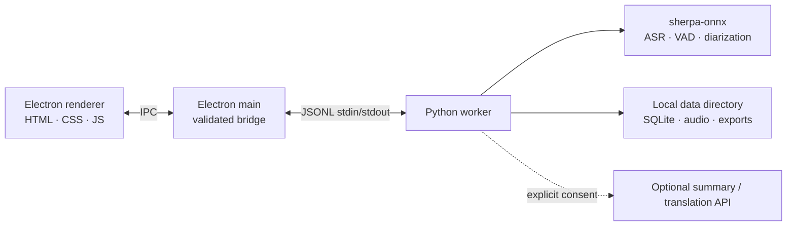

<p align="center"></p>

<p align="center"><strong>Private, local-first meeting memory.</strong><br />Record a conversation, follow it live, and leave with a traceable transcript.</p>

<p align="center"><a href="README.md">English</a> · <a href="docs/README.zh-CN.md">简体中文</a> · <a href="docs/README.es.md">Español</a> · <a href="docs/README.ja.md">日本語</a> · <a href="docs/README.ko.md">한국어</a> · <a href="docs/README.fr.md">Français</a> · <a href="docs/README.de.md">Deutsch</a> · <a href="docs/README.ru.md">Русский</a></p>

## Product tour

| | |
| --- | --- |
|  |  |
|  |  |


## Features

- Record microphone and system audio, then view live captions while the meeting is happening.
- Run streaming ASR, punctuation, post-meeting refinement, VAD, and speaker diarization locally through **sherpa-onnx**.
- Choose downloadable models for the meeting language.
- Refine a completed recording, identify and rename speakers, and keep recordings and transcript versions on-device.
- Import audio; export transcript or notes as Markdown, TXT, JSON, SRT, DOCX, or PDF, and audio as FLAC, WAV, or M4A.
- Generate optional translations and structured summaries only after explicit consent and a provider configuration.
- Use the same product in English, Simplified Chinese, Spanish, Japanese, Korean, French, German, or Russian.

## Architecture



The renderer never opens a backend port. Electron validates IPC payloads with Zod; the main process launches one Python worker, which owns model downloads, audio processing, local storage, and exports. The default data location is `~/Library/Application Support/Brevia` on macOS; set `BREVIA_DATA_DIR` for development or tests.

## Tech stack

| Layer | Technology |
| --- | --- |
| Desktop shell | Electron 43, preload bridge, secure context isolation and sandbox |
| Interface | Vanilla HTML, CSS/Tailwind build, JavaScript, built-in i18n catalog |
| Local service | Python 3, JSONL worker protocol, SQLite-backed storage |
| Speech AI | `sherpa-onnx==1.13.2`, ONNX Runtime, Zipformer / Paraformer / SenseVoice / Whisper / Qwen3 model choices |
| Speaker processing | sherpa-onnx Pyannote segmentation and speaker-embedding models |

## Requirements

- Node.js 20+ and npm.
- Python 3.10+ with a supported `sherpa-onnx` wheel (the app uses Python 3.12 in its diagnostic examples).
- macOS for the current desktop-capture permission flow; microphone and Screen Recording permissions are required for live capture. Imported audio and most local processing do not require capture permissions.
- Storage for the models you select. The default Chinese streaming model alone is about 570 MiB; refined and diarization models add more.
- `ffmpeg` is needed for some audio exports. macOS `textutil` / `cupsfilter` are used when available for DOCX / PDF export.

## Run locally

```bash
npm install
python3 -m pip install -r backend/requirements.txt
npm start
```

At first launch, allow microphone and screen-recording access when prompted. Open **Settings → Model library** and download the models needed for your language and workflow before recording.

Useful development commands:

```bash
npm test
npm run build
npm run test:model
npm run test:diarization
```

To keep development data outside the normal app directory:

```bash
BREVIA_DATA_DIR=/absolute/path/to/brevia-data BREVIA_MODELS_DIR=/absolute/path/to/models npm start
```

## Deployment

This repository currently runs as an unpackaged Electron application. Build the frontend CSS, provision the Python runtime and dependencies, then package Electron with the `backend/`, `frontend/`, and required model/runtime files included:

```bash
npm ci
npm run build
python3 -m pip install -r backend/requirements.txt
npm start
```

For a distributable, set `BREVIA_PYTHON` to the bundled Python executable or include it at `.venv/bin/python`; Electron already prefers that path when packaged. Do not ship model weights by assumption: let users download the models they need, preserve each upstream model's license, and make sure the packaged app can write to its user-data directory.

## Contributing

1. Create a focused branch and keep changes small.
2. Run `npm test`; run the model diagnostics when touching ASR or diarization.
3. Do not commit downloaded models, recordings, exports, API keys, or local app data.
4. Keep user-facing copy in all eight locales coherent; add an English source string and its translations together.
5. Describe any model, platform, or permission impact in the pull request.

## License

Brevia is released under the [ISC License](LICENSE). Model files and third-party packages retain their own licenses and terms.

## Acknowledgments

- [sherpa-onnx](https://github.com/k2-fsa/sherpa-onnx) is the core local speech runtime behind Brevia's ASR, VAD, punctuation, and speaker-processing workflow. It is licensed under [Apache-2.0](https://github.com/k2-fsa/sherpa-onnx/blob/master/LICENSE).
- Thanks to the model authors and maintainers whose downloadable artifacts are declared in `backend/models.json`.
- Electron, ONNX Runtime, Python, and the open-source speech community make a local-first desktop workflow possible.
