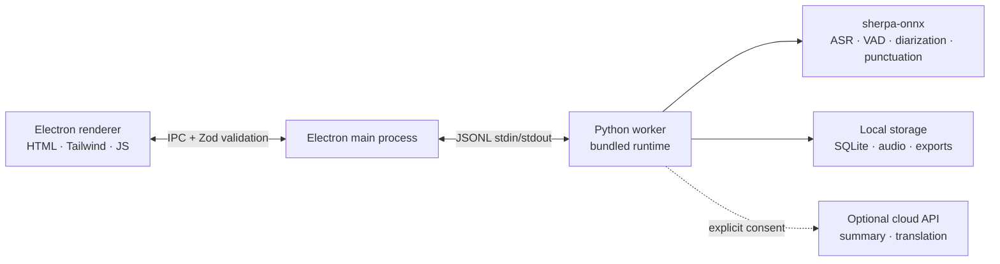

<p align="center"></p>

<p align="center"><strong>A minimal meeting recorder that stays on your device.</strong><br />Transcribe, distill with AI, remember — without the cloud.</p>

<p align="center">
  <a href="https://github.com/zerolovesea/Brevia/releases"></a>
  <a href="https://github.com/zerolovesea/Brevia/blob/main/LICENSE"></a>
  <a href="https://github.com/zerolovesea/Brevia/releases"></a>
  
  
  
</p>

<p align="center"><a href="README.md">English</a> · <a href="docs/README.zh-CN.md">简体中文</a> · <a href="docs/README.es.md">Español</a> · <a href="docs/README.ja.md">日本語</a> · <a href="docs/README.ko.md">한국어</a> · <a href="docs/README.fr.md">Français</a> · <a href="docs/README.de.md">Deutsch</a> · <a href="docs/README.ru.md">Русский</a></p>

## Product tour

| | |
| --- | --- |
|  |  |
|  |  |


## Features

- **Real-time transcription** — capture microphone and system audio simultaneously with live captions during the meeting.
- **Fully local speech AI** — streaming ASR, punctuation restoration, post-meeting refinement, VAD, and speaker diarization all run on-device via sherpa-onnx. No audio leaves your machine.
- **27 downloadable models** — choose from Zipformer, Paraformer, Whisper, SenseVoice, FireRedASR, and more, covering 30+ languages.
- **Speaker identification** — automatic speaker segmentation with Pyannote + voice-embedding models; rename and track participants across recordings.
- **Rich export** — transcript and notes as Markdown, TXT, JSON, SRT, DOCX, or PDF; audio as FLAC, WAV, or M4A.
- **Audio import** — bring in existing recordings for offline transcription and refinement.
- **Optional AI summaries** — generate translations and structured notes only after explicit consent and provider configuration.
- **Multi-language UI** — English, Simplified Chinese, Spanish, Japanese, Korean, French, German, and Russian.

## Install

Download the latest release from [GitHub Releases](https://github.com/zerolovesea/Brevia/releases):

| Platform | Artifact |
| --- | --- |
| macOS (Apple Silicon) | `Brevia-<version>-arm64.dmg` |
| Windows (x64) | `Brevia-<version>-x64-setup.exe` |

> **Unsigned build note:** macOS may show a "damaged" or blocked warning. Go to **System Settings → Privacy & Security → Open Anyway**, or run:
>
> ```bash
> xattr -dr com.apple.quarantine "/Applications/Brevia.app"
> ```
>
> On Windows, Microsoft Defender SmartScreen may prompt — proceed after verifying the download source.

## Architecture



Brevia follows a strict local-first design. The renderer never opens a network port. Electron validates all IPC payloads with Zod schemas. The main process launches a single Python worker that owns model management, audio processing, local storage, and file exports. Data lives in `~/brevia` by default.

## Tech stack

| Layer | Technology |
| --- | --- |
| Desktop shell | Electron 43 — preload bridge, context isolation, sandboxed renderer |
| Frontend | Vanilla HTML/CSS/JS, Tailwind CSS, built-in i18n (8 locales) |
| Backend | Python 3.10+, JSONL worker protocol, SQLite storage |
| Speech engine | sherpa-onnx 1.13.2, ONNX Runtime, 27 models (Zipformer / Paraformer / Whisper / SenseVoice / FireRedASR / FunASR) |
| Speaker processing | Pyannote segmentation + speaker-embedding models via sherpa-onnx |
| Build & packaging | electron-builder, PyInstaller (bundled Python runtime) |

## Run from source

```bash
npm install
python3 -m pip install -r backend/requirements.txt
npm start
```

At first launch, allow microphone and screen-recording access when prompted. Open **Settings → Model Library** and download the models needed for your language before recording.

Development commands:

```bash
npm test                    # UI + backend tests
npm run build               # Tailwind CSS build
npm run test:model          # ASR model diagnostics
npm run test:diarization    # Speaker diarization diagnostics
```

Override data/model directories for development:

```bash
BREVIA_DATA_DIR=/path/to/data BREVIA_MODELS_DIR=/path/to/models npm start
```

## Build an installer

```bash
npm ci
npm run build
python3 -m pip install -r backend/requirements-build.txt
npm run dist:mac   # ARM64 DMG on macOS
npm run dist:win   # x64 EXE on Windows
```

Output goes to `dist/`. Each platform build bundles a native Python worker; models are not included and remain on-demand downloads.

## FAQ

<details>
<summary><strong>macOS says the app is "damaged" or cannot be opened</strong></summary>

This happens because the build is not code-signed. Run in Terminal:

```bash
xattr -dr com.apple.quarantine "/Applications/Brevia.app"
```

Then open the app normally.
</details>

<details>
<summary><strong>Do I need to install Python separately?</strong></summary>

No. Release builds bundle the Python runtime and all required dependencies. A separate Python installation is only needed if you want to run from source.
</details>

<details>
<summary><strong>Where is my data stored?</strong></summary>

- Default: `~/brevia`

Recordings, transcripts, and speaker profiles all stay on-device. Set `BREVIA_DATA_DIR` to override.
</details>

<details>
<summary><strong>Which languages are supported for transcription?</strong></summary>

30+ languages including Chinese, English, Japanese, Korean, French, German, Spanish, Russian, Arabic, Thai, Vietnamese, Indonesian, and more. Choose the appropriate model from the in-app Model Library for your meeting language.
</details>

<details>
<summary><strong>Does Brevia send audio to the cloud?</strong></summary>

No. All speech recognition runs locally via sherpa-onnx. The optional summary/translation feature requires explicit consent and your own API provider configuration — it sends text only, never audio.
</details>

<details>
<summary><strong>How much disk space do models need?</strong></summary>

It depends on the models you select. A typical setup (streaming + refinement + speaker diarization) uses about 1–2 GB. The compact streaming models start around 80 MB; larger models range to ~1 GB each.
</details>

<details>
<summary><strong>Can I import existing recordings?</strong></summary>

Yes. Import audio files from the meeting library. Brevia will transcribe them offline using the same speech pipeline. Requires `ffmpeg` on PATH (or set `BREVIA_FFMPEG`).
</details>

<details>
<summary><strong>How do I switch the UI language?</strong></summary>

Go to **Settings → General** and select your preferred language. The app supports English, Simplified Chinese, Spanish, Japanese, Korean, French, German, and Russian.
</details>

## Contributing

1. Create a focused branch and keep changes small.
2. Run `npm test`; run the model diagnostics when touching ASR or diarization.
3. Do not commit downloaded models, recordings, exports, API keys, or local app data.
4. Keep user-facing copy in all eight locales coherent; add an English source string and its translations together.
5. Describe any model, platform, or permission impact in the pull request.

## License

Brevia is released under the [ISC License](LICENSE). Model files and third-party packages retain their own licenses and terms.

## Acknowledgments

- [sherpa-onnx](https://github.com/k2-fsa/sherpa-onnx) — core local speech runtime for ASR, VAD, punctuation, and speaker processing. Licensed under [Apache-2.0](https://github.com/k2-fsa/sherpa-onnx/blob/master/LICENSE).
- Thanks to the model authors and maintainers whose downloadable artifacts are declared in `backend/models.json`.
- Electron, ONNX Runtime, Python, and the open-source speech community make this local-first workflow possible.
