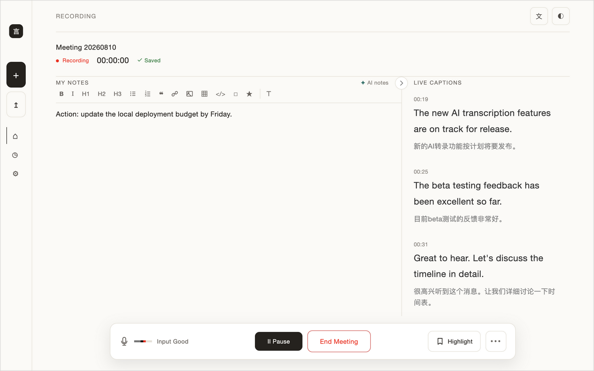
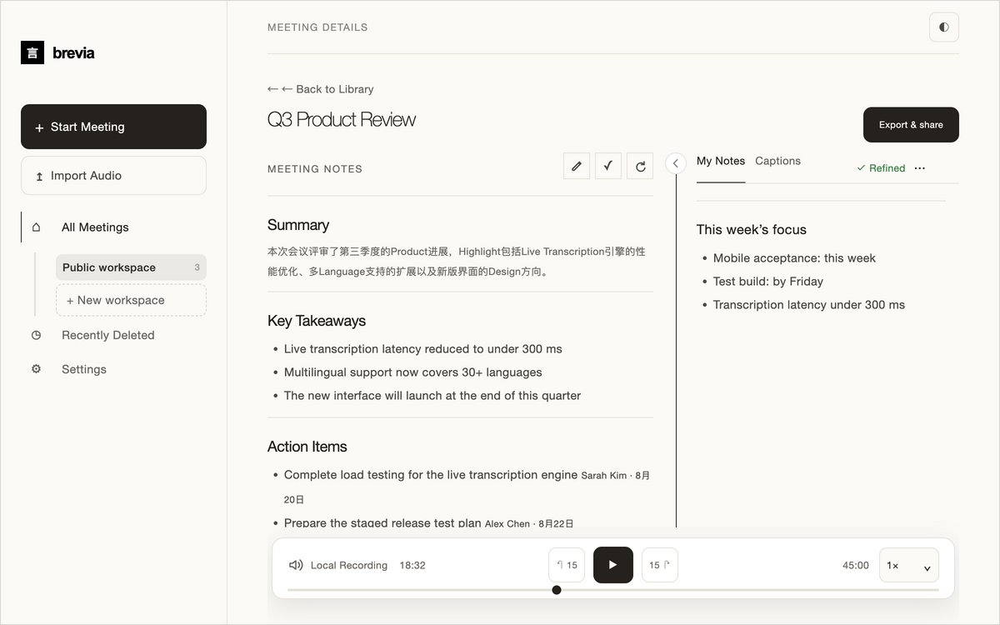
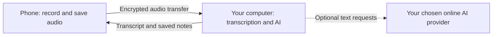

<strong>A local-first AI meeting assistant, on your computer and phone.</strong> Live transcription · AI notes · translation · meeting summaries — with your computer doing the processing.

  
  
  

<strong>English</strong> · <a href="docs/README.zh-CN.md">简体中文</a> · <a href="docs/README.es.md">Español</a> · <a href="docs/README.ja.md">日本語</a> · <a href="docs/README.ko.md">한국어</a> · <a href="docs/README.fr.md">Français</a> · <a href="docs/README.de.md">Deutsch</a> · <a href="docs/README.ru.md">Русский</a>

<a href="https://brevia.work">Website</a> · <a href="#download">Download</a> · <a href="#record-on-your-phone">Phone app</a> · <a href="#faq">FAQ</a>

Brevia helps you capture, organize and revisit conversations. Record both sides of a call on your computer, or use your phone for an interview or an in-person meeting. Follow the transcript, review AI suggestions and leave with notes you can edit and share. Speech recognition runs on your own computer; online AI is optional.

## Download

| Device                    | Download / availability                                                                                                                                                  |
| ------------------------- | ------------------------------------------------------------------------------------------------------------------------------------------------------------------------ |
| macOS 14+ · Apple Silicon | [Latest desktop release](https://github.com/zerolovesea/Brevia/releases/latest) — choose `Brevia-<version>-arm64.dmg`                                                    |
| Windows · x64             | [Latest desktop release](https://github.com/zerolovesea/Brevia/releases/latest) — choose `Brevia-<version>-x64-setup.exe`                                                |
| Android 7+                | [Download signed APK](https://modelscope.cn/models/zyaztec/brevia-release/resolve/master/android/Brevia-android.apk) — updates are available through Settings in the app |
| iPhone · iOS 15+          | App Store review pending; TestFlight is invitation-only. [Follow release updates](https://github.com/zerolovesea/Brevia/releases)                                        |

## Features

### Live transcription and translation

Capture your microphone and computer audio together so both sides of an online meeting appear in one transcript. Brevia produces captions after speech pauses and offers optional translation alongside them. An optional floating-caption window lets you follow the conversation while working in another app.

Transcription supports **30+ languages**, including English, Chinese, Japanese, Korean, Spanish, French, German, Russian, Arabic, Thai, Vietnamese and Indonesian. Select the meeting language and Brevia suggests a compatible recognition model. You can also import an existing audio recording.

### AI notes you can review

AI Notes highlights decisions, action items, important numbers, risks and open questions while the meeting is happening. Choose on-demand suggestions, gentle prompts or automatic organization. Accept only what helps, and write alongside the suggestions in rich text or Markdown on desktop.

After the meeting, generate a summary from the reviewed transcript. Notes and summaries can use local AI or your chosen online provider, including Claude, OpenAI, OpenRouter and compatible services. You can configure them independently.

See AI notes and meeting summaries

### Review, find and share

- **Speaker identification after the meeting.** Refinement separates speakers and can match them to saved voiceprints. Live captions do not identify speakers.
- **A searchable meeting library.** Search titles, transcripts, speakers and tags; organize meetings into workspaces. Recently deleted desktop meetings can be restored for 30 days.
- **Editable results and useful exports.** Edit transcripts and summaries; export text and notes as Markdown, TXT, JSON, SRT, DOCX or PDF, and audio as WAV.
- **An interface that fits your work.** Light and dark themes, with English, Simplified Chinese, Spanish, Japanese, Korean, French, German and Russian interfaces on desktop and mobile.

## Supported models

Download speech, AI-note and translation models from **Settings → Model Library** as needed. Voice activity detection and speaker models are included with the app. All models below run on the computer; mobile recording does not require downloading them to your phone. Available variants and sizes are shown in the Model Library.

| Use                        | Model                     | Languages / purpose                                           |
| -------------------------- | ------------------------- | ------------------------------------------------------------- |
| Transcription / refinement | FunASR Nano               | Chinese, Cantonese, English                                   |
| Transcription / refinement | Qwen3-ASR 0.6B            | 30 languages, including Chinese, English, Japanese and Korean |
| Transcription / refinement | Parakeet TDT 0.6B v3      | 25 European languages                                         |
| AI notes / summaries       | Qwen 3.5 2B / 4B          | Chinese / English                                             |
| Caption translation        | Tencent Hy-MT2 1.8B       | Multilingual translation                                      |
| Voice activity detection   | Silero VAD                | Detect speech and pauses                                      |
| Speaker separation         | Pyannote Segmentation 3.0 | Separate speakers after a meeting                             |
| Voiceprint matching        | 3D-Speaker ERes2Net Base  | Match saved speaker profiles                                  |

## Record on your phone

[**Download Android APK**](https://modelscope.cn/models/zyaztec/brevia-release/resolve/master/android/Brevia-android.apk) · iPhone: App Store review pending; TestFlight by invitation ([Release updates](https://github.com/zerolovesea/Brevia/releases))

Bring Brevia to meetings, interviews and everyday conversations. Open the phone app and start recording without an account. Connect your own computer to follow transcripts and notes while you record.

  
  
  

- **Record wherever you are.** No pairing or internet connection is needed. Pause, resume and mark important moments. Audio stays on your phone until you choose a computer and confirm an upload for transcription.
- **Your phone captures; your computer organizes.** Once paired, the computer handles speech recognition and returns live transcripts and notes to your phone. Models and AI settings stay on the computer, with no large models to download on your phone.
- **Listen back and share.** Find recordings in your meeting library, revisit the conversation, export WAV audio, or share notes as Markdown and transcripts as text. Deleting a phone copy does not delete the meeting on your computer.

During a temporary network outage, audio continues saving on your phone; authorized uploads resume after reconnecting. Background recording is supported, but calls, force-stop and system restrictions may interrupt it. Check the status when you return; uploads after recording may require keeping the app open.

## How your phone and computer work together

```mermaid
flowchart LR
  Phone[Phone: record and save audio] -->|Encrypted audio transfer| PC[Your computer: transcription and AI]
  PC -->|Transcript and saved notes| Phone
  PC -. Optional text requests .-> AI[Your chosen online AI provider]
```

- **Pair on the same Wi-Fi first.** Open **Settings → Device connections → Connect new device** on desktop. Scan its QR code on the phone or enter the address and PIN, compare the verification code, then approve on the computer. Subsequent connections use the saved device identity.
- **Local network by default.** The phone sends audio over HTTPS to the paired computer; the computer returns transcripts and notes. The computer must remain awake and reachable for live processing. The phone does not run recognition models.
- **Save before acknowledging.** Audio is saved on the phone first. The upload position advances only after the computer confirms it has saved the audio. After a disconnection, transfer resumes from that position; a successful upload does not automatically delete the phone copy.
- **Optional remote connection.** With your own signalling/TURN service configured, paired devices can use a WebRTC DataChannel across networks. Direct connection is preferred; a relay may carry encrypted traffic when needed. Initial pairing still requires the local network. See [remote setup and recovery](docs/mobile-remote.md).

Speech recognition and speaker processing run on your computer. Local models can also handle AI notes, summaries and translation after download. If you choose an online AI provider, relevant transcript and note text is sent to that service, not audio. Remote relay operators can see connection metadata such as network addresses and traffic volume, but cannot read the encrypted meeting content through the relay. [Privacy policy](https://brevia.work/privacy.html).

Phone audio uses about **115 MB per recorded hour** before exports and caches. Remote uploads also consume data, plus network overhead; use Wi-Fi for long recordings when possible.

## Get started

1. **Prepare the desktop app.** Install Brevia, grant microphone and system-audio permissions when prompted, and download the suggested recognition model. Select a local AI model if you want offline notes and summaries.
2. **Start recording or import audio.** Choose a meeting language, capture the conversation, then review and export the result.
3. **Add your phone when useful.** Follow the pairing steps above for live transcription, or record offline now and upload later. Pairing alone does not upload offline recordings.

## FAQ

<strong>Can I use Brevia without the internet?</strong>

Yes. Desktop transcription and local AI work after the required models are downloaded. Phone-only recording needs neither a computer nor an account; phone transcription needs your paired computer, which can be reached over the local network without internet access. Online AI and remote connections need internet access.

<strong>Which models should I download?</strong>

Start with the suggested speech model for your language. Add a local AI model for notes and summaries, and a translation model if needed. The Model Library shows download sizes; choose a smaller local AI model on a less powerful computer. You do not need every model.

<strong>Where are my recordings stored?</strong>

Desktop data defaults to `~/brevia`; model and recording folders can be selected during setup and changed in Settings. Phone recordings and cached text are stored in the app. Deleting the phone copy does not delete the computer copy. Export or sync pending recordings before uninstalling the phone app, as uninstalling removes its local data.

<strong>Windows shows a SmartScreen warning</strong>

Confirm that the installer came from the official [release page](https://github.com/zerolovesea/Brevia/releases), then choose **More info → Run anyway** if you trust the download.

## Feedback and contributing

Found a problem or have a suggestion? [Open an issue](https://github.com/zerolovesea/Brevia/issues) with your device, app version, meeting language and steps to reproduce. Remove private content and credentials from screenshots and logs. Report security issues privately to the maintainer.

For development, architecture, model details and packaging, see the [development guide](docs/DEVELOPMENT.md), [mobile guide](mobile/README.md) and [contribution guidelines](CONTRIBUTING.md).

## License and acknowledgments

Brevia uses the [ISC License](LICENSE). Model files and third-party packages retain their own licenses. Thanks to [mlx-audio](https://github.com/Blaizzy/mlx-audio), [sherpa-onnx](https://github.com/k2-fsa/sherpa-onnx), Electron, and the authors of Qwen, FunASR, Parakeet, Pyannote, 3D-Speaker, Silero and Tencent Hy-MT2. Model details are listed in the [development guide](docs/DEVELOPMENT.md#supported-models).
