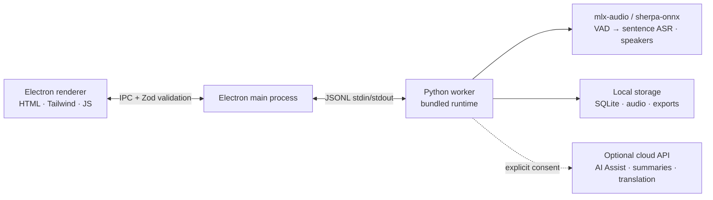

# Development guide

[Back to Brevia](../README.md) · **English** · [简体中文](DEVELOPMENT.zh-CN.md)

Read [CONTRIBUTING.md](../CONTRIBUTING.md) before changing code. This guide covers desktop architecture, model selection, local development and packaging. For Flutter and mobile distribution, see the [mobile development guide](../mobile/README.md); for remote phone connections, see [deployment and recovery](mobile-remote.md). Release procedures live in [RELEASING.md](RELEASING.md).

## Architecture



The diagram describes desktop processing. Phones add a paired audio source: local HTTPS or optional WebRTC transport delivers audio to the desktop worker and returns transcripts and notes. Initial pairing requires a local network and desktop approval; see the [mobile guide](../mobile/README.md) for storage, device authentication and recovery.

Brevia follows a local-first design:

- **The renderer opens no network ports**, and every IPC message is validated by the Electron main process against a Zod schema.
- **The main process is a thin shell.** It launches a single Python worker over JSONL stdin/stdout; the worker owns model management, audio processing, speaker profiles, local storage, and exports.
- **Data lives in `~/brevia`** by default — SQLite, raw audio, exports, cached models, and voice profiles.
- **Cloud calls are opt-in.** AI Assist, LLM summaries, and translation require the user to configure a provider explicitly, and only text is sent upstream.

## Tech stack

| Layer              | Technology                                                                                                                                           |
| ------------------ | ---------------------------------------------------------------------------------------------------------------------------------------------------- |
| Desktop shell      | Electron 43 — preload bridge, context isolation, sandboxed renderer                                                                                  |
| Frontend           | Vanilla HTML/CSS/JS, Tailwind CSS 4, built-in i18n (8 locales)                                                                                       |
| Backend            | Python 3.10+, JSONL worker protocol, SQLite storage                                                                                                  |
| Speech engine      | [mlx-audio](https://github.com/Blaizzy/mlx-audio) / MLX (macOS); [sherpa-onnx](https://github.com/k2-fsa/sherpa-onnx) 1.13.8 (Windows), ONNX Runtime |
| Speaker processing | Pyannote segmentation + 3D-Speaker ERes2Net Base embeddings                                                                                          |
| LLM client         | Built-in llama.cpp (GGUF) plus OpenAI- / Anthropic-compatible chat APIs                                                                              |
| Audio I/O          | ffmpeg (bundled in releases)                                                                                                                         |
| Build & packaging  | electron-builder, PyInstaller (bundled Python runtime)                                                                                               |

## Supported models

Sentence transcription, post-meeting refinement, AI notes, and caption translation models are downloaded on demand from **Settings → Model Library**; voice activity detection, speaker diarization, and speaker-embedding models ship with the app. The manifest lives in [`backend/models.json`](../backend/models.json).

| Category                                         | Representative models                             | Languages                                      |
| ------------------------------------------------ | ------------------------------------------------- | ---------------------------------------------- |
| Sentence transcription / post-meeting refinement | FunASR Nano, Qwen3-ASR 0.6B, Parakeet TDT 0.6B v3 | Chinese / multilingual / 25 European languages |
| Voice activity detection                         | Silero VAD                                        | Universal                                      |
| Speaker diarization                              | Pyannote Segmentation 3.0                         | Universal                                      |
| Speaker embeddings                               | 3D-Speaker ERes2Net Base                          | Chinese                                        |
| AI notes & meeting summary                       | Qwen 3.5 2B, Qwen 3.5 4B                          | Chinese / English                              |
| Caption translation                              | Tencent Hy-MT2 1.8B                               | 33 languages                                   |

For LLM summaries, pick **Built-in AI** to run a bundled GGUF model locally (Qwen 3.5 2B / 4B), or point Brevia at Claude, OpenAI, OpenRouter, or any custom service that speaks OpenAI Chat Completions or Anthropic Messages — Gemini (OpenAI-compatible endpoint), DeepSeek, Kimi, Qwen, and more.

## Local development

Prerequisites: Node.js 22+, Python 3.10+, Git, and ffmpeg (for audio import).

```bash
git clone https://github.com/zerolovesea/Brevia.git
cd Brevia
npm install
python3 -m pip install -r backend/requirements.txt
npm start
```

On first launch, grant microphone and screen-recording permissions, then choose speech models and the model and meeting folders on the same page. You can change either path later in **Settings**. Brevia moves existing files to the empty folder you choose and updates the running app without restarting. Keep external drives connected when launching Brevia.

### Common scripts

```bash
npm test                    # Dead-code gate + Electron behavior + UI + E2E smoke + backend tests
npm run test:e2e            # Launch the real app and assert through CDP
npm run build               # Build Tailwind CSS
npm run test:model          # ASR model diagnostics
npm run test:diarization    # Speaker diarization diagnostics
npm run start:fresh         # Reset the onboarding flow and start
```

### Environment variables

```bash
BREVIA_DATA_DIR=/path/to/data       # Custom data dir (recordings, exports, SQLite)
BREVIA_MODELS_DIR=/path/to/models   # Custom model dir
BREVIA_MEETINGS_DIR=/path/to/recordings # Custom recordings and meetings dir
BREVIA_FFMPEG=/path/to/ffmpeg       # ffmpeg binary (if not on PATH)
BREVIA_ASR_BACKEND=cpu              # cpu, cuda, or coreml; mps safely maps to cpu
BREVIA_LLAMA_THREADS=2              # Cap llama.cpp CPU threads (default: min(4, cores/2))
BREVIA_GPU_LAYERS=0                 # Force all llama.cpp layers to CPU

BREVIA_DATA_DIR=~/brevia-dev BREVIA_MODELS_DIR=~/brevia-models npm start
```

#### Sentence transcription

Recording uses **Silero VAD → one offline ASR decode → one final caption**.
FunASR Nano is the default for Chinese and Cantonese, Qwen3-ASR 0.6B for Japanese
and Korean, and Parakeet TDT 0.6B v3 for English, Spanish, French, German, Russian,
and automatic language selection. Punctuation and casing
come from the recognizer. MLX FunASR and Qwen also display draft text while decoding a completed segment.
There is no separate punctuation model or second live refinement pass.

VAD waits for a speech pause (Chinese: 0.7 seconds; other languages: 0.8 seconds).
Continuous speech is capped by the live setting, the language-specific VAD limit and the model capacity. A VAD segment may
contain more than one grammatical sentence, and neighbouring sentences are
coalesced into one caption: roughly 110 Chinese characters (150 max) or 280
Latin characters (380 max) per caption, so a single short sentence never stands
alone. A VAD endpoint is **not** a paragraph boundary — in real meetings the
silence after one has a median of 30–50 ms, which would cut 24-character
fragments; only a genuine long pause (≥1.2 s) starts a new paragraph, and a
paragraph below the target is submitted after at most 8 seconds. When continuous speech is cut, the next decode reaches ~400 ms back
before the cut so a word split across it is recognised again with context; the
repeated part is aligned away at the seam. These limits are adjustable under
`vad` in advanced settings. Recognition runs on a separate serial executor;
queued speech stays on disk. Pause flushes the current segment, and stop drains
all recognition work before marking the meeting ready. Original audio is kept
if recognition fails, and a warning identifies the affected interval.

Imported recordings skip speaker diarization automatically when the estimated
preparation time — audio length scaled by CPU cores — exceeds the budget, so a
long import produces a transcript in seconds instead of making you wait
minutes. A smaller built-in AI-notes model can reduce competition for CPU.

See [benchmark methodology and results](../backend/benchmarks/vad-2026-09-05/REPORT.md).

### Build installers

```bash
npm ci
npm run build
python3 -m pip install -r backend/requirements-build.txt
npm run dist:mac   # macOS ARM64 DMG
npm run dist:win   # Windows x64 EXE
```

Artifacts land in `dist/`. Each platform build bundles a native Python worker; voice detection, diarization, and voiceprint models ship inside it, while the recognition, refinement, AI-note, and translation models remain on-demand downloads.

## Choosing the recognition model

The first-run setup lists the download-able speech models and pre-checks the one Brevia suggests for your interface language (Silero VAD, speaker diarization, and voiceprint models are bundled and always installed); you can uncheck the rest before downloading.

For each meeting Brevia then picks a default recognition model from the **meeting language**, declared per model in `backend/models.json`:

| Meeting language                                           | Default recognition model | Why                                                                 |
| ---------------------------------------------------------- | ------------------------- | ------------------------------------------------------------------- |
| Chinese, Cantonese                                         | FunASR Nano               | Highest accuracy on Chinese and its dialects                        |
| Japanese, Korean                                           | Qwen3-ASR 0.6B            | The only selectable model covering both                             |
| English, Spanish, French, German, Russian, mixed languages | Parakeet TDT 0.6B v3      | 25 European languages in one model, adds punctuation and timestamps |
| Anything else                                              | Qwen3-ASR 0.6B            | Widest language coverage among the remaining models                 |

On Apple Silicon Macs, speech recognition and Silero VAD use mlx-audio/MLX; Windows keeps Sherpa ONNX. Speaker diarization and voiceprints use Sherpa on both platforms. Upgrading a Mac requires downloading the corresponding MLX recognition model; existing recordings remain available. The segment cap is the smallest of the live setting, the language-specific VAD limit and the model capacity (20 seconds for the macOS MLX models). Automatic language detection waits for at least 2 seconds of silence.

If the declared default is not downloaded yet, Brevia uses an installed model that supports that language instead of asking you to download another one. The meeting setup screen shows a **recognition model** selector (including models you have not downloaded, listed with their size), and the same selector appears on the live screen and switches the model mid-meeting through `meeting.reconfigure`. `Settings → Advanced → Live recognition` (`live_asr.max_speech_seconds`) can cap how long a single live sentence segment may grow; the effective cap is always the smallest of that value, the per-language VAD setting, and the model's own capacity.

On lower-performance machines, prefer a 2B local AI-notes model or an online provider.

## Contributing

Read the repository-wide [coding and formatting conventions](../CONTRIBUTING.md) before making changes.

For mobile changes, follow the [mobile development and submission guide](../mobile/README.md#日常开发与提交), including PR checks, automatic TestFlight distribution, Android artifacts, and release troubleshooting.

Pull requests are welcome. To keep the tree tidy:

1. Branch from `main` with a narrow focus — one concern per PR.
2. Follow [CONTRIBUTING.md](../CONTRIBUTING.md) for scope-specific checks. Run `npm test` for desktop or backend changes; run `npm run test:model` and `npm run test:diarization` when touching ASR or diarization.
3. Do not commit downloaded models, recordings, exports, API keys, or anything from `~/brevia`.
4. When you change user-facing copy, update all eight locales in `frontend/i18n-data.js` — add the English source string and its translations together.
5. Note any model, platform, or permission impact in the PR description.
