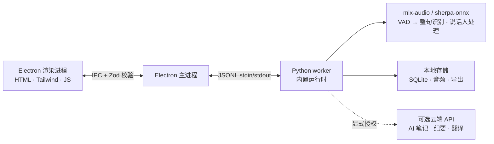

# 开发指南

[返回言录介绍](README.zh-CN.md) · **简体中文** · [English](DEVELOPMENT.md)

修改代码前请阅读 [CONTRIBUTING.md](../CONTRIBUTING.md)。本指南介绍桌面端架构、模型选择、本地开发与打包。Flutter 开发和手机端分发见[手机开发指南](../mobile/README.md)，手机跨网连接见[部署与恢复说明](mobile-remote.md)，发布流程见 [RELEASING.md](RELEASING.md)。

## 架构



上图描述桌面端处理流程。手机作为已配对的音频来源，通过局域网 HTTPS 或可选的 WebRTC 传输向桌面 worker 提供音频，并接收转写与笔记。首次配对需要局域网和电脑端确认；存储、设备认证与恢复机制见[手机开发指南](../mobile/README.md)。

言录采用本地优先设计：

- **渲染进程不开放网络端口。** 每条 IPC 消息均由 Electron 主进程通过 Zod schema 校验。
- **主进程保持轻量。** 启动单个 Python worker，通过 JSONL 标准输入／输出通信；worker 负责模型管理、音频处理、说话人档案、本地存储与导出。
- **数据默认位于 `~/brevia`。** 包括 SQLite 数据库、原始音频、导出文件、模型缓存和声纹档案。
- **云端调用由用户选择启用。** AI 笔记、会议纪要与翻译需显式配置在线服务商后才向其发送请求，发送内容仅为文字。

## 技术栈

| 层级         | 技术                                                                                                                                                       |
| ------------ | ---------------------------------------------------------------------------------------------------------------------------------------------------------- |
| 桌面外壳     | Electron 43：preload 桥接、上下文隔离、渲染进程沙箱                                                                                                        |
| 前端         | 原生 HTML/CSS/JS、Tailwind CSS 4、内置八种语言的国际化支持                                                                                                 |
| 后端         | Python 3.10+、JSONL worker 协议、SQLite 存储                                                                                                               |
| 语音引擎     | macOS 使用 [mlx-audio](https://github.com/Blaizzy/mlx-audio) / MLX；Windows 使用 [sherpa-onnx](https://github.com/k2-fsa/sherpa-onnx) 1.13.8、ONNX Runtime |
| 说话人处理   | Pyannote 分段与 3D-Speaker ERes2Net Base 声纹嵌入                                                                                                          |
| 大模型客户端 | 内置 llama.cpp（GGUF），以及兼容 OpenAI / Anthropic 的对话 API                                                                                             |
| 音频输入输出 | ffmpeg，发行版内置                                                                                                                                         |
| 构建与打包   | electron-builder、PyInstaller，打包 Python 运行时                                                                                                          |

## 支持的模型

整句识别、会后精修、AI 笔记与字幕翻译模型可在 **设置 → 模型库** 按需下载；语音活动检测、说话人分离和声纹模型随应用安装。模型清单位于 [`backend/models.json`](../backend/models.json)。

| 类型               | 代表模型                                          | 语言                        |
| ------------------ | ------------------------------------------------- | --------------------------- |
| 整句识别／会后精修 | FunASR Nano、Qwen3-ASR 0.6B、Parakeet TDT 0.6B v3 | 中文／多语言／25 种欧洲语言 |
| 语音活动检测       | Silero VAD                                        | 通用                        |
| 说话人分离         | Pyannote Segmentation 3.0                         | 通用                        |
| 声纹嵌入           | 3D-Speaker ERes2Net Base                          | 中文                        |
| AI 笔记／会议纪要  | Qwen 3.5 2B、Qwen 3.5 4B                          | 中文／英语                  |
| 字幕翻译           | Tencent Hy-MT2 1.8B                               | 33 种语言                   |

会议纪要可选择「内置 AI」，在本机运行 GGUF 模型（Qwen 3.5 2B / 4B）；也可以连接 Claude、OpenAI、OpenRouter，或任意兼容 OpenAI Chat Completions / Anthropic Messages 的服务，例如 Gemini 的 OpenAI 兼容端点、DeepSeek、Kimi、通义千问等。

## 本地开发

前置依赖：Node.js 22+、Python 3.10+、Git，以及音频导入所需的 ffmpeg。

```bash
git clone https://github.com/zerolovesea/Brevia.git
cd Brevia
npm install
python3 -m pip install -r backend/requirements.txt
npm start
```

首次启动时，授予麦克风与屏幕录制权限，并在同一设置页选择语音模型、模型文件夹和会议文件夹。之后可在 **设置** 中修改路径；选择空文件夹后，言录会迁移现有文件并更新运行中的应用，无需重启。使用外接硬盘时，请在启动前连接硬盘。

### 常用脚本

```bash
npm test                    # 死代码门禁、Electron 行为、UI、端到端冒烟与后端测试
npm run test:e2e            # 启动真实应用并通过 CDP 断言
npm run build               # 构建 Tailwind CSS
npm run test:model          # 语音识别模型诊断
npm run test:diarization    # 说话人分离诊断
npm run start:fresh         # 重置首次使用引导并启动
```

### 环境变量

```bash
BREVIA_DATA_DIR=/path/to/data          # 数据目录：录音、导出、SQLite
BREVIA_MODELS_DIR=/path/to/models      # 模型目录
BREVIA_MEETINGS_DIR=/path/to/recordings # 录音与会议目录
BREVIA_FFMPEG=/path/to/ffmpeg          # ffmpeg 路径，未加入 PATH 时使用
BREVIA_ASR_BACKEND=cpu                # cpu、cuda 或 coreml；mps 安全映射为 cpu
BREVIA_LLAMA_THREADS=2                # llama.cpp CPU 线程上限，默认 min(4, 核心数/2)
BREVIA_GPU_LAYERS=0                   # 将 llama.cpp 全部层放在 CPU 上运行

BREVIA_DATA_DIR=~/brevia-dev BREVIA_MODELS_DIR=~/brevia-models npm start
```

#### 整句转写

录音链路为 **Silero VAD → 单次离线 ASR 解码 → 完整字幕**。中文和粤语默认使用 FunASR Nano，日语和韩语使用 Qwen3-ASR 0.6B，英语、西班牙语、法语、德语、俄语及自动语言选择使用 Parakeet TDT 0.6B v3。标点和大小写由识别模型提供；MLX FunASR 与 Qwen 在解码已结束的音频段时也会显示草稿文字。实时链路没有单独的标点模型或第二轮精修。

VAD 在发言停顿后触发，中文等待 0.7 秒，其他语言等待 0.8 秒。连续发言的分段长度取实时设置、语言对应的 VAD 限制和模型容量中的最小值。一段 VAD 音频可能包含多个语法句；相邻句子会合并为字幕段落，中文目标约 110 字、上限 150 字，拉丁字符目标约 280 字符、上限 380 字符，避免短句各占一段。

**VAD 端点不等于段落边界。** 真实会议测试中，端点后的静音中位数仅为 30–50 毫秒，按端点分段会形成平均约 24 字的碎片。只有至少 1.2 秒的长停顿才开启新段落，未达到目标长度的段落最多等待 8 秒后提交。连续语音被切开时，下一次解码回看切点前约 400 毫秒，让跨越切点的词保留上下文；重复内容在接缝处对齐去重。这些限制可在高级设置的 `vad` 中调整。

识别在独立的串行执行器中运行，排队音频保留在磁盘。暂停会提交当前音频段，停止会等待识别队列处理完毕后再将会议标记为就绪。识别失败时保留原始录音，并用警告标明受影响的时间区间。

导入录音时，若按音频时长和 CPU 核心数估算的准备时间超过预算，会自动跳过说话人分离，减少等待。选用较小的内置 AI 笔记模型也有助于降低 CPU 资源竞争。

参见[基准测试方法与结果](../backend/benchmarks/vad-2026-09-05/REPORT.md)。

### 构建安装包

```bash
npm ci
npm run build
python3 -m pip install -r backend/requirements-build.txt
npm run dist:mac   # macOS ARM64 DMG
npm run dist:win   # Windows x64 EXE
```

产物输出到 `dist/`。每个平台的安装包包含原生 Python worker，以及语音活动检测、说话人分离与声纹模型；识别、精修、AI 笔记和翻译模型由用户按需下载。

## 选择识别模型

首次设置列出可下载的语音模型，并根据界面语言预选推荐模型；下载前可取消不需要的选项。Silero VAD、说话人分离与声纹模型随应用安装。

每场会议按 **会议语言** 选择默认识别模型，对应关系在 `backend/models.json` 中声明：

| 会议语言                                   | 默认识别模型         | 说明                                 |
| ------------------------------------------ | -------------------- | ------------------------------------ |
| 中文、粤语                                 | FunASR Nano          | 中文与方言的默认选择                 |
| 日语、韩语                                 | Qwen3-ASR 0.6B       | 同时覆盖日语与韩语                   |
| 英语、西班牙语、法语、德语、俄语、混合语言 | Parakeet TDT 0.6B v3 | 覆盖 25 种欧洲语言，提供标点与时间戳 |
| 其他语言                                   | Qwen3-ASR 0.6B       | 提供更广的多语言覆盖                 |

Apple Silicon Mac 上，语音识别与 Silero VAD 使用 mlx-audio / MLX；Windows 使用 Sherpa ONNX。两端的说话人分离与声纹处理均使用 Sherpa。Mac 升级后需下载相应的 MLX 识别模型，已有录音仍可访问。分段上限取实时设置、语言对应的 VAD 限制和模型容量中的最小值，macOS MLX 模型的容量上限为 20 秒。自动语言检测至少等待 2 秒静音。

若默认模型尚未下载，言录会优先使用已安装且支持该语言的模型。会议准备页提供「识别模型」选择器，包含尚未下载的模型及其大小；实时会议页也可通过同一选择器切换模型，底层调用 `meeting.reconfigure`。**设置 → 高级 → 实时识别** 中的 `live_asr.max_speech_seconds` 可限制单段实时语音的最长时间，最终仍取该设置、语言配置和模型容量中的最小值。

性能较弱的电脑可优先使用 2B 本地 AI 笔记模型，或选择在线服务商。

## 参与贡献

修改前请阅读全项目通用的[代码与格式规范](../CONTRIBUTING.md)。

手机端改动请遵循[日常开发与提交指南](../mobile/README.md#日常开发与提交)，其中包括 PR 检查、自动 TestFlight 分发、Android 产物和发布故障排查。

欢迎提交 PR，请遵循以下约定：

1. 从 `main` 创建聚焦的分支，一个 PR 处理一项明确的问题。
2. 按 [CONTRIBUTING.md](../CONTRIBUTING.md) 运行修改范围对应的检查。桌面或后端改动运行 `npm test`；涉及语音识别或说话人分离时，额外运行 `npm run test:model` 和 `npm run test:diarization`。
3. 不提交已下载模型、录音、导出文件、API 密钥或 `~/brevia` 中的本地数据。
4. 修改面向用户的文案时，同步维护 `frontend/i18n-data.js` 的八种语言，英文源字符串与译文一并提交。
5. 在 PR 描述中说明对模型、平台或系统权限的影响。
