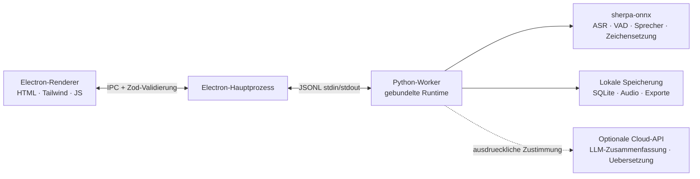

<p align="center"></p>

<p align="center"><strong>Ein minimalistischer, local-first KI-Meeting-Assistent.</strong><br />Live-Transkription · mehrsprachig · Sprechererkennung · KI-Zusammenfassungen — Audio verlaesst dein Geraet nie.</p>

<p align="center">
  <a href="https://github.com/zerolovesea/Brevia/releases"></a>
  <a href="https://github.com/zerolovesea/Brevia/blob/main/LICENSE"></a>
  <a href="https://github.com/zerolovesea/Brevia/releases"></a>
  
  
  
</p>

<p align="center"><a href="../README.md">English</a> · <a href="README.zh-CN.md">简体中文</a> · <a href="README.es.md">Español</a> · <a href="README.ja.md">日本語</a> · <a href="README.ko.md">한국어</a> · <a href="README.fr.md">Français</a> · <strong>Deutsch</strong> · <a href="README.ru.md">Русский</a></p>

---

## Ueber Brevia

Brevia ist ein Desktop-KI-Meeting-Assistent, der den zeitaufwendigsten Teil jedes Meetings — Aufnehmen, Ordnen und Nachvollziehen — an die KI auf deinem Geraet abgibt. Er nimmt Mikrofon und Systemaudio gleichzeitig auf, streamt Live-Untertitel und wandelt das beendete Gespraech in strukturierte Notizen um. Die gesamte Spracherkennung laeuft lokal; Aufnahmen, Transkripte und Sprecherprofile bleiben standardmaessig auf deinem Rechner.

Das Design ist bewusst zurueckhaltend: eine Oberflaeche, die das Meeting nicht stoert, ein Funktionsumfang, der einem klaren Bogen folgt — **erfassen → verstehen → wiederfinden** — und eine feste Regel: Was lokal moeglich ist, geschieht auch lokal.

<p align="center"></p>

## Funktionen

### Eine ruhige Meeting-Oberflaeche mit Live-Transkription und -Uebersetzung

Oeffnen, Aufnahme starten, Untertitel zusehen. Brevia erfasst Mikrofon und Systemaudio gleichzeitig, sodass beide Seiten eines Remote-Gespraechs im gleichen Transkript landen. Die optionale Live-Uebersetzung wird neben dem Untertitel-Stream angezeigt und unterstuetzt mehrsprachige Gespraeche.


### 30+ Transkriptionssprachen und KI-Meeting-Notizen

Brevia transkribiert Sprache in mehr als 30 Sprachen — Englisch, Chinesisch, Japanisch, Koreanisch, Franzoesisch, Deutsch, Spanisch, Russisch, Arabisch, Thai, Vietnamesisch, Indonesisch und mehr. Nach Ende des Meetings verbindest du einen beliebigen LLM-Anbieter, und Brevia entwirft in einem Durchgang die Zusammenfassung, wichtigen Entscheidungen und To-dos.

Die integrierte KI fuehrt ein mitgeliefertes Modell auf dem eigenen Rechner aus. Alternativ lassen sich Claude, OpenAI, OpenRouter oder jeder Dienst anbinden, der das Chat-Format von OpenAI oder Anthropic spricht. Es wird nur Text gesendet, niemals Audio.


### Stimmprofil-Registrierung und meetinguebergreifende Sprechererkennung

Nimm pro Teammitglied eine kurze Sprachprobe auf, und Brevia erkennt sie in allen kuenftigen Meetings namentlich — nicht als „Sprecher 1, Sprecher 2", sondern als die Personen, die sie sind. Die Erkennung funktioniert aufnahmeuebergreifend, sodass die Frage „was hat Alice gesagt?" in den Meetings der letzten Woche mit einem Klick beantwortet ist.

Angetrieben von Pyannote-Segmentierung plus Sprecher-Embedding-Modellen, alles auf dem Geraet.


### Eine kuratierte lokale Modellbibliothek

Herunterladbare Modelle fuer Streaming-ASR, Offline-Verfeinerung, Zeichensetzung, Sprachaktivitaetserkennung, Sprecherdiarisierung, Sprecher-Embeddings und Quellentrennung. Kombiniere nach Sprache und Genauigkeit — alles laeuft auf deinem Geraet.


### Und mehr

- **Quellentrennung** — Spleeter trennt Aufnahmen in Vokal- und Nicht-Vokal-Spuren fuer die Nachbearbeitung.
- **Audio-Import** — bring bestehende Aufnahmen fuer die Offline-Transkription in die gleiche Sprachpipeline.
- **Vielseitige Exporte** — Transkripte und Notizen als Markdown, TXT, JSON, SRT, DOCX oder PDF; Audio als FLAC, WAV oder M4A.
- **Mehrsprachige Oberflaeche** — Englisch, vereinfachtes Chinesisch, Spanisch, Japanisch, Koreanisch, Franzoesisch, Deutsch und Russisch.

## Installation

Lade die neueste Version von [GitHub Releases](https://github.com/zerolovesea/Brevia/releases) herunter:

| Plattform | Installer |
| --- | --- |
| macOS (Apple Silicon) | `Brevia-<version>-arm64.dmg` |
| Windows (x64) | `Brevia-<version>-x64-setup.exe` |
> Unter Windows kann beim ersten Start eine **Microsoft Defender SmartScreen**-Warnung erscheinen. Klicke auf **„Weitere Informationen" → „Trotzdem ausfuehren"**, nachdem du bestaetigt hast, dass der Download von der offiziellen Releases-Seite stammt.

Erteile beim ersten Start die Berechtigungen fuer Mikrofon und Bildschirmaufnahme und oeffne dann **Einstellungen → Modellbibliothek**, um die benoetigten Modelle herunterzuladen.

## Architektur



Brevia folgt einem strikt local-first Design:

- **Der Renderer oeffnet keine Netzwerkports**, und jede IPC-Nachricht wird vom Electron-Hauptprozess gegen ein Zod-Schema validiert.
- **Der Hauptprozess ist eine duenne Huelle.** Er startet einen einzigen Python-Worker ueber JSONL stdin/stdout; der Worker uebernimmt Modellverwaltung, Audioverarbeitung, Sprecherprofile, lokale Speicherung und Exporte.
- **Daten leben standardmaessig in `~/brevia`** — SQLite, Rohaudio, Exporte, zwischengespeicherte Modelle und Stimmprofile.
- **Cloud-Aufrufe sind Opt-in.** LLM-Zusammenfassungen und Uebersetzungen erfordern, dass Nutzerinnen und Nutzer einen Anbieter explizit konfigurieren, und es wird nur Text gesendet.

## Tech-Stack

| Ebene | Technologie |
| --- | --- |
| Desktop-Shell | Electron 43 — preload-Bruecke, Kontextisolation, gesandboxter Renderer |
| Frontend | Vanilla HTML/CSS/JS, Tailwind CSS 4, eingebautes i18n (8 Sprachen) |
| Backend | Python 3.10+, JSONL-Worker-Protokoll, SQLite-Speicher |
| Sprach-Engine | [sherpa-onnx](https://github.com/k2-fsa/sherpa-onnx) 1.13.2, ONNX Runtime |
| Sprecherverarbeitung | Pyannote-Segmentierung + 3D-Speaker ERes2Net Base Embeddings |
| LLM-Client | Integriertes llama.cpp (GGUF) sowie OpenAI- / Anthropic-kompatible Chat-APIs |
| Audio-I/O | ffmpeg (in Releases enthalten) |
| Build & Paketierung | electron-builder, PyInstaller (Python-Runtime gebundelt) |
## Unterstuetzte Modelle

Jedes Modell wird bei Bedarf aus **Einstellungen → Modellbibliothek** heruntergeladen. Das Manifest liegt in [`backend/models.json`](../backend/models.json).

| Kategorie | Repraesentative Modelle | Sprachen |
| --- | --- | --- |
| Streaming-ASR | Zipformer (zh / en / fr / ko / mehrsprachig), Nemotron 3.5 | 30+ |
| Verfeinerungs-ASR | Qwen3-ASR 0.6B / 1.7B, Whisper Large v3, FunASR Nano | Mehrsprachig |
| Zeichensetzung | CT-Transformer zh+en, Online Punct englische Grossschreibung | zh / en |
| Sprachaktivitaetserkennung | Silero VAD | Universell |
| Sprachverbesserung | GTCRN Live Denoiser | Universell |
| Sprecherdiarisierung | Pyannote Segmentation 3.0, Reverb Diarization v1 | Universell |
| Sprecher-Embeddings | 3D-Speaker ERes2Net Base | Universell |
| Quellentrennung | Spleeter 2 Stems | Universell |

Fuer LLM-Zusammenfassungen waehlen Sie **Integrierte KI**, um ein mitgeliefertes GGUF-Modell lokal auszufuehren (Qwen 3.5 2B / 4B, Gemma 3 1B / 4B), oder verweisen Brevia auf Claude, OpenAI, OpenRouter bzw. einen eigenen Dienst, der OpenAI Chat Completions oder Anthropic Messages spricht — Gemini (OpenAI-kompatibler Endpoint), DeepSeek, Kimi, Qwen und mehr.

## Lokale Entwicklung

Voraussetzungen: Node.js 18+, Python 3.10+, Git und ffmpeg (fuer Audio-Import).

```bash
git clone https://github.com/zerolovesea/Brevia.git
cd Brevia
npm install
python3 -m pip install -r backend/requirements.txt
npm start
```

Erteile beim ersten Start die Berechtigungen fuer Mikrofon und Bildschirmaufnahme und lade dann die gewuenschten Modelle aus **Einstellungen → Modellbibliothek** herunter.

### Haeufig verwendete Skripte

```bash
npm test                    # UI- + Backend-Tests
npm run build               # Tailwind-CSS-Build
npm run test:model          # ASR-Modell-Diagnose
npm run test:diarization    # Sprecherdiarisierungs-Diagnose
npm run start:fresh         # Onboarding zuruecksetzen und starten
```

### Umgebungsvariablen

```bash
BREVIA_DATA_DIR=/path/to/data       # Benutzerdefiniertes Datenverzeichnis (Aufnahmen, Exporte, SQLite)
BREVIA_MODELS_DIR=/path/to/models   # Benutzerdefiniertes Modellverzeichnis
BREVIA_FFMPEG=/path/to/ffmpeg       # ffmpeg-Binary (falls nicht im PATH)

BREVIA_DATA_DIR=~/brevia-dev BREVIA_MODELS_DIR=~/brevia-models npm start
```
### Installer bauen

```bash
npm ci
npm run build
python3 -m pip install -r backend/requirements-build.txt
npm run dist:mac   # macOS ARM64 DMG
npm run dist:win   # Windows x64 EXE
```

Die Artefakte landen in `dist/`. Jeder Plattform-Build bundelt einen nativen Python-Worker; Modelle sind nicht enthalten und bleiben On-Demand-Downloads.

## FAQ

<details>
<summary><strong>Windows zeigt eine Microsoft-Defender-SmartScreen-Warnung</strong></summary>

Release-Builds sind nicht mit einem kostenpflichtigen Code-Signing-Zertifikat signiert, und SmartScreen blockiert neu gesehene ausfuehrbare Dateien standardmaessig. Klicke auf **„Weitere Informationen" → „Trotzdem ausfuehren"**, nachdem du bestaetigt hast, dass der Download von der offiziellen [Releases](https://github.com/zerolovesea/Brevia/releases)-Seite stammt.
</details>

<details>
<summary><strong>Muss ich Python separat installieren?</strong></summary>

Nein. Release-Builds bundeln die Python-Runtime und alle noetigen Abhaengigkeiten. Eine separate Python-Installation wird nur benoetigt, wenn du aus dem Quellcode startest.
</details>

<details>
<summary><strong>Wo werden meine Daten gespeichert?</strong></summary>

Standardmaessig in `~/brevia` — Aufnahmen, Transkripte, Exporte, zwischengespeicherte Modelle, Stimmprofile und die SQLite-Datenbank. Setze `BREVIA_DATA_DIR`, um dies zu aendern.
</details>

<details>
<summary><strong>Welche Transkriptionssprachen werden unterstuetzt?</strong></summary>

Mehr als 30 Sprachen, darunter Chinesisch, Englisch, Japanisch, Koreanisch, Franzoesisch, Deutsch, Spanisch, Russisch, Arabisch, Thai, Vietnamesisch und Indonesisch. Waehle das passende Modell in der Modellbibliothek der App.
</details>
<details>
<summary><strong>Sendet Brevia Audio in die Cloud?</strong></summary>

Nein. Spracherkennung und Diarisierung laufen komplett lokal. Nur LLM-Zusammenfassungen und Uebersetzungen kontaktieren das Netzwerk, und auch nur nachdem du einen Anbieter konfiguriert hast — ausschliesslich Text, niemals Audio.
</details>

<details>
<summary><strong>Wie viel Speicherplatz benoetigen die Modelle?</strong></summary>

Haengt davon ab, welche du installierst. Eine typische Zusammenstellung (Streaming + Verfeinerung + Diarisierung) liegt bei 1–2 GB. Kompakte Streaming-Modelle beginnen bei ca. 80 MB; groessere Modelle uebersteigen 1 GB.
</details>

<details>
<summary><strong>Kann ich bestehende Aufnahmen importieren?</strong></summary>

Ja. Importiere Audiodateien aus der Meeting-Bibliothek, und Brevia transkribiert sie offline mit derselben Sprachpipeline. Erfordert `ffmpeg` im PATH (oder `BREVIA_FFMPEG` setzen).
</details>

<details>
<summary><strong>Wie wechsle ich die Oberflaechensprache?</strong></summary>

**Einstellungen → Allgemein → Oberflaechensprache.** Verfuegbar sind Englisch, vereinfachtes Chinesisch, Spanisch, Japanisch, Koreanisch, Franzoesisch, Deutsch und Russisch.
</details>

<details>
<summary><strong>Wie werden Stimmproben gespeichert?</strong></summary>

Stimm-Embeddings (ein kleiner Float-Vektor) und Referenzaudio liegen in der lokalen SQLite-Datenbank und im Dateisystem. Nichts verlaesst das Geraet, und beim Loeschen eines Profils werden die zugehoerigen Daten entfernt.
</details>

## Feedback und Beitraege

### Ein Problem melden

Bug oder Feature-Wunsch? Bitte in [GitHub Issues](https://github.com/zerolovesea/Brevia/issues) melden. Die Triage geht schneller mit:

- OS und Version (z. B. macOS 14.5 / Windows 11 23H2)
- Brevia-Version (**Einstellungen → Info**)
- Verwendete Modelle und Sprache
- Reproduktionsschritte / erwartetes Ergebnis / tatsaechliches Ergebnis
- Relevante Logs (**Einstellungen → Erweitert → Log-Ordner oeffnen**) — bitte vor dem Anhaengen auf sensible Inhalte pruefen

**Sicherheitsprobleme:** bitte kein oeffentliches Issue anlegen. Kontaktiere den Maintainer per E-Mail.

### Beitragen

Pull Requests sind willkommen. Damit der Baum aufgeraeumt bleibt:

1. Zweig von `main` mit engem Fokus — ein Anliegen pro PR.
2. `npm test` vor dem Einreichen ausfuehren; `npm run test:model` und `npm run test:diarization` ausfuehren, wenn ASR oder Diarisierung beruehrt werden.
3. Keine heruntergeladenen Modelle, Aufnahmen, Exporte, API-Schluessel oder Inhalte aus `~/brevia` committen.
4. Bei Aenderungen an nutzersichtbarem Text alle acht Sprachen in `frontend/i18n-data.js` aktualisieren — englische Quellzeichenkette und Uebersetzungen zusammen hinzufuegen.
5. Auswirkungen auf Modelle, Plattform oder Berechtigungen in der PR-Beschreibung vermerken.

## Lizenz

Brevia wird unter der [ISC License](../LICENSE) veroeffentlicht. Modelldateien und Drittanbieterpakete behalten ihre eigenen Lizenzen und Bedingungen.

## Danksagungen

- [sherpa-onnx](https://github.com/k2-fsa/sherpa-onnx) — die lokale Runtime hinter ASR, VAD, Zeichensetzung und Sprecherverarbeitung. Lizenziert unter [Apache-2.0](https://github.com/k2-fsa/sherpa-onnx/blob/master/LICENSE).
- Dank an die Modellautorinnen und -maintainer, deren herunterladbare Artefakte in [`backend/models.json`](../backend/models.json) deklariert sind, darunter Zipformer, Whisper, Qwen3-ASR, FunASR, Pyannote, 3D-Speaker, Silero, Spleeter und Tencent Hy-MT2.
- Electron, ONNX Runtime, Python und die Open-Source-Sprach-Community machen diesen local-first Workflow moeglich.
