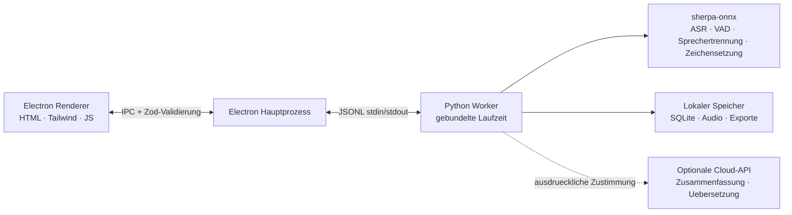

<p align="center"></p>

<p align="center"><strong>Ein minimaler Meeting-Recorder, der auf deinem Geraet bleibt.</strong><br />Transkribieren, mit KI zusammenfassen, erinnern — ohne Cloud, voellig privat.</p>

<p align="center">
  <a href="https://github.com/zerolovesea/Brevia/releases"></a>
  <a href="https://github.com/zerolovesea/Brevia/blob/main/LICENSE"></a>
  <a href="https://github.com/zerolovesea/Brevia/releases"></a>
  
  
  
</p>

<p align="center"><a href="../README.md">English</a> · <a href="README.zh-CN.md">简体中文</a> · <a href="README.es.md">Español</a> · <a href="README.ja.md">日本語</a> · <a href="README.ko.md">한국어</a> · <a href="README.fr.md">Français</a> · <strong>Deutsch</strong> · <a href="README.ru.md">Русский</a></p>

## Produkttour

| | |
| --- | --- |
|  |  |
|  |  |


## Funktionen

- **Echtzeit-Transkription** — Mikrofon und Systemaudio gleichzeitig aufnehmen mit Live-Untertiteln.
- **Vollstaendig lokale Sprach-KI** — Streaming-ASR, Zeichensetzung, Nachbearbeitung, VAD und Sprechertrennung laufen via sherpa-onnx auf dem Geraet. Kein Audio verlaesst deinen Rechner.
- **27 herunterladbare Modelle** — Zipformer, Paraformer, Whisper, SenseVoice, FireRedASR, FunASR u.a., 30+ Sprachen abgedeckt.
- **Sprechererkennung** — Pyannote-Segmentierung + Voice-Embedding-Modelle; Sprecher umbenennen und ueber Aufnahmen hinweg verfolgen.
- **Vielseitiger Export** — Transkripte und Notizen als Markdown, TXT, JSON, SRT, DOCX oder PDF; Audio als FLAC, WAV oder M4A.
- **Audio-Import** — bestehende Aufnahmen importieren fuer Offline-Transkription und Nachbearbeitung.
- **Optionale KI-Zusammenfassungen** — Uebersetzungen und strukturierte Notizen nur nach ausdruecklicher Zustimmung und Provider-Konfiguration.
- **Mehrsprachige Oberflaeche** — Englisch, vereinfachtes Chinesisch, Spanisch, Japanisch, Koreanisch, Franzoesisch, Deutsch und Russisch.

## Installation

Die neueste Version von [GitHub Releases](https://github.com/zerolovesea/Brevia/releases) herunterladen:

| Plattform | Datei |
| --- | --- |
| macOS (Apple Silicon) | `Brevia-<version>-arm64.dmg` |
| Windows (x64) | `Brevia-<version>-x64-setup.exe` |

> **Hinweis zum unsignierten Build:** macOS zeigt moeglicherweise eine Warnung „beschaedigt" oder blockiert das Oeffnen. Gehe zu **Systemeinstellungen → Datenschutz & Sicherheit → Dennoch oeffnen**, oder fuehre aus:
>
> ```bash
> xattr -dr com.apple.quarantine "/Applications/Brevia.app"
> ```
>
> Unter Windows warnt moeglicherweise Microsoft Defender SmartScreen — nach Pruefung der Download-Quelle fortfahren.

## Architektur



Brevia folgt einem strikt lokalen Design. Der Renderer oeffnet keinen Netzwerk-Port. Electron validiert alle IPC-Nachrichten mit Zod-Schemas. Der Hauptprozess startet einen einzelnen Python-Worker, der Modellverwaltung, Audioverarbeitung, lokalen Speicher und Dateiexporte uebernimmt. Daten liegen in `~/Library/Application Support/Brevia` (macOS) oder `%APPDATA%/Brevia` (Windows).

## Technologie-Stack

| Schicht | Technologie |
| --- | --- |
| Desktop-Shell | Electron 43 — Preload-Bruecke, Kontextisolierung, Sandbox-Renderer |
| Frontend | Natives HTML/CSS/JS, Tailwind CSS, eingebaute i18n (8 Sprachen) |
| Backend | Python 3.10+, JSONL-Worker-Protokoll, SQLite-Speicher |
| Sprach-Engine | sherpa-onnx 1.13.2, ONNX Runtime, 27 Modelle (Zipformer / Paraformer / Whisper / SenseVoice / FireRedASR / FunASR) |
| Sprecherverarbeitung | sherpa-onnx Pyannote-Segmentierung + Voice-Embedding-Modelle |
| Build & Paketierung | electron-builder, PyInstaller (Python-Laufzeit integriert) |

## Aus dem Quellcode starten

```bash
npm install
python3 -m pip install -r backend/requirements.txt
npm start
```

Beim ersten Start Mikrofon- und Bildschirmaufnahme-Zugriff erlauben. Unter **Settings → Model Library** die benoetigten Modelle fuer deine Sprache herunterladen.

Entwicklungsbefehle:

```bash
npm test                    # UI- + Backend-Tests
npm run build               # Tailwind-CSS-Build
npm run test:model          # ASR-Modell-Diagnose
npm run test:diarization    # Sprechertrennung-Diagnose
```

Daten-/Modellverzeichnisse fuer Entwicklung aendern:

```bash
BREVIA_DATA_DIR=/path/to/data BREVIA_MODELS_DIR=/path/to/models npm start
```

## Installer erstellen

```bash
npm ci
npm run build
python3 -m pip install -r backend/requirements-build.txt
npm run dist:mac   # macOS ARM64 DMG
npm run dist:win   # Windows x64 EXE
```

Der Installer wird in `dist/` erstellt. Jeder Plattform-Build enthaelt einen nativen Python-Worker; Modelle sind nicht enthalten und werden bei Bedarf heruntergeladen.

## Haeufige Fragen

<details>
<summary><strong>macOS meldet, die App sei „beschaedigt" oder kann nicht geoeffnet werden</strong></summary>

Dies liegt daran, dass der Build nicht codesigniert ist. Im Terminal ausfuehren:

```bash
xattr -dr com.apple.quarantine "/Applications/Brevia.app"
```

Danach die App normal oeffnen.
</details>

<details>
<summary><strong>Muss ich Python separat installieren?</strong></summary>

Nein. Release-Builds enthalten die Python-Laufzeit und alle Abhaengigkeiten. Python wird nur benoetigt, wenn aus dem Quellcode gestartet wird.
</details>

<details>
<summary><strong>Wo werden meine Daten gespeichert?</strong></summary>

- macOS: `~/Library/Application Support/Brevia`
- Windows: `%APPDATA%/Brevia`

Aufnahmen, Transkripte und Sprecherprofile bleiben auf dem Geraet. Mit `BREVIA_DATA_DIR` den Speicherort aendern.
</details>

<details>
<summary><strong>Welche Sprachen werden fuer die Transkription unterstuetzt?</strong></summary>

Ueber 30 Sprachen, darunter Chinesisch, Englisch, Japanisch, Koreanisch, Franzoesisch, Deutsch, Spanisch, Russisch, Arabisch, Thai, Vietnamesisch, Indonesisch und mehr. Das passende Modell in der Modell-Bibliothek auswaehlen.
</details>

<details>
<summary><strong>Sendet Brevia Audio in die Cloud?</strong></summary>

Nein. Alle Spracherkennung laeuft lokal ueber sherpa-onnx. Die optionale Zusammenfassungs-/Uebersetzungsfunktion erfordert ausdrueckliche Zustimmung und eigene API-Provider-Konfiguration — es wird nur Text gesendet, niemals Audio.
</details>

<details>
<summary><strong>Wie viel Speicherplatz brauchen die Modelle?</strong></summary>

Abhaengig von den gewaehlten Modellen. Eine typische Konfiguration (Streaming + Nachbearbeitung + Sprechertrennung) belegt ca. 1–2 GB. Kompakte Streaming-Modelle beginnen bei ~80 MB; groessere Modelle erreichen ~1 GB.
</details>

<details>
<summary><strong>Kann ich vorhandene Aufnahmen importieren?</strong></summary>

Ja. Audiodateien ueber die Meeting-Bibliothek importieren. Brevia transkribiert sie offline mit derselben Sprach-Pipeline. `ffmpeg` muss im PATH sein (oder `BREVIA_FFMPEG` setzen).
</details>

<details>
<summary><strong>Wie aendere ich die Oberflaechen-Sprache?</strong></summary>

Unter **Settings → General** die bevorzugte Sprache auswaehlen. Unterstuetzt werden Englisch, vereinfachtes Chinesisch, Spanisch, Japanisch, Koreanisch, Franzoesisch, Deutsch und Russisch.
</details>

## Beitragen

1. Einen fokussierten Branch erstellen und Aenderungen klein halten.
2. `npm test` ausfuehren; bei ASR- oder Sprechertrennungs-Aenderungen auch die Modelldiagnosen.
3. Keine Modelle, Aufnahmen, Exporte, API-Schluessel oder lokale Daten committen.
4. UI-Texte in allen acht Sprachen konsistent halten.
5. Modell-, Plattform- oder Rechte-Auswirkungen im Pull Request beschreiben.

## Lizenz

Brevia steht unter der [ISC License](../LICENSE). Modelle und Drittanbieter-Pakete behalten ihre eigenen Lizenzen und Bedingungen.

## Danksagungen

- [sherpa-onnx](https://github.com/k2-fsa/sherpa-onnx) — Kern-Laufzeit fuer lokale ASR, VAD, Zeichensetzung und Sprecherverarbeitung. Lizenziert unter [Apache-2.0](https://github.com/k2-fsa/sherpa-onnx/blob/master/LICENSE).
- Dank an die Modell-Autoren, die in `backend/models.json` deklariert sind.
- Electron, ONNX Runtime, Python und die Open-Source-Sprach-Community machen diesen lokalen Workflow moeglich.