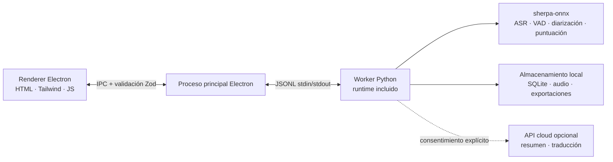

<p align="center"></p>

<p align="center"><strong>Un grabador de reuniones minimalista que se queda en tu dispositivo.</strong><br />Transcribe, resume con IA, recuerda — sin la nube, privacidad total.</p>

<p align="center">
  <a href="https://github.com/zerolovesea/Brevia/releases"></a>
  <a href="https://github.com/zerolovesea/Brevia/blob/main/LICENSE"></a>
  <a href="https://github.com/zerolovesea/Brevia/releases"></a>
  
  
  
</p>

<p align="center"><a href="../README.md">English</a> · <a href="README.zh-CN.md">简体中文</a> · <strong>Español</strong> · <a href="README.ja.md">日本語</a> · <a href="README.ko.md">한국어</a> · <a href="README.fr.md">Français</a> · <a href="README.de.md">Deutsch</a> · <a href="README.ru.md">Русский</a></p>

## Recorrido del producto

| | |
| --- | --- |
|  |  |
|  |  |


## Funcionalidades

- **Transcripción en tiempo real** — captura micrófono y audio del sistema simultáneamente con subtítulos en directo.
- **IA de voz completamente local** — ASR en streaming, puntuación, refinamiento post-reunión, VAD y diarización se ejecutan en el dispositivo vía sherpa-onnx. Ningún audio sale de tu máquina.
- **27 modelos descargables** — Zipformer, Paraformer, Whisper, SenseVoice, FireRedASR y más, cubriendo 30+ idiomas.
- **Identificación de hablantes** — segmentación Pyannote + modelos de embeddings de voz; renombra y rastrea participantes entre grabaciones.
- **Exportación versátil** — transcripciones y notas como Markdown, TXT, JSON, SRT, DOCX o PDF; audio como FLAC, WAV o M4A.
- **Importación de audio** — importa grabaciones existentes para transcripción y refinamiento offline.
- **Resúmenes IA opcionales** — genera traducciones y notas estructuradas solo tras consentimiento explícito y configuración del proveedor.
- **Interfaz multilingüe** — inglés, chino simplificado, español, japonés, coreano, francés, alemán y ruso.

## Instalación

Descarga la última versión desde [GitHub Releases](https://github.com/zerolovesea/Brevia/releases):

| Plataforma | Archivo |
| --- | --- |
| macOS (Apple Silicon) | `Brevia-<version>-arm64.dmg` |
| Windows (x64) | `Brevia-<version>-x64-setup.exe` |

> **Nota sobre build sin firmar:** macOS puede mostrar un aviso de "dañado" o bloquearlo. Ve a **Ajustes del Sistema → Privacidad y seguridad → Abrir de todos modos**, o ejecuta:
>
> ```bash
> xattr -dr com.apple.quarantine "/Applications/Brevia.app"
> ```
>
> En Windows, Microsoft Defender SmartScreen puede avisar — procede tras verificar la fuente de descarga.

## Arquitectura



Brevia sigue un diseño estrictamente local. El renderer no abre puertos de red. Electron valida todos los mensajes IPC con esquemas Zod. El proceso principal lanza un único Worker Python que gestiona modelos, procesamiento de audio, almacenamiento local y exportaciones. Los datos residen en `~/Library/Application Support/Brevia` (macOS) o `%APPDATA%/Brevia` (Windows).

## Stack tecnológico

| Capa | Tecnología |
| --- | --- |
| Shell de escritorio | Electron 43 — puente preload, aislamiento de contexto, renderer en sandbox |
| Frontend | HTML/CSS/JS nativo, Tailwind CSS, i18n integrado (8 idiomas) |
| Backend | Python 3.10+, protocolo Worker JSONL, almacenamiento SQLite |
| Motor de voz | sherpa-onnx 1.13.2, ONNX Runtime, 27 modelos (Zipformer / Paraformer / Whisper / SenseVoice / FireRedASR / FunASR) |
| Procesamiento de hablantes | Segmentación Pyannote + modelos de embeddings de voz vía sherpa-onnx |
| Build y empaquetado | electron-builder, PyInstaller (runtime Python incluido) |

## Ejecutar desde el código fuente

```bash
npm install
python3 -m pip install -r backend/requirements.txt
npm start
```

En el primer inicio, concede acceso al micrófono y grabación de pantalla. Abre **Settings → Model Library** y descarga los modelos para tu idioma antes de grabar.

Comandos de desarrollo:

```bash
npm test                    # Tests de UI + backend
npm run build               # Build de Tailwind CSS
npm run test:model          # Diagnósticos de modelos ASR
npm run test:diarization    # Diagnósticos de diarización
```

Directorio de datos/modelos personalizado:

```bash
BREVIA_DATA_DIR=/path/to/data BREVIA_MODELS_DIR=/path/to/models npm start
```

## Crear un instalador

```bash
npm ci
npm run build
python3 -m pip install -r backend/requirements-build.txt
npm run dist:mac   # DMG ARM64 en macOS
npm run dist:win   # EXE x64 en Windows
```

El instalador se genera en `dist/`. Cada build incluye un Worker Python nativo; los modelos no se incluyen y se descargan bajo demanda.

## Preguntas frecuentes

<details>
<summary><strong>macOS dice que la app está "dañada" o no puede abrirse</strong></summary>

Esto ocurre porque el build no tiene firma de código. Ejecuta en Terminal:

```bash
xattr -dr com.apple.quarantine "/Applications/Brevia.app"
```

Luego abre la app normalmente.
</details>

<details>
<summary><strong>¿Necesito instalar Python por separado?</strong></summary>

No. Las versiones de release incluyen el runtime Python y todas las dependencias. Solo necesitas Python si ejecutas desde el código fuente.
</details>

<details>
<summary><strong>¿Dónde se almacenan mis datos?</strong></summary>

- macOS: `~/Library/Application Support/Brevia`
- Windows: `%APPDATA%/Brevia`

Grabaciones, transcripciones y perfiles de hablantes permanecen en el dispositivo. Configura `BREVIA_DATA_DIR` para cambiar la ubicación.
</details>

<details>
<summary><strong>¿Qué idiomas se soportan para transcripción?</strong></summary>

Más de 30 idiomas incluyendo chino, inglés, japonés, coreano, francés, alemán, español, ruso, árabe, tailandés, vietnamita, indonesio y más. Elige el modelo adecuado desde la Biblioteca de Modelos.
</details>

<details>
<summary><strong>¿Brevia envía audio a la nube?</strong></summary>

No. Todo el reconocimiento de voz se ejecuta localmente vía sherpa-onnx. La función opcional de resumen/traducción requiere consentimiento explícito y configuración de tu propio proveedor API — solo envía texto, nunca audio.
</details>

<details>
<summary><strong>¿Cuánto espacio en disco necesitan los modelos?</strong></summary>

Depende de los modelos seleccionados. Una configuración típica (streaming + refinamiento + diarización) ocupa aproximadamente 1–2 GB. Los modelos compactos empiezan en ~80 MB; los más grandes llegan a ~1 GB.
</details>

<details>
<summary><strong>¿Puedo importar grabaciones existentes?</strong></summary>

Sí. Importa archivos de audio desde la biblioteca de reuniones. Brevia los transcribirá offline con el mismo motor de voz. Requiere `ffmpeg` en PATH (o configura `BREVIA_FFMPEG`).
</details>

<details>
<summary><strong>¿Cómo cambio el idioma de la interfaz?</strong></summary>

Ve a **Settings → General** y selecciona tu idioma preferido. La app soporta inglés, chino simplificado, español, japonés, coreano, francés, alemán y ruso.
</details>

## Contribuir

1. Crea una rama enfocada y mantén los cambios pequeños.
2. Ejecuta `npm test`; ejecuta los diagnósticos de modelo al tocar ASR o diarización.
3. No hagas commit de modelos, grabaciones, exportaciones, claves API ni datos locales.
4. Mantén coherentes los textos en los ocho idiomas.
5. Describe el impacto en modelos, plataforma o permisos en el pull request.

## Licencia

Brevia se publica bajo la [ISC License](../LICENSE). Los modelos y paquetes de terceros conservan sus propias licencias y términos.

## Agradecimientos

- [sherpa-onnx](https://github.com/k2-fsa/sherpa-onnx) — runtime central de voz local para ASR, VAD, puntuación y procesamiento de hablantes. Licenciado bajo [Apache-2.0](https://github.com/k2-fsa/sherpa-onnx/blob/master/LICENSE).
- Gracias a los autores de modelos declarados en `backend/models.json`.
- Electron, ONNX Runtime, Python y la comunidad de voz open-source hacen posible este flujo de trabajo local.

