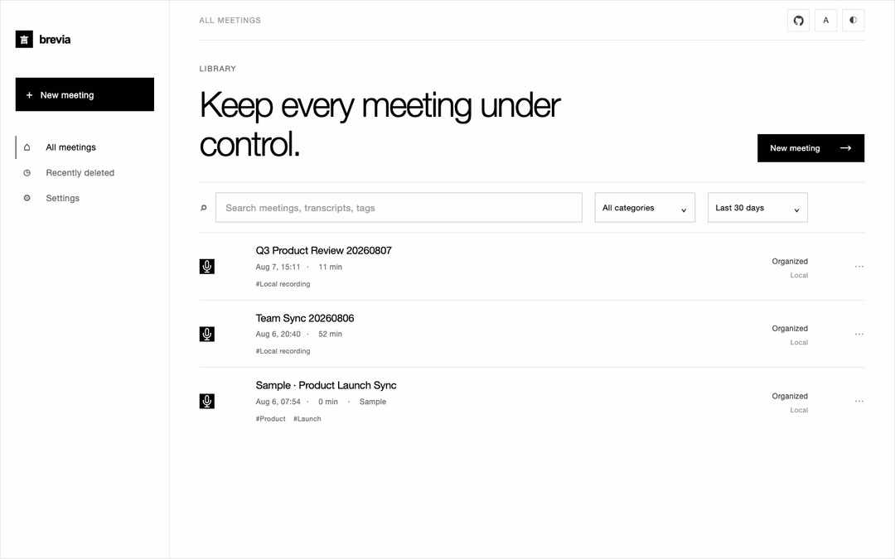
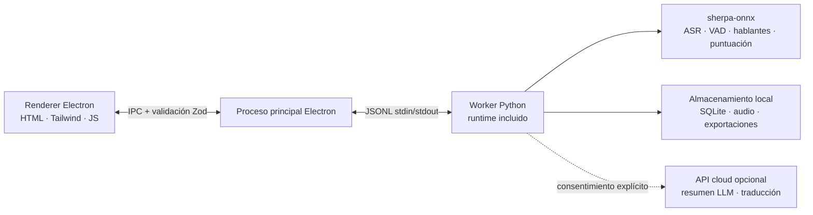

<p align="center"></p>

<p align="center"><strong>Un asistente de reuniones con IA minimalista y local.</strong><br />Transcripción en vivo · multilingüe · identificación de hablantes · resúmenes con IA — el audio nunca sale de tu equipo.</p>

<p align="center">
  <a href="https://github.com/zerolovesea/Brevia/releases"></a>
  <a href="https://github.com/zerolovesea/Brevia/blob/main/LICENSE"></a>
  <a href="https://github.com/zerolovesea/Brevia/releases"></a>
  
  
  
</p>

<p align="center"><a href="../README.md">English</a> · <a href="README.zh-CN.md">简体中文</a> · <strong>Español</strong> · <a href="README.ja.md">日本語</a> · <a href="README.ko.md">한국어</a> · <a href="README.fr.md">Français</a> · <a href="README.de.md">Deutsch</a> · <a href="README.ru.md">Русский</a></p>

---

## Acerca de

Brevia es un asistente de reuniones con IA para escritorio que delega en la IA local la parte más lenta de cualquier reunión: capturar, organizar y revisar. Graba el micrófono y el audio del sistema a la vez, muestra subtítulos en vivo y convierte la conversación terminada en notas estructuradas. Todo el reconocimiento de voz se ejecuta en local; grabaciones, transcripciones y perfiles de voz permanecen en tu equipo por defecto.

El diseño es deliberadamente silencioso: una interfaz que no estorba a la reunión, un conjunto de funciones que sigue un solo arco — **capturar → entender → recuperar** — y una regla firme: lo que puede hacerse en local, se hace en local.

<p align="center"></p>

## Funcionalidades

### Pantalla de reunión silenciosa con transcripción y traducción en vivo

Ábrelo, pulsa grabar y observa los subtítulos aparecer. Brevia captura el micrófono y el audio del sistema a la vez, de modo que ambas partes de una llamada remota quedan en la misma transcripción. La traducción en vivo opcional se muestra junto al flujo de subtítulos para conversaciones multilingües.


### 30+ idiomas de transcripción y notas de reunión con IA

Brevia transcribe voz en más de 30 idiomas — inglés, chino, japonés, coreano, francés, alemán, español, ruso, árabe, tailandés, vietnamita, indonesio y más. Al terminar la reunión, conecta cualquier proveedor de LLM y Brevia redactará el resumen, decisiones clave y tareas en una sola pasada.

La IA integrada ejecuta un modelo incluido en tu propio equipo, o puedes conectar Claude, OpenAI, OpenRouter o cualquier servicio compatible con el formato chat de OpenAI o Anthropic. Solo se envía texto, nunca audio.


### Registro de voz e identificación de hablantes entre reuniones

Registra una muestra corta de voz por compañero y Brevia lo reconocerá por su nombre en cada reunión futura — no como "Hablante 1, Hablante 2", sino como las personas que realmente son. El reconocimiento funciona entre grabaciones, así que buscar "¿qué dijo Alicia?" en las reuniones de la semana pasada es un clic.

Con segmentación Pyannote más modelos de embeddings de voz, todo ejecutándose en el dispositivo.


### Biblioteca local de modelos curada

Modelos descargables que cubren ASR en streaming, refinamiento offline, restauración de puntuación, detección de actividad vocal, diarización, embeddings de hablante y separación de fuentes. Combínalos por idioma y precisión — todo corre en tu dispositivo.


### Y más

- **Separación de fuentes** — Spleeter divide grabaciones en pistas vocales y no vocales para postproducción.
- **Importación de audio** — trae grabaciones existentes para transcribirlas offline con el mismo pipeline.
- **Exportaciones versátiles** — transcripciones y notas en Markdown, TXT, JSON, SRT, DOCX o PDF; audio en FLAC, WAV o M4A.
- **Interfaz multilingüe** — inglés, chino simplificado, español, japonés, coreano, francés, alemán y ruso.

## Instalación

Descarga la última versión desde [GitHub Releases](https://github.com/zerolovesea/Brevia/releases):

| Plataforma | Instalador |
| --- | --- |
| macOS (Apple Silicon) | `Brevia-<version>-arm64.dmg` |
| Windows (x64) | `Brevia-<version>-x64-setup.exe` |
> Windows puede mostrar un aviso de **Microsoft Defender SmartScreen** al primer arranque. Haz clic en **"Más información" → "Ejecutar de todas formas"** tras verificar que la descarga provino de la página oficial de Releases.

En el primer arranque, concede permisos de micrófono y grabación de pantalla, luego abre **Settings → Model Library** para descargar los modelos que necesitas.

## Arquitectura



Brevia sigue un diseño estrictamente local:

- **El renderer no abre puertos de red**, y cada mensaje IPC es validado por el proceso principal con un esquema Zod.
- **El proceso principal es una capa fina.** Lanza un único worker Python sobre JSONL stdin/stdout; el worker gestiona modelos, procesamiento de audio, perfiles de voz, almacenamiento local y exportaciones.
- **Los datos viven en `~/brevia`** por defecto — SQLite, audio crudo, exportaciones, modelos en caché y perfiles de voz.
- **Las llamadas a la nube son opt-in.** Los resúmenes LLM y traducción requieren que el usuario configure un proveedor explícitamente, y solo se envía texto.

## Stack tecnológico

| Capa | Tecnología |
| --- | --- |
| Shell de escritorio | Electron 43 — puente preload, aislamiento de contexto, renderer en sandbox |
| Frontend | HTML/CSS/JS nativo, Tailwind CSS 4, i18n integrado (8 idiomas) |
| Backend | Python 3.10+, protocolo worker JSONL, almacenamiento SQLite |
| Motor de voz | [sherpa-onnx](https://github.com/k2-fsa/sherpa-onnx) 1.13.2, ONNX Runtime |
| Procesamiento de hablantes | Segmentación Pyannote + embeddings 3D-Speaker ERes2Net Base |
| Cliente LLM | llama.cpp integrado (GGUF) y APIs chat compatibles con OpenAI / Anthropic |
| E/S de audio | ffmpeg (incluido en releases) |
| Build y empaquetado | electron-builder, PyInstaller (runtime Python incluido) |
## Modelos soportados

Cada modelo se descarga bajo demanda desde **Settings → Model Library**. El manifiesto está en [`backend/models.json`](../backend/models.json).

| Categoría | Modelos representativos | Idiomas |
| --- | --- | --- |
| ASR streaming | Zipformer (zh / en / fr / ko / multilingüe), Nemotron 3.5 | 30+ |
| ASR refinamiento | Qwen3-ASR 0.6B / 1.7B, Whisper Large v3, FunASR Nano | Multilingüe |
| Puntuación | CT-Transformer zh+en, Online Punct English casing | zh / en |
| Detección de actividad vocal | Silero VAD | Universal |
| Mejora de voz | GTCRN Live Denoiser | Universal |
| Diarización | Pyannote Segmentation 3.0, Reverb Diarization v1 | Universal |
| Embeddings de hablante | 3D-Speaker ERes2Net Base | Universal |
| Separación de fuentes | Spleeter 2 Stems | Universal |

Para los resúmenes LLM, elige **IA integrada** para ejecutar en local un modelo GGUF incluido (Qwen 3.5 2B / 4B), o apunta Brevia a Claude, OpenAI, OpenRouter o cualquier servicio propio compatible con OpenAI Chat Completions o Anthropic Messages: Gemini (endpoint compatible con OpenAI), DeepSeek, Kimi, Qwen y más.

## Desarrollo local

Prerrequisitos: Node.js 18+, Python 3.10+, Git y ffmpeg (para importación de audio).

```bash
git clone https://github.com/zerolovesea/Brevia.git
cd Brevia
npm install
python3 -m pip install -r backend/requirements.txt
npm start
```

Concede permisos de micrófono y grabación de pantalla al primer arranque, luego descarga los modelos que necesitas desde **Settings → Model Library**.

### Scripts comunes

```bash
npm test                    # Tests de UI + backend
npm run build               # Build de Tailwind CSS
npm run test:model          # Diagnóstico de modelos ASR
npm run test:diarization    # Diagnóstico de diarización
npm run start:fresh         # Reinicia el flujo de onboarding y arranca
```

### Variables de entorno

```bash
BREVIA_DATA_DIR=/path/to/data       # Directorio de datos personalizado (grabaciones, exportaciones, SQLite)
BREVIA_MODELS_DIR=/path/to/models   # Directorio de modelos personalizado
BREVIA_FFMPEG=/path/to/ffmpeg       # Binario ffmpeg (si no está en PATH)

BREVIA_DATA_DIR=~/brevia-dev BREVIA_MODELS_DIR=~/brevia-models npm start
```
### Construir instaladores

```bash
npm ci
npm run build
python3 -m pip install -r backend/requirements-build.txt
npm run dist:mac   # DMG ARM64 macOS
npm run dist:win   # EXE x64 Windows
```

Los artefactos salen a `dist/`. Cada build de plataforma incluye un worker Python nativo; los modelos no se empaquetan — se descargan bajo demanda.

## Preguntas frecuentes

<details>
<summary><strong>Windows muestra un aviso de Microsoft Defender SmartScreen</strong></summary>

Los builds de release no están firmados con un certificado de firma de código de pago, y SmartScreen bloquea por defecto los ejecutables recién vistos. Haz clic en **"Más información" → "Ejecutar de todas formas"** tras confirmar que la descarga provino de la página oficial de [Releases](https://github.com/zerolovesea/Brevia/releases).
</details>

<details>
<summary><strong>¿Necesito instalar Python por separado?</strong></summary>

No. Los builds de release incluyen el runtime Python y todas las dependencias. Solo necesitas Python para ejecutar desde el código fuente.
</details>

<details>
<summary><strong>¿Dónde se almacenan mis datos?</strong></summary>

`~/brevia` por defecto — grabaciones, transcripciones, exportaciones, modelos en caché, perfiles de voz y la base de datos SQLite. Configura `BREVIA_DATA_DIR` para cambiarlo.
</details>

<details>
<summary><strong>¿Qué idiomas de transcripción se soportan?</strong></summary>

Más de 30 idiomas incluyendo chino, inglés, japonés, coreano, francés, alemán, español, ruso, árabe, tailandés, vietnamita e indonesio. Elige el modelo correspondiente desde la Biblioteca de Modelos.
</details>
<details>
<summary><strong>¿Brevia envía audio a la nube?</strong></summary>

No. Reconocimiento de voz y diarización se ejecutan localmente. Solo los resúmenes LLM y traducción contactan la red, y únicamente tras configurar un proveedor — solo texto, nunca audio.
</details>

<details>
<summary><strong>¿Cuánto espacio en disco requieren los modelos?</strong></summary>

Depende de cuáles instales. Una configuración típica (streaming + refinamiento + diarización) ronda 1–2 GB. Los modelos compactos empiezan en ~80 MB; los grandes superan 1 GB.
</details>

<details>
<summary><strong>¿Puedo importar grabaciones existentes?</strong></summary>

Sí. Importa archivos de audio desde la biblioteca de reuniones y Brevia los transcribirá offline con el mismo pipeline. Requiere `ffmpeg` en PATH (o configura `BREVIA_FFMPEG`).
</details>

<details>
<summary><strong>¿Cómo cambio el idioma de la interfaz?</strong></summary>

**Settings → General → Interface language.** Disponibles: inglés, chino simplificado, español, japonés, coreano, francés, alemán y ruso.
</details>

<details>
<summary><strong>¿Cómo se almacenan las muestras de voz?</strong></summary>

Los embeddings de voz (un vector pequeño de floats) y el audio de referencia residen en la base SQLite local y el sistema de archivos. Nada sale del dispositivo, y borrar un perfil elimina los datos asociados.
</details>

## Feedback y contribuciones

### Reportar un problema

¿Encontraste un bug o tienes una petición? Repórtalo en [GitHub Issues](https://github.com/zerolovesea/Brevia/issues). Se triagean más rápido si incluyen:

- SO y versión (p. ej. macOS 14.5 / Windows 11 23H2)
- Versión de Brevia (**Settings → About**)
- Modelos e idioma en uso
- Pasos para reproducir / resultado esperado / resultado real
- Logs relevantes (**Settings → Advanced → Open log folder**) — revísalos por contenido sensible antes de adjuntar

**Problemas de seguridad:** por favor no abras un issue público. Contacta al mantenedor por email.

### Contribuir

Los pull requests son bienvenidos. Para mantener el árbol limpio:

1. Bifurca desde `main` con un enfoque estrecho — una preocupación por PR.
2. Ejecuta `npm test` antes de enviar; ejecuta `npm run test:model` y `npm run test:diarization` al tocar ASR o diarización.
3. No hagas commit de modelos descargados, grabaciones, exportaciones, claves API o nada de `~/brevia`.
4. Al cambiar textos visibles, actualiza los ocho idiomas en `frontend/i18n-data.js` — añade la cadena inglesa fuente y sus traducciones juntas.
5. Menciona cualquier impacto en modelos, plataforma o permisos en la descripción del PR.

## Licencia

Brevia se publica bajo la [ISC License](../LICENSE). Los archivos de modelos y paquetes de terceros mantienen sus propias licencias y términos.

## Agradecimientos

- [sherpa-onnx](https://github.com/k2-fsa/sherpa-onnx) — el runtime local que impulsa ASR, VAD, puntuación y procesamiento de hablantes. Licenciado bajo [Apache-2.0](https://github.com/k2-fsa/sherpa-onnx/blob/master/LICENSE).
- Gracias a los autores y mantenedores de modelos cuyos artefactos descargables se declaran en [`backend/models.json`](../backend/models.json), incluyendo Zipformer, Whisper, Qwen3-ASR, FunASR, Pyannote, 3D-Speaker, Silero, Spleeter y Tencent Hy-MT2.
- Electron, ONNX Runtime, Python y la comunidad open-source de voz hacen posible este flujo local.
