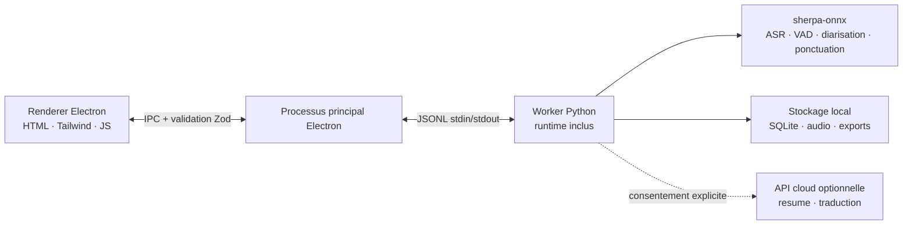

<p align="center"></p>

<p align="center"><strong>Un enregistreur de reunions minimal qui reste sur votre appareil.</strong><br />Transcription, synthese IA, memorisation — sans le cloud, en toute confidentialite.</p>

<p align="center">
  <a href="https://github.com/zerolovesea/Brevia/releases"></a>
  <a href="https://github.com/zerolovesea/Brevia/blob/main/LICENSE"></a>
  <a href="https://github.com/zerolovesea/Brevia/releases"></a>
  
  
  
</p>

<p align="center"><a href="../README.md">English</a> · <a href="README.zh-CN.md">简体中文</a> · <a href="README.es.md">Español</a> · <a href="README.ja.md">日本語</a> · <a href="README.ko.md">한국어</a> · <strong>Français</strong> · <a href="README.de.md">Deutsch</a> · <a href="README.ru.md">Русский</a></p>

## Visite du produit

| | |
| --- | --- |
|  |  |
|  |  |


## Fonctionnalites

- **Transcription en temps reel** — capture le microphone et l'audio systeme simultanement avec sous-titres en direct.
- **IA vocale entierement locale** — ASR en streaming, ponctuation, raffinement post-reunion, VAD et diarisation s'executent sur l'appareil via sherpa-onnx. Aucun audio ne quitte votre machine.
- **27 modeles telechargeables** — Zipformer, Paraformer, Whisper, SenseVoice, FireRedASR, FunASR et plus, couvrant 30+ langues.
- **Identification des intervenants** — segmentation Pyannote + modeles d'empreintes vocales ; renommez et suivez les participants entre les enregistrements.
- **Export riche** — transcriptions et notes en Markdown, TXT, JSON, SRT, DOCX ou PDF ; audio en FLAC, WAV ou M4A.
- **Import audio** — importez des enregistrements existants pour transcription et raffinement hors ligne.
- **Resumes IA optionnels** — traductions et notes structurees generees uniquement apres consentement explicite et configuration du fournisseur.
- **Interface multilingue** — anglais, chinois simplifie, espagnol, japonais, coreen, francais, allemand et russe.

## Installation

Telechargez la derniere version depuis [GitHub Releases](https://github.com/zerolovesea/Brevia/releases) :

| Plateforme | Fichier |
| --- | --- |
| macOS (Apple Silicon) | `Brevia-<version>-arm64.dmg` |
| Windows (x64) | `Brevia-<version>-x64-setup.exe` |

> **Note sur le build non signe :** macOS peut afficher un avertissement « endommage » ou bloquer l'ouverture. Allez dans **Reglages Systeme → Confidentialite et securite → Ouvrir quand meme**, ou executez :
>
> ```bash
> xattr -dr com.apple.quarantine "/Applications/Brevia.app"
> ```
>
> Sous Windows, Microsoft Defender SmartScreen peut avertir — poursuivez apres avoir verifie la source du telechargement.

## Architecture



Brevia suit une conception strictement locale. Le renderer n'ouvre aucun port reseau. Electron valide tous les messages IPC avec des schemas Zod. Le processus principal lance un seul Worker Python qui gere les modeles, le traitement audio, le stockage local et les exports. Les donnees sont stockees dans `~/Library/Application Support/Brevia` (macOS) ou `%APPDATA%/Brevia` (Windows).

## Stack technique

| Couche | Technologie |
| --- | --- |
| Shell bureau | Electron 43 — pont preload, isolation de contexte, renderer sandboxe |
| Frontend | HTML/CSS/JS natif, Tailwind CSS, i18n integre (8 langues) |
| Backend | Python 3.10+, protocole Worker JSONL, stockage SQLite |
| Moteur vocal | sherpa-onnx 1.13.2, ONNX Runtime, 27 modeles (Zipformer / Paraformer / Whisper / SenseVoice / FireRedASR / FunASR) |
| Traitement des intervenants | Segmentation Pyannote + modeles d'empreintes vocales via sherpa-onnx |
| Build et packaging | electron-builder, PyInstaller (runtime Python inclus) |

## Executer depuis les sources

```bash
npm install
python3 -m pip install -r backend/requirements.txt
npm start
```

Au premier lancement, autorisez l'acces au microphone et a l'enregistrement d'ecran. Ouvrez **Settings → Model Library** et telechargez les modeles pour votre langue avant d'enregistrer.

Commandes de developpement :

```bash
npm test                    # Tests UI + backend
npm run build               # Build Tailwind CSS
npm run test:model          # Diagnostics modeles ASR
npm run test:diarization    # Diagnostics diarisation
```

Repertoires de donnees/modeles personnalises :

```bash
BREVIA_DATA_DIR=/path/to/data BREVIA_MODELS_DIR=/path/to/models npm start
```

## Creer un installeur

```bash
npm ci
npm run build
python3 -m pip install -r backend/requirements-build.txt
npm run dist:mac   # DMG ARM64 sur macOS
npm run dist:win   # EXE x64 sur Windows
```

L'installeur est genere dans `dist/`. Chaque build inclut un Worker Python natif ; les modeles ne sont pas inclus et restent telecharges a la demande.

## Questions frequentes

<details>
<summary><strong>macOS dit que l'app est « endommagee » ou ne peut pas etre ouverte</strong></summary>

C'est parce que le build n'est pas signe. Executez dans le Terminal :

```bash
xattr -dr com.apple.quarantine "/Applications/Brevia.app"
```

Puis ouvrez l'app normalement.
</details>

<details>
<summary><strong>Faut-il installer Python separement ?</strong></summary>

Non. Les builds de release incluent le runtime Python et toutes les dependances. Python n'est necessaire que pour executer depuis les sources.
</details>

<details>
<summary><strong>Ou sont stockees mes donnees ?</strong></summary>

- macOS : `~/Library/Application Support/Brevia`
- Windows : `%APPDATA%/Brevia`

Enregistrements, transcriptions et profils d'intervenants restent sur l'appareil. Definissez `BREVIA_DATA_DIR` pour changer l'emplacement.
</details>

<details>
<summary><strong>Quelles langues sont supportees pour la transcription ?</strong></summary>

Plus de 30 langues dont le chinois, l'anglais, le japonais, le coreen, le francais, l'allemand, l'espagnol, le russe, l'arabe, le thai, le vietnamien, l'indonesien et plus. Choisissez le modele adapte dans la Bibliotheque de Modeles.
</details>

<details>
<summary><strong>Brevia envoie-t-il l'audio dans le cloud ?</strong></summary>

Non. Toute la reconnaissance vocale s'execute localement via sherpa-onnx. La fonction optionnelle de resume/traduction necessite un consentement explicite et la configuration de votre propre fournisseur API — elle n'envoie que du texte, jamais d'audio.
</details>

<details>
<summary><strong>Combien d'espace disque les modeles occupent-ils ?</strong></summary>

Cela depend des modeles choisis. Une configuration typique (streaming + raffinement + diarisation) occupe environ 1 a 2 Go. Les modeles compacts commencent a ~80 Mo ; les plus gros atteignent ~1 Go.
</details>

<details>
<summary><strong>Puis-je importer des enregistrements existants ?</strong></summary>

Oui. Importez des fichiers audio depuis la bibliotheque de reunions. Brevia les transcrira hors ligne avec le meme moteur vocal. Necessite `ffmpeg` dans le PATH (ou definissez `BREVIA_FFMPEG`).
</details>

<details>
<summary><strong>Comment changer la langue de l'interface ?</strong></summary>

Allez dans **Settings → General** et selectionnez votre langue preferee. L'app supporte l'anglais, le chinois simplifie, l'espagnol, le japonais, le coreen, le francais, l'allemand et le russe.
</details>

## Contribuer

1. Creez une branche ciblee et gardez les changements petits.
2. Executez `npm test` ; executez les diagnostics de modele en touchant l'ASR ou la diarisation.
3. Ne commitez pas de modeles, enregistrements, exports, cles API ni donnees locales.
4. Maintenez la coherence des textes dans les huit langues.
5. Decrivez l'impact sur les modeles, la plateforme ou les permissions dans la pull request.

## Licence

Brevia est publie sous la [ISC License](../LICENSE). Les modeles et packages tiers conservent leurs propres licences et conditions.

## Remerciements

- [sherpa-onnx](https://github.com/k2-fsa/sherpa-onnx) — runtime vocal local central pour ASR, VAD, ponctuation et traitement des intervenants. Sous licence [Apache-2.0](https://github.com/k2-fsa/sherpa-onnx/blob/master/LICENSE).
- Merci aux auteurs de modeles declares dans `backend/models.json`.
- Electron, ONNX Runtime, Python et la communaute vocale open-source rendent ce workflow local possible.
