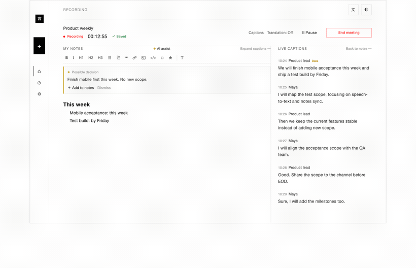
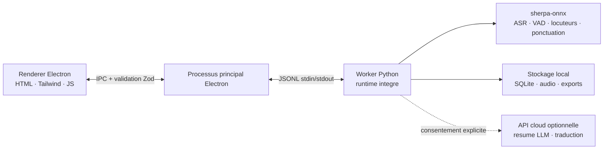

<p align="center"></p>

<p align="center"><strong>Un assistant de reunion IA minimaliste et local-first.</strong><br />Notes AI Assist · transcription en direct · multilingue · identification des locuteurs · resumes verifiables — l'audio ne quitte pas votre appareil.</p>

<p align="center">
  <a href="https://github.com/zerolovesea/Brevia/releases"></a>
  <a href="https://github.com/zerolovesea/Brevia/blob/main/LICENSE"></a>
  <a href="https://github.com/zerolovesea/Brevia/releases"></a>
  
  
  
</p>

<p align="center"><a href="../README.md">English</a> · <a href="README.zh-CN.md">简体中文</a> · <a href="README.es.md">Español</a> · <a href="README.ja.md">日本語</a> · <a href="README.ko.md">한국어</a> · <strong>Français</strong> · <a href="README.de.md">Deutsch</a> · <a href="README.ru.md">Русский</a></p>

---

## A propos

Brevia est un assistant de reunion IA pour ordinateur de bureau qui delegue a l'IA embarquee la partie la plus chronophage de toute reunion — capturer, organiser et revisiter. Il enregistre simultanement le microphone et l'audio systeme, diffuse des sous-titres en direct et transforme la conversation terminee en notes structurees. Toute la reconnaissance vocale s'execute en local ; enregistrements, transcriptions et profils vocaux restent par defaut sur votre machine.

Le design est deliberement discret : une interface qui ne gene pas la reunion, un ensemble de fonctionnalites qui suit un seul arc — **capturer → comprendre → retrouver** — et une regle ferme : ce qui peut se faire en local doit se faire en local.

<p align="center"></p>

## Fonctionnalites

### Des notes AI Assist toujours verifiables

AI Assist suit la transcription en direct et peut signaler decisions, actions, chiffres cles, risques, questions et changements de sujet. Choisissez l'activation a la demande, des suggestions discretes ou l'organisation automatique. Chaque suggestion reste verifiable : ajoutez seulement les utiles a vos notes et continuez a ecrire en texte enrichi ou Markdown.

AI Assist utilise votre configuration existante de modele de resume. Avec un fournisseur distant, seuls le texte de transcription et le contexte actuel des notes sont envoyes ; l'audio ne quitte jamais votre appareil.


### Un ecran de reunion discret avec transcription et traduction en direct

Ouvrez l'application, appuyez sur enregistrer, et regardez les sous-titres apparaitre. Brevia capture simultanement votre microphone et l'audio systeme, si bien que les deux cotes d'un appel distant se retrouvent dans la meme transcription. La traduction en direct optionnelle s'affiche a cote du flux de sous-titres pour les conversations multilingues.


### Plus de 30 langues de transcription et des resumes de reunion

Brevia transcrit la parole dans plus de 30 langues — anglais, chinois, japonais, coreen, francais, allemand, espagnol, russe, arabe, thai, vietnamien, indonesien et plus. Une fois la reunion terminee, branchez n'importe quel fournisseur LLM et Brevia redigera le resume, les decisions cles et les taches a partir de votre transcription verifiee.

L'IA integree execute un modele fourni directement sur votre machine, ou vous pouvez brancher Claude, OpenAI, OpenRouter ou tout service compatible avec le format chat OpenAI ou Anthropic. Seul le texte est envoye, jamais l'audio.

### Enregistrement d'empreinte vocale et identification des locuteurs entre reunions

Enregistrez un court echantillon vocal par coequipier et Brevia les reconnaitra par leur nom dans toutes les reunions futures — pas comme « Locuteur 1, Locuteur 2 », mais comme les personnes qu'ils sont. La reconnaissance fonctionne entre enregistrements, donc parcourir les reunions de la semaine passee pour trouver « qu'a dit Alice ? » se fait en un clic.

Propulse par la segmentation Pyannote plus les modeles d'embeddings de locuteur, le tout s'executant sur l'appareil.


### Une bibliotheque locale de modeles selectionnee

Des modeles telechargeables couvrant l'ASR en streaming, le raffinement hors ligne, la restauration de ponctuation, la detection d'activite vocale, la diarisation, l'embedding de locuteur et la separation de sources. Combinez-les par langue et precision — tout s'execute sur votre appareil.


### Et plus encore

- **Separation de sources** — Spleeter separe les enregistrements en pistes vocales et non vocales pour la post-production.
- **Import audio** — apportez des enregistrements existants pour une transcription hors ligne via le meme pipeline.
- **Exports riches** — transcriptions et notes en Markdown, TXT, JSON, SRT, DOCX ou PDF ; audio en FLAC, WAV ou M4A.
- **Notes verifiables** — ecrivez en texte enrichi ou Markdown et acceptez seulement les suggestions IA utiles.
- **Interface multilingue** — anglais, chinois simplifie, espagnol, japonais, coreen, francais, allemand et russe.

## Installation

Telechargez la derniere version depuis [GitHub Releases](https://github.com/zerolovesea/Brevia/releases) :

| Plateforme | Installeur |
| --- | --- |
| macOS (Apple Silicon) | `Brevia-<version>-arm64.dmg` |
| Windows (x64) | `Brevia-<version>-x64-setup.exe` |
> Windows peut afficher un avertissement **Microsoft Defender SmartScreen** au premier lancement. Cliquez sur **« Informations complementaires » → « Executer quand meme »** apres avoir verifie que le telechargement provient de la page officielle Releases.

Au premier lancement, accordez les permissions microphone et enregistrement d'ecran, puis ouvrez **Reglages → Bibliotheque de modeles** pour telecharger les modeles necessaires.

## Architecture



Brevia suit une conception strictement local-first :

- **Le renderer n'ouvre aucun port reseau**, et chaque message IPC est valide par le processus principal Electron avec un schema Zod.
- **Le processus principal est une coquille legere.** Il lance un unique worker Python via JSONL stdin/stdout ; le worker gere les modeles, le traitement audio, les profils vocaux, le stockage local et les exports.
- **Les donnees vivent dans `~/brevia`** par defaut — SQLite, audio brut, exports, modeles en cache et profils vocaux.
- **Les appels cloud sont opt-in.** Les resumes LLM et la traduction exigent que l'utilisateur configure explicitement un fournisseur, et seul le texte est envoye.

## Stack technique

| Couche | Technologie |
| --- | --- |
| Shell bureau | Electron 43 — pont preload, isolation de contexte, renderer sandbox |
| Frontend | HTML/CSS/JS natif, Tailwind CSS 4, i18n integre (8 langues) |
| Backend | Python 3.10+, protocole worker JSONL, stockage SQLite |
| Moteur vocal | [sherpa-onnx](https://github.com/k2-fsa/sherpa-onnx) 1.13.2, ONNX Runtime |
| Traitement des locuteurs | Segmentation Pyannote + embeddings 3D-Speaker ERes2Net Base |
| Client LLM | llama.cpp integre (GGUF) et APIs chat compatibles OpenAI / Anthropic |
| I/O audio | ffmpeg (integre aux releases) |
| Build et empaquetage | electron-builder, PyInstaller (runtime Python integre) |
## Modeles pris en charge

Chaque modele est telecharge a la demande depuis **Reglages → Bibliotheque de modeles**. Le manifeste est dans [`backend/models.json`](../backend/models.json).

| Categorie | Modeles representatifs | Langues |
| --- | --- | --- |
| ASR streaming | Zipformer (zh / en / fr / ko / multilingue), Nemotron 3.5 | 30+ |
| ASR raffinement | Qwen3-ASR 0.6B / 1.7B, Whisper Large v3, FunASR Nano | Multilingue |
| Ponctuation | CT-Transformer zh+en, Online Punct casse anglaise | zh / en |
| Detection d'activite vocale | Silero VAD | Universel |
| Amelioration vocale | GTCRN Live Denoiser | Universel |
| Diarisation | Pyannote Segmentation 3.0, Reverb Diarization v1 | Universel |
| Embeddings de locuteur | 3D-Speaker ERes2Net Base | Universel |
| Separation de sources | Spleeter 2 Stems | Universel |

Pour les resumes LLM, choisissez **IA integree** pour executer localement un modele GGUF fourni (Qwen 3.5 2B / 4B), ou pointez Brevia vers Claude, OpenAI, OpenRouter ou tout service personnalise compatible avec OpenAI Chat Completions ou Anthropic Messages : Gemini (endpoint compatible OpenAI), DeepSeek, Kimi, Qwen et plus.

## Developpement local

Prerequis : Node.js 18+, Python 3.10+, Git et ffmpeg (pour l'import audio).

```bash
git clone https://github.com/zerolovesea/Brevia.git
cd Brevia
npm install
python3 -m pip install -r backend/requirements.txt
npm start
```

Accordez les permissions microphone et enregistrement d'ecran au premier lancement, puis telechargez les modeles necessaires depuis **Reglages → Bibliotheque de modeles**.

### Scripts courants

```bash
npm test                    # Tests UI + backend
npm run build               # Build Tailwind CSS
npm run test:model          # Diagnostic des modeles ASR
npm run test:diarization    # Diagnostic de diarisation
npm run start:fresh         # Reinitialise l'onboarding et demarre
```

### Variables d'environnement

```bash
BREVIA_DATA_DIR=/path/to/data       # Repertoire de donnees personnalise (enregistrements, exports, SQLite)
BREVIA_MODELS_DIR=/path/to/models   # Repertoire de modeles personnalise
BREVIA_FFMPEG=/path/to/ffmpeg       # Binaire ffmpeg (si absent du PATH)

BREVIA_DATA_DIR=~/brevia-dev BREVIA_MODELS_DIR=~/brevia-models npm start
```
### Construire les installeurs

```bash
npm ci
npm run build
python3 -m pip install -r backend/requirements-build.txt
npm run dist:mac   # DMG ARM64 macOS
npm run dist:win   # EXE x64 Windows
```

Les artefacts arrivent dans `dist/`. Chaque build de plateforme integre un worker Python natif ; les modeles ne sont pas integres — ils restent des telechargements a la demande.

## FAQ

<details>
<summary><strong>Windows affiche un avertissement Microsoft Defender SmartScreen</strong></summary>

Les builds de release ne sont pas signes avec un certificat de signature de code payant, et SmartScreen bloque par defaut les executables recemment observes. Cliquez sur **« Informations complementaires » → « Executer quand meme »** apres avoir confirme que le telechargement provient de la page officielle [Releases](https://github.com/zerolovesea/Brevia/releases).
</details>

<details>
<summary><strong>Dois-je installer Python separement ?</strong></summary>

Non. Les builds de release integrent le runtime Python et toutes les dependances necessaires. Un environnement Python separe n'est requis que pour l'execution depuis les sources.
</details>

<details>
<summary><strong>Ou sont stockees mes donnees ?</strong></summary>

`~/brevia` par defaut — enregistrements, transcriptions, exports, modeles en cache, profils vocaux et la base SQLite. Definissez `BREVIA_DATA_DIR` pour changer.
</details>

<details>
<summary><strong>Quelles langues de transcription sont prises en charge ?</strong></summary>

Plus de 30 langues incluant le chinois, l'anglais, le japonais, le coreen, le francais, l'allemand, l'espagnol, le russe, l'arabe, le thai, le vietnamien et l'indonesien. Choisissez le modele correspondant dans la Bibliotheque de modeles de l'application.
</details>
<details>
<summary><strong>Brevia envoie-t-il de l'audio vers le cloud ?</strong></summary>

Non. La reconnaissance vocale et la diarisation s'executent toutes en local. Seuls les resumes LLM et la traduction contactent le reseau, et uniquement apres que vous ayez configure un fournisseur — texte uniquement, jamais d'audio.
</details>

<details>
<summary><strong>Quel espace disque les modeles necessitent-ils ?</strong></summary>

Cela depend de ceux que vous installez. Une configuration typique (streaming + raffinement + diarisation) fait 1–2 Go. Les modeles de streaming compacts commencent a environ 80 Mo ; les plus grands depassent 1 Go.
</details>

<details>
<summary><strong>Puis-je importer des enregistrements existants ?</strong></summary>

Oui. Importez des fichiers audio depuis la bibliotheque de reunions et Brevia les transcrira hors ligne via le meme pipeline. Necessite `ffmpeg` dans le PATH (ou definir `BREVIA_FFMPEG`).
</details>

<details>
<summary><strong>Comment changer la langue de l'interface ?</strong></summary>

**Reglages → General → Langue de l'interface.** Anglais, chinois simplifie, espagnol, japonais, coreen, francais, allemand et russe sont disponibles.
</details>

<details>
<summary><strong>Comment les echantillons d'empreinte vocale sont-ils stockes ?</strong></summary>

Les embeddings vocaux (un petit vecteur de flottants) et l'audio de reference vivent dans la base SQLite locale et le systeme de fichiers. Rien ne quitte l'appareil, et supprimer un profil supprime les donnees associees.
</details>

## Feedback et contributions

### Signaler un probleme

Un bug ou une demande de fonctionnalite ? Merci de le remonter dans [GitHub Issues](https://github.com/zerolovesea/Brevia/issues). Le triage est plus rapide avec :

- OS et version (ex. macOS 14.5 / Windows 11 23H2)
- Version de Brevia (**Reglages → A propos**)
- Modeles et langue utilises
- Etapes de reproduction / resultat attendu / resultat reel
- Logs pertinents (**Reglages → Avance → Ouvrir le dossier des logs**) — verifiez qu'ils ne contiennent pas de contenu sensible avant de les joindre

**Problemes de securite :** merci de ne pas ouvrir d'issue publique. Contactez le mainteneur par e-mail.

### Contribuer

Les pull requests sont bienvenues. Pour garder l'arbre propre :

1. Branchez depuis `main` avec un focus etroit — une preoccupation par PR.
2. Executez `npm test` avant de soumettre ; executez `npm run test:model` et `npm run test:diarization` lorsque vous touchez a l'ASR ou a la diarisation.
3. Ne commitez pas de modeles telecharges, enregistrements, exports, cles API ou contenu de `~/brevia`.
4. Lorsque vous modifiez du texte visible par l'utilisateur, mettez a jour les huit locales dans `frontend/i18n-data.js` — ajoutez la chaine source anglaise et ses traductions ensemble.
5. Notez tout impact sur les modeles, la plateforme ou les permissions dans la description du PR.

## Licence

Brevia est publie sous la [ISC License](../LICENSE). Les fichiers de modeles et les paquets tiers conservent leurs propres licences et conditions.

## Remerciements

- [sherpa-onnx](https://github.com/k2-fsa/sherpa-onnx) — le runtime local propulsant ASR, VAD, ponctuation et traitement des locuteurs. Sous licence [Apache-2.0](https://github.com/k2-fsa/sherpa-onnx/blob/master/LICENSE).
- Merci aux auteurs et mainteneurs des modeles dont les artefacts telechargeables sont declares dans [`backend/models.json`](../backend/models.json), incluant Zipformer, Whisper, Qwen3-ASR, FunASR, Pyannote, 3D-Speaker, Silero, Spleeter et Tencent Hy-MT2.
- Electron, ONNX Runtime, Python et la communaute open-source de la parole rendent ce flux local-first possible.
