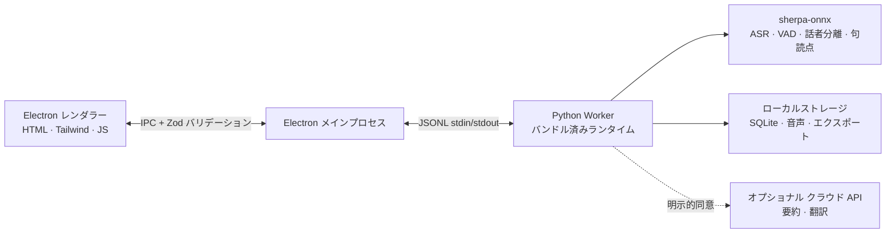

<p align="center"></p>

<p align="center"><strong>デバイスで完結するミニマルな会議レコーダー。</strong><br />文字起こし、AI 要約、記憶 — クラウド不要、完全なプライバシー。</p>

<p align="center">
  <a href="https://github.com/zerolovesea/Brevia/releases"></a>
  <a href="https://github.com/zerolovesea/Brevia/blob/main/LICENSE"></a>
  <a href="https://github.com/zerolovesea/Brevia/releases"></a>
  
  
  
</p>

<p align="center"><a href="../README.md">English</a> · <a href="README.zh-CN.md">简体中文</a> · <a href="README.es.md">Español</a> · <strong>日本語</strong> · <a href="README.ko.md">한국어</a> · <a href="README.fr.md">Français</a> · <a href="README.de.md">Deutsch</a> · <a href="README.ru.md">Русский</a></p>

## プロダクトツアー

| | |
| --- | --- |
|  |  |
|  |  |


## 機能

- **リアルタイム文字起こし** — マイクとシステム音声を同時にキャプチャし、会議中にライブ字幕を表示します。
- **完全ローカルの音声 AI** — ストリーミング ASR、句読点復元、会議後精修、VAD、話者分離をすべてデバイス上で実行（sherpa-onnx）。音声はマシンから出ません。
- **27 個のダウンロード可能モデル** — Zipformer、Paraformer、Whisper、SenseVoice、FireRedASR、FunASR 他、30 以上の言語をカバー。
- **話者識別** — Pyannote セグメンテーション + 声紋埋め込みモデルで自動話者分離。録音を跨いで名前変更・追跡可能。
- **豊富なエクスポート** — 文字起こし・ノートを Markdown、TXT、JSON、SRT、DOCX、PDF に。音声を FLAC、WAV、M4A に出力。
- **音声インポート** — 既存の録音を取り込んでオフラインで文字起こし・精修。
- **オプショナル AI 要約** — 明示的な同意とプロバイダー設定後にのみ翻訳と構造化ノートを生成。
- **多言語 UI** — 英語、簡体字中国語、スペイン語、日本語、韓国語、フランス語、ドイツ語、ロシア語。

## インストール

[GitHub Releases](https://github.com/zerolovesea/Brevia/releases) から最新版をダウンロード：

| プラットフォーム | ファイル |
| --- | --- |
| macOS (Apple Silicon) | `Brevia-<version>-arm64.dmg` |
| Windows (x64) | `Brevia-<version>-x64-setup.exe` |

> **未署名ビルドについて：** macOS で「壊れている」または開けないと表示される場合があります。**システム設定 → プライバシーとセキュリティ → このまま開く** を選択するか、ターミナルで実行：
>
> ```bash
> xattr -dr com.apple.quarantine "/Applications/Brevia.app"
> ```
>
> Windows では Microsoft Defender SmartScreen が警告を出す場合があります。ダウンロード元を確認してから続行してください。

## アーキテクチャ



Brevia は厳密なローカルファースト設計です。レンダラーはネットワークポートを開きません。Electron は Zod スキーマですべての IPC ペイロードを検証します。メインプロセスが単一の Python Worker を起動し、モデル管理、音声処理、ローカルストレージ、ファイルエクスポートを統括します。データは `~/Library/Application Support/Brevia`（macOS）または `%APPDATA%/Brevia`（Windows）に保存されます。

## 技術スタック

| レイヤー | 技術 |
| --- | --- |
| デスクトップシェル | Electron 43 — preload ブリッジ、コンテキスト分離、サンドボックスレンダラー |
| フロントエンド | ネイティブ HTML/CSS/JS、Tailwind CSS、ビルトイン i18n（8 言語） |
| バックエンド | Python 3.10+、JSONL Worker プロトコル、SQLite ストレージ |
| 音声エンジン | sherpa-onnx 1.13.2、ONNX Runtime、27 モデル（Zipformer / Paraformer / Whisper / SenseVoice / FireRedASR / FunASR） |
| 話者処理 | sherpa-onnx Pyannote セグメンテーション + 声紋埋め込みモデル |
| ビルド・パッケージング | electron-builder、PyInstaller（Python ランタイム内蔵） |

## ソースから実行

```bash
npm install
python3 -m pip install -r backend/requirements.txt
npm start
```

初回起動時にマイクと画面収録のアクセスを許可してください。**Settings → Model Library** で言語に合ったモデルをダウンロードしてから録音します。

開発コマンド：

```bash
npm test                    # UI + バックエンドテスト
npm run build               # Tailwind CSS ビルド
npm run test:model          # ASR モデル診断
npm run test:diarization    # 話者分離診断
```

開発用データ・モデルディレクトリの変更：

```bash
BREVIA_DATA_DIR=/path/to/data BREVIA_MODELS_DIR=/path/to/models npm start
```

## インストーラーのビルド

```bash
npm ci
npm run build
python3 -m pip install -r backend/requirements-build.txt
npm run dist:mac   # macOS ARM64 DMG
npm run dist:win   # Windows x64 EXE
```

インストーラーは `dist/` に出力されます。各プラットフォームビルドにネイティブ Python Worker が含まれます。モデルは含まれず、オンデマンドでダウンロードされます。

## よくある質問

<details>
<summary><strong>macOS で「壊れている」または開けないと表示される</strong></summary>

コード署名がないためです。ターミナルで以下を実行してください：

```bash
xattr -dr com.apple.quarantine "/Applications/Brevia.app"
```

その後、通常通りアプリを開けます。
</details>

<details>
<summary><strong>Python を別途インストールする必要がありますか？</strong></summary>

いいえ。リリース版には Python ランタイムとすべての依存関係が含まれています。ソースから実行する場合のみ別途 Python が必要です。
</details>

<details>
<summary><strong>データはどこに保存されますか？</strong></summary>

- macOS：`~/Library/Application Support/Brevia`
- Windows：`%APPDATA%/Brevia`

録音、文字起こし、話者プロファイルはすべてデバイス上に保持されます。`BREVIA_DATA_DIR` で場所を変更できます。
</details>

<details>
<summary><strong>文字起こしに対応している言語は？</strong></summary>

中国語、英語、日本語、韓国語、フランス語、ドイツ語、スペイン語、ロシア語、アラビア語、タイ語、ベトナム語、インドネシア語など 30 以上の言語に対応。アプリ内のモデルライブラリから会議の言語に合ったモデルを選択してください。
</details>

<details>
<summary><strong>Brevia は音声をクラウドに送信しますか？</strong></summary>

いいえ。すべての音声認識は sherpa-onnx を通じてローカルで動作します。オプショナルな要約・翻訳機能は明示的な同意と API プロバイダー設定が必要で、テキストのみを送信し、音声は送信しません。
</details>

<details>
<summary><strong>モデルにどのくらいのディスク容量が必要ですか？</strong></summary>

選択するモデルによります。典型的な構成（ストリーミング + 精修 + 話者分離）で約 1〜2 GB。コンパクトなストリーミングモデルは最小約 80 MB、大型モデルは最大 ~1 GB です。
</details>

<details>
<summary><strong>既存の録音をインポートできますか？</strong></summary>

はい。会議ライブラリから音声ファイルをインポートできます。Brevia は同じ音声パイプラインでオフライン文字起こしを行います。`ffmpeg` が PATH に必要です（または `BREVIA_FFMPEG` を設定）。
</details>

<details>
<summary><strong>UI 言語を切り替えるには？</strong></summary>

**Settings → General** からお好みの言語を選択してください。英語、簡体字中国語、スペイン語、日本語、韓国語、フランス語、ドイツ語、ロシア語に対応しています。
</details>

## コントリビューション

1. 焦点を絞ったブランチを作り、変更は小さく保つ。
2. `npm test` を実行。ASR や話者分離に触れる場合はモデル診断も実行。
3. モデルファイル、録音、エクスポート、API キー、ローカルデータをコミットしない。
4. UI テキストを変更する場合は 8 言語すべてを同期。
5. モデル、プラットフォーム、権限への影響を PR に記載。

## ライセンス

Brevia は [ISC License](../LICENSE) で公開されています。モデルファイルとサードパーティパッケージはそれぞれのライセンスと条件に従います。

## 謝辞

- [sherpa-onnx](https://github.com/k2-fsa/sherpa-onnx) — ローカル ASR、VAD、句読点、話者処理のコアランタイム。[Apache-2.0](https://github.com/k2-fsa/sherpa-onnx/blob/master/LICENSE) ライセンス。
- `backend/models.json` に宣言されたモデルの著者・メンテナーに感謝します。
- Electron、ONNX Runtime、Python、オープンソース音声コミュニティがこのローカルファーストなワークフローを可能にしています。
