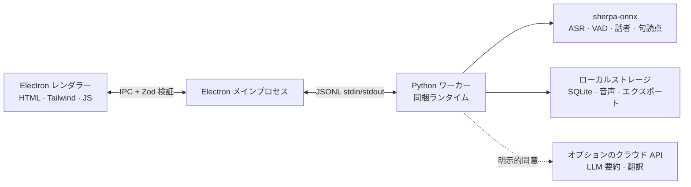

<p align="center"></p>

<p align="center"><strong>ミニマルでローカル完結型の AI 会議アシスタント。</strong><br />リアルタイム文字起こし · 多言語 · 話者識別 · AI 要約 — 音声は端末から出ません。</p>

<p align="center">
  <a href="https://github.com/zerolovesea/Brevia/releases"></a>
  <a href="https://github.com/zerolovesea/Brevia/blob/main/LICENSE"></a>
  <a href="https://github.com/zerolovesea/Brevia/releases"></a>
  
  
  
</p>

<p align="center"><a href="../README.md">English</a> · <a href="README.zh-CN.md">简体中文</a> · <a href="README.es.md">Español</a> · <strong>日本語</strong> · <a href="README.ko.md">한국어</a> · <a href="README.fr.md">Français</a> · <a href="README.de.md">Deutsch</a> · <a href="README.ru.md">Русский</a></p>

---

## 概要

Brevia は、会議で最も時間のかかる部分——記録・整理・振り返り——を端末上の AI に任せるデスクトップ AI 会議アシスタントです。マイクとシステム音声を同時に録音し、リアルタイム字幕をストリーミングし、終了した会話を構造化されたメモにまとめます。すべての音声認識はローカルで動作し、録音・文字起こし・話者プロファイルはデフォルトで自分の端末に留まります。

デザインは意図的に静かです：会議の邪魔をしないインターフェース、**キャプチャ → 理解 → 検索** という一本の流れに沿った機能セット、そして「ローカルでできることはローカルで」という一貫したルール。

<p align="center"></p>

## 機能

### 静かな会議画面でのリアルタイム文字起こしと翻訳

開いて録音ボタンを押せば、字幕が現れます。Brevia はマイクとシステム音声を同時にキャプチャし、リモート通話の両側が同じ文字起こしに収まります。オプションのリアルタイム翻訳が字幕の隣に並列表示され、多言語の会話をサポートします。


### 30 以上の文字起こし言語と AI 議事録

Brevia は 30 以上の言語で音声を文字起こしします——英語、中国語、日本語、韓国語、フランス語、ドイツ語、スペイン語、ロシア語、アラビア語、タイ語、ベトナム語、インドネシア語など。会議終了後、任意の LLM プロバイダに接続すれば、会議要約、重要な決定事項、アクションアイテムを一気に生成します。

内蔵 AI はバンドルされたモデルをこの端末で実行します。Claude、OpenAI、OpenRouter、または OpenAI / Anthropic のチャット形式に対応したサービスを接続することもできます。送信されるのはテキストのみで、音声は送信されません。


### 声紋登録と会議横断での話者識別

チームメンバーごとに短い音声サンプルを登録すれば、Brevia は今後のすべての会議で名前で認識します——「話者 1、話者 2」ではなく、実際の人物として。認識は録音をまたいで機能するので、先週の会議を振り返って「田中さんは何を言った？」を探すのはワンクリックです。

Pyannote のセグメンテーションと話者埋め込みモデルを組み合わせ、すべて端末上で実行されます。


### 精選されたローカルモデルライブラリ

ストリーミング ASR、オフライン精修、句読点復元、音声区間検出、話者ダイアライゼーション、話者埋め込み、ソース分離をカバーするダウンロード可能なモデル。言語と精度で自由に組み合わせ——すべて端末上で動作します。


### さらに

- **ソース分離** — Spleeter が録音をボーカルと非ボーカルのトラックに分割、後処理に便利。
- **音声インポート** — 既存の録音を持ち込んで、同じ音声パイプラインでオフライン文字起こし。
- **豊富なエクスポート** — 文字起こしとメモを Markdown、TXT、JSON、SRT、DOCX、PDF で；音声を FLAC、WAV、M4A で。
- **多言語 UI** — 英語、簡体中国語、スペイン語、日本語、韓国語、フランス語、ドイツ語、ロシア語。

## インストール

最新版を [GitHub Releases](https://github.com/zerolovesea/Brevia/releases) からダウンロードしてください：

| プラットフォーム | インストーラ |
| --- | --- |
| macOS (Apple Silicon) | `Brevia-<version>-arm64.dmg` |
| Windows (x64) | `Brevia-<version>-x64-setup.exe` |
> Windows では初回起動時に **Microsoft Defender SmartScreen** の警告が出る場合があります。**「詳細情報」→「実行」** をクリックし、ダウンロード元が公式 Releases ページであることを確認してから続けてください。

初回起動時にマイクと画面録画の権限を付与し、**設定 → モデルライブラリ** で必要なモデルをダウンロードしてください。

## アーキテクチャ



Brevia は厳密なローカルファースト設計に従います：

- **レンダラーはネットワークポートを開きません**。すべての IPC メッセージは Electron メインプロセスが Zod スキーマで検証します。
- **メインプロセスは薄いシェル**。JSONL の stdin/stdout で単一の Python ワーカーを起動し、モデル管理・音声処理・話者プロファイル・ローカルストレージ・エクスポートをすべてワーカーが担います。
- **データはデフォルトで `~/brevia` に保存**——SQLite、生音声、エクスポート、キャッシュされたモデル、声紋プロファイル。
- **クラウド呼び出しはオプトイン**。LLM 要約と翻訳はユーザーが明示的にプロバイダを設定した場合のみ有効になり、送信されるのはテキストのみです。

## 技術スタック

| レイヤ | 技術 |
| --- | --- |
| デスクトップシェル | Electron 43 — preload ブリッジ、コンテキスト分離、サンドボックス化されたレンダラー |
| フロントエンド | 素の HTML/CSS/JS、Tailwind CSS 4、組み込み i18n（8 ロケール） |
| バックエンド | Python 3.10+、JSONL ワーカープロトコル、SQLite ストレージ |
| 音声エンジン | [sherpa-onnx](https://github.com/k2-fsa/sherpa-onnx) 1.13.2、ONNX Runtime |
| 話者処理 | Pyannote セグメンテーション + 3D-Speaker ERes2Net Base 埋め込み |
| LLM クライアント | 内蔵 llama.cpp（GGUF）＋ OpenAI / Anthropic 互換チャット API |
| 音声 I/O | ffmpeg（リリースに同梱） |
| ビルドとパッケージ | electron-builder、PyInstaller（Python ランタイム同梱） |
## 対応モデル

すべてのモデルは **設定 → モデルライブラリ** からオンデマンドでダウンロードされます。マニフェストは [`backend/models.json`](../backend/models.json) にあります。

| カテゴリ | 代表的なモデル | 言語 |
| --- | --- | --- |
| ストリーミング ASR | Zipformer（zh / en / fr / ko / 多言語）、Nemotron 3.5 | 30+ |
| 精修 ASR | Qwen3-ASR 0.6B / 1.7B、Whisper Large v3、FunASR Nano | 多言語 |
| 句読点 | CT-Transformer zh+en、Online Punct 英語ケーシング | zh / en |
| 音声区間検出 | Silero VAD | 汎用 |
| 音声強調 | GTCRN Live Denoiser | 汎用 |
| ダイアライゼーション | Pyannote Segmentation 3.0、Reverb Diarization v1 | 汎用 |
| 話者埋め込み | 3D-Speaker ERes2Net Base | 汎用 |
| ソース分離 | Spleeter 2 Stems | 汎用 |

LLM 要約では「内蔵 AI」を選ぶとバンドルされた GGUF モデル（Qwen 3.5 2B / 4B、Gemma 3 1B / 4B）をローカルで実行できます。Claude、OpenAI、OpenRouter、または OpenAI Chat Completions / Anthropic Messages に対応した独自サービス（Gemini の OpenAI 互換エンドポイント、DeepSeek、Kimi、Qwen など）も利用可能です。

## ローカル開発

前提条件：Node.js 18+、Python 3.10+、Git、ffmpeg（音声インポート用）。

```bash
git clone https://github.com/zerolovesea/Brevia.git
cd Brevia
npm install
python3 -m pip install -r backend/requirements.txt
npm start
```

初回起動時にマイクと画面録画の権限を付与してから、**設定 → モデルライブラリ** から必要なモデルをダウンロードしてください。

### よく使うスクリプト

```bash
npm test                    # UI + バックエンドテスト
npm run build               # Tailwind CSS ビルド
npm run test:model          # ASR モデル診断
npm run test:diarization    # ダイアライゼーション診断
npm run start:fresh         # オンボーディングをリセットして起動
```

### 環境変数

```bash
BREVIA_DATA_DIR=/path/to/data       # カスタムデータディレクトリ（録音、エクスポート、SQLite）
BREVIA_MODELS_DIR=/path/to/models   # カスタムモデルディレクトリ
BREVIA_FFMPEG=/path/to/ffmpeg       # ffmpeg バイナリ（PATH にない場合）

BREVIA_DATA_DIR=~/brevia-dev BREVIA_MODELS_DIR=~/brevia-models npm start
```
### インストーラのビルド

```bash
npm ci
npm run build
python3 -m pip install -r backend/requirements-build.txt
npm run dist:mac   # macOS ARM64 DMG
npm run dist:win   # Windows x64 EXE
```

成果物は `dist/` に出力されます。各プラットフォームビルドはネイティブの Python ワーカーを同梱します；モデルは同梱されず、オンデマンドでダウンロードされます。

## FAQ

<details>
<summary><strong>Windows で Microsoft Defender SmartScreen の警告が表示される</strong></summary>

リリースビルドは有料のコード署名証明書で署名されていないため、SmartScreen は新しく見る実行ファイルをデフォルトでブロックします。**「詳細情報」→「実行」** をクリックし、ダウンロード元が公式 [Releases](https://github.com/zerolovesea/Brevia/releases) ページであることを確認してから続けてください。
</details>

<details>
<summary><strong>Python を別途インストールする必要はありますか？</strong></summary>

いいえ。リリースビルドは Python ランタイムと必要な依存関係をすべて同梱しています。ソースから実行する場合のみ、別途 Python 環境が必要です。
</details>

<details>
<summary><strong>データはどこに保存されますか？</strong></summary>

デフォルトで `~/brevia`——録音、文字起こし、エクスポート、キャッシュされたモデル、声紋プロファイル、SQLite データベース。`BREVIA_DATA_DIR` を設定して変更できます。
</details>

<details>
<summary><strong>どの言語の文字起こしに対応していますか？</strong></summary>

中国語、英語、日本語、韓国語、フランス語、ドイツ語、スペイン語、ロシア語、アラビア語、タイ語、ベトナム語、インドネシア語など 30 以上の言語に対応。アプリ内のモデルライブラリで対応するモデルを選択してください。
</details>
<details>
<summary><strong>Brevia は音声をクラウドに送信しますか？</strong></summary>

送信しません。音声認識とダイアライゼーションはすべてローカルで実行されます。LLM 要約と翻訳のみがネットワークに接続しますが、プロバイダを設定した後のみ——テキストのみで、音声は決して送信しません。
</details>

<details>
<summary><strong>モデルにはどれくらいのディスク容量が必要ですか？</strong></summary>

インストールするモデルによります。典型的な構成（ストリーミング + 精修 + ダイアライゼーション）で 1–2 GB。コンパクトなストリーミングモデルは約 80 MB から、大きなモデルは 1 GB 超。
</details>

<details>
<summary><strong>既存の録音をインポートできますか？</strong></summary>

できます。会議ライブラリから音声ファイルをインポートすると、Brevia は同じ音声パイプラインでオフライン文字起こしします。PATH に `ffmpeg` が必要（または `BREVIA_FFMPEG` を設定）。
</details>

<details>
<summary><strong>UI 言語を切り替えるには？</strong></summary>

**設定 → 一般 → 言語**。英語、簡体中国語、スペイン語、日本語、韓国語、フランス語、ドイツ語、ロシア語が利用可能。
</details>

<details>
<summary><strong>声紋サンプルはどのように保存されますか？</strong></summary>

声紋埋め込み（小さな浮動小数点ベクトル）と参考音声はローカルの SQLite データベースとファイルシステムに保存されます。端末から出ることはなく、プロファイルを削除すると関連データも削除されます。
</details>

## フィードバックとコントリビュート

### Issue を報告する

バグや機能リクエストは [GitHub Issues](https://github.com/zerolovesea/Brevia/issues) に報告してください。以下を含めるとトリアージが早くなります：

- OS とバージョン（例：macOS 14.5 / Windows 11 23H2）
- Brevia のバージョン（**設定 → バージョン情報**）
- 使用中のモデルと言語
- 再現手順 / 期待される結果 / 実際の結果
- 関連するログ（**設定 → 詳細 → ログフォルダを開く**）——添付前に機密情報が含まれていないか確認してください

**セキュリティに関する問題：** 公開 Issue を開かず、メンテナにメールで連絡してください。

### コントリビュート

プルリクエストを歓迎します。ツリーを整った状態に保つために：

1. `main` から狭い焦点のブランチを切ってください——1 PR につき 1 つの関心事。
2. 提出前に `npm test` を実行；ASR やダイアライゼーションに触れる場合は `npm run test:model` と `npm run test:diarization` も実行。
3. ダウンロード済みモデル、録音、エクスポート、API キー、`~/brevia` の内容をコミットしないでください。
4. ユーザー向けテキストを変更する場合、`frontend/i18n-data.js` の 8 ロケールすべてを更新してください——英語ソース文字列とその翻訳を一緒に追加。
5. モデル、プラットフォーム、権限への影響を PR の説明に記載してください。

## ライセンス

Brevia は [ISC License](../LICENSE) の下でリリースされています。モデルファイルとサードパーティパッケージはそれぞれのライセンスと条件を保持します。

## 謝辞

- [sherpa-onnx](https://github.com/k2-fsa/sherpa-onnx) — ASR、VAD、句読点、話者処理を支えるローカルランタイム。[Apache-2.0](https://github.com/k2-fsa/sherpa-onnx/blob/master/LICENSE) でライセンスされています。
- [`backend/models.json`](../backend/models.json) で宣言されているダウンロード可能な成果物のモデル作者とメンテナに感謝します——Zipformer、Whisper、Qwen3-ASR、FunASR、Pyannote、3D-Speaker、Silero、Spleeter、Tencent Hy-MT2 など。
- Electron、ONNX Runtime、Python、オープンソースの音声コミュニティが、このローカルファーストのワークフローを可能にしています。
