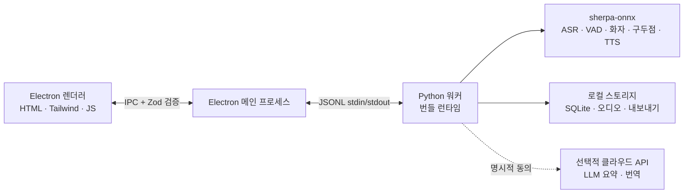

<p align="center"></p>

<p align="center"><strong>미니멀하고 로컬 우선인 AI 회의 어시스턴트.</strong><br />실시간 전사 · 다국어 · 화자 식별 · AI 요약 — 오디오가 기기를 벗어나지 않습니다.</p>

<p align="center">
  <a href="https://github.com/zerolovesea/Brevia/releases"></a>
  <a href="https://github.com/zerolovesea/Brevia/blob/main/LICENSE"></a>
  <a href="https://github.com/zerolovesea/Brevia/releases"></a>
  
  
  
</p>

<p align="center"><a href="../README.md">English</a> · <a href="README.zh-CN.md">简体中文</a> · <a href="README.es.md">Español</a> · <a href="README.ja.md">日本語</a> · <strong>한국어</strong> · <a href="README.fr.md">Français</a> · <a href="README.de.md">Deutsch</a> · <a href="README.ru.md">Русский</a></p>

---

## 소개

Brevia 는 회의에서 가장 시간이 많이 걸리는 부분——기록, 정리, 복기——을 기기 위의 AI 에 맡기는 데스크톱 AI 회의 어시스턴트입니다. 마이크와 시스템 오디오를 동시에 녹음하고, 실시간 자막을 스트리밍하며, 끝난 대화를 구조화된 메모로 정리합니다. 모든 음성 인식은 로컬에서 동작하며, 녹음·전사·화자 프로필은 기본적으로 사용자 기기에 남습니다.

디자인은 의도적으로 조용합니다: 회의를 방해하지 않는 인터페이스, **캡처 → 이해 → 검색** 이라는 하나의 흐름을 따르는 기능 세트, 그리고 로컬에서 할 수 있는 일은 로컬에서 한다는 확고한 원칙.

## 기능

### 조용한 회의 화면에서의 실시간 전사와 번역

앱을 열고 녹음 버튼을 누르면 자막이 나타납니다. Brevia 는 마이크와 시스템 오디오를 동시에 캡처하므로, 원격 통화의 양쪽이 같은 전사에 담깁니다. 선택적인 실시간 번역이 자막 흐름 옆에 나란히 표시되어 다국어 대화를 지원합니다.


### 30 개 이상의 전사 언어와 AI 회의록

Brevia 는 30 개 이상의 언어로 음성을 전사합니다 — 영어, 중국어, 일본어, 한국어, 프랑스어, 독일어, 스페인어, 러시아어, 아랍어, 태국어, 베트남어, 인도네시아어 등. 회의가 끝나면 원하는 LLM 공급자를 연결하기만 하면 Brevia 가 회의 요약, 주요 결정 사항, 실행 항목을 한 번에 작성합니다.

OpenAI, Anthropic, Ollama 채팅 형식을 지원하는 어떤 공급자든 작동합니다 — 로컬 Ollama 배포 포함. 오디오가 아닌 텍스트만 전송됩니다.


### 성문 등록과 회의 간 화자 식별

팀 구성원별로 짧은 음성 샘플을 등록하면 Brevia 가 이후 모든 회의에서 이름으로 인식합니다 — "화자 1, 화자 2" 가 아닌 실제 사람으로. 녹음 간 인식이 작동하므로 지난주 회의에서 "지수가 뭐라고 했지?" 를 찾는 것은 한 번의 클릭입니다.

Pyannote 분할 + 화자 임베딩 모델을 사용하며 모두 기기에서 실행됩니다.


### 정선된 로컬 모델 라이브러리

스트리밍 ASR, 오프라인 정제, 구두점 복원, 음성 활동 감지, 화자 다이어라이제이션, 화자 임베딩, 음성 합성, 소스 분리를 아우르는 27 개 이상의 다운로드 가능한 모델. 언어와 정밀도에 따라 자유롭게 조합 — 모두 기기에서 실행됩니다.


### 그 외

- **TTS 음성 합성 및 복제** — ZipVoice 는 등록된 화자의 참조 오디오로 중국어와 영어를 합성; 독일어, 프랑스어, 스페인어, 러시아어, 한국어에는 별도의 VITS 목소리 제공.
- **소스 분리** — Spleeter 가 녹음을 보컬과 비보컬 트랙으로 분할해 후처리에 활용.
- **오디오 가져오기** — 기존 녹음을 같은 음성 파이프라인으로 오프라인 전사.
- **다양한 내보내기** — 전사와 메모를 Markdown, TXT, JSON, SRT, DOCX, PDF 로; 오디오를 FLAC, WAV, M4A 로.
- **다국어 UI** — 영어, 중국어 간체, 스페인어, 일본어, 한국어, 프랑스어, 독일어, 러시아어.

## 설치

최신 버전을 [GitHub Releases](https://github.com/zerolovesea/Brevia/releases) 에서 다운로드하세요:

| 플랫폼 | 설치 파일 |
| --- | --- |
| macOS (Apple Silicon) | `Brevia-<version>-arm64.dmg` |
| Windows (x64) | `Brevia-<version>-x64-setup.exe` |
> Windows 에서는 첫 실행 시 **Microsoft Defender SmartScreen** 경고가 나타날 수 있습니다. 다운로드 출처가 공식 Releases 페이지인지 확인한 후 **"추가 정보" → "실행"** 을 클릭하세요.

첫 실행 시 마이크와 화면 녹화 권한을 부여한 후, **설정 → 모델 라이브러리** 에서 필요한 모델을 다운로드하세요.

## 아키텍처



Brevia 는 엄격한 로컬 우선 설계를 따릅니다:

- **렌더러는 네트워크 포트를 열지 않으며**, 모든 IPC 메시지는 Electron 메인 프로세스가 Zod 스키마로 검증합니다.
- **메인 프로세스는 얇은 쉘입니다.** JSONL stdin/stdout 을 통해 단일 Python 워커를 실행하며, 워커가 모델 관리, 오디오 처리, 화자 프로필, 로컬 스토리지, 내보내기를 모두 담당합니다.
- **데이터는 기본적으로 `~/brevia`** 에 저장됩니다 — SQLite, 원본 오디오, 내보내기, 캐시된 모델, 성문 프로필.
- **클라우드 호출은 옵트인**입니다. LLM 요약과 번역은 사용자가 명시적으로 공급자를 구성해야만 활성화되며, 텍스트만 전송됩니다.

## 기술 스택

| 계층 | 기술 |
| --- | --- |
| 데스크톱 쉘 | Electron 43 — preload 브리지, 컨텍스트 격리, 샌드박스 렌더러 |
| 프론트엔드 | 순수 HTML/CSS/JS, Tailwind CSS 4, 내장 i18n (8 로케일) |
| 백엔드 | Python 3.10+, JSONL 워커 프로토콜, SQLite 스토리지 |
| 음성 엔진 | [sherpa-onnx](https://github.com/k2-fsa/sherpa-onnx) 1.13.2, ONNX Runtime |
| 화자 처리 | Pyannote 분할 + 3D-Speaker / NeMo Titanet / CAM++ 임베딩 |
| LLM 클라이언트 | OpenAI / Anthropic / Ollama 호환 채팅 API |
| 오디오 I/O | ffmpeg (릴리스에 포함) |
| 빌드 및 패키징 | electron-builder, PyInstaller (Python 런타임 포함) |
## 지원 모델

모든 모델은 **설정 → 모델 라이브러리** 에서 요청 시 다운로드됩니다. 매니페스트는 [`backend/models.json`](../backend/models.json) 에 있습니다.

| 분류 | 대표 모델 | 언어 |
| --- | --- | --- |
| 스트리밍 ASR | Zipformer (zh / en / fr / ko / 다국어), Paraformer 이중언어, Nemotron 3.5 | 30+ |
| 정제 ASR | Qwen3-ASR 0.6B / 1.7B, Whisper Turbo / Large v3, FireRedASR2, FunASR Nano | 다국어 |
| 구두점 | CT-Transformer zh+en, Online Punct 영어 대소문자 | zh / en |
| 음성 활동 감지 | Silero VAD | 범용 |
| 음성 향상 | GTCRN Live Denoiser | 범용 |
| 화자 다이어라이제이션 | Pyannote Segmentation 3.0, Reverb Diarization v1 | 범용 |
| 화자 임베딩 | 3D-Speaker ERes2Net, CAM++, NeMo Titanet | zh / en |
| 소스 분리 | Spleeter 2 Stems | 범용 |
| 음성 합성 | ZipVoice (zh + en), VITS Piper (fr / de / es / ru), VITS Mimic3 (ko) | 다국어 |

LLM 요약과 번역은 OpenAI Chat Completions, Anthropic Messages, Ollama Chat 형식을 지원하는 어떤 공급자든 작동합니다 — OpenAI, Claude, Gemini (OpenAI 호환 엔드포인트), DeepSeek, Kimi, Qwen, Ollama 등.

## 로컬 개발

전제 조건: Node.js 18+, Python 3.10+, Git, ffmpeg (오디오 가져오기용).

```bash
git clone https://github.com/zerolovesea/Brevia.git
cd Brevia
npm install
python3 -m pip install -r backend/requirements.txt
npm start
```

첫 실행 시 마이크와 화면 녹화 권한을 부여한 후, **설정 → 모델 라이브러리** 에서 필요한 모델을 다운로드하세요.

### 자주 쓰는 스크립트

```bash
npm test                    # UI + 백엔드 테스트
npm run build               # Tailwind CSS 빌드
npm run test:model          # ASR 모델 진단
npm run test:diarization    # 화자 다이어라이제이션 진단
npm run start:fresh         # 온보딩 초기화 후 시작
```

### 환경 변수

```bash
BREVIA_DATA_DIR=/path/to/data       # 사용자 지정 데이터 디렉터리 (녹음, 내보내기, SQLite)
BREVIA_MODELS_DIR=/path/to/models   # 사용자 지정 모델 디렉터리
BREVIA_FFMPEG=/path/to/ffmpeg       # ffmpeg 바이너리 (PATH 에 없을 때)

BREVIA_DATA_DIR=~/brevia-dev BREVIA_MODELS_DIR=~/brevia-models npm start
```
### 설치 파일 빌드

```bash
npm ci
npm run build
python3 -m pip install -r backend/requirements-build.txt
npm run dist:mac   # macOS ARM64 DMG
npm run dist:win   # Windows x64 EXE
```

산출물은 `dist/` 에 생성됩니다. 각 플랫폼 빌드는 네이티브 Python 워커를 포함하지만 모델은 포함하지 않으며 요청 시 다운로드됩니다.

## FAQ

<details>
<summary><strong>Windows 에서 Microsoft Defender SmartScreen 경고가 표시됩니다</strong></summary>

릴리스 빌드는 유료 코드 서명 인증서로 서명되어 있지 않아 SmartScreen 이 새로 보이는 실행 파일을 기본적으로 차단합니다. 다운로드 출처가 공식 [Releases](https://github.com/zerolovesea/Brevia/releases) 페이지인지 확인한 후 **"추가 정보" → "실행"** 을 클릭하세요.
</details>

<details>
<summary><strong>Python 을 별도로 설치해야 하나요?</strong></summary>

아니요. 릴리스 빌드는 Python 런타임과 모든 필요 의존성을 포함합니다. 소스에서 실행할 때만 별도 Python 환경이 필요합니다.
</details>

<details>
<summary><strong>데이터는 어디에 저장되나요?</strong></summary>

기본적으로 `~/brevia` — 녹음, 전사, 내보내기, 캐시된 모델, 성문 프로필, SQLite 데이터베이스. `BREVIA_DATA_DIR` 을 설정해 변경할 수 있습니다.
</details>

<details>
<summary><strong>어떤 언어의 전사를 지원하나요?</strong></summary>

중국어, 영어, 일본어, 한국어, 프랑스어, 독일어, 스페인어, 러시아어, 아랍어, 태국어, 베트남어, 인도네시아어 등 30 개 이상의 언어. 앱 내 모델 라이브러리에서 해당 모델을 선택하세요.
</details>
<details>
<summary><strong>Brevia 가 오디오를 클라우드로 보내나요?</strong></summary>

아니요. 음성 인식, 다이어라이제이션, TTS 는 모두 로컬에서 실행됩니다. LLM 요약과 번역만 네트워크와 통신하며, 공급자를 구성한 이후에만 — 텍스트만, 오디오는 절대 보내지 않습니다.
</details>

<details>
<summary><strong>모델은 얼마나 많은 디스크 공간을 필요로 하나요?</strong></summary>

설치하는 모델에 따라 다릅니다. 일반적인 구성 (스트리밍 + 정제 + 다이어라이제이션) 은 1–2 GB. 작은 스트리밍 모델은 약 80 MB 부터, 대형 모델은 1 GB 이상.
</details>

<details>
<summary><strong>기존 녹음을 가져올 수 있나요?</strong></summary>

가능합니다. 회의 라이브러리에서 오디오 파일을 가져오면 Brevia 가 동일한 음성 파이프라인으로 오프라인 전사합니다. PATH 에 `ffmpeg` 이 필요합니다 (또는 `BREVIA_FFMPEG` 설정).
</details>

<details>
<summary><strong>UI 언어는 어떻게 바꾸나요?</strong></summary>

**설정 → 일반 → 인터페이스 언어**. 영어, 중국어 간체, 스페인어, 일본어, 한국어, 프랑스어, 독일어, 러시아어를 지원합니다.
</details>

<details>
<summary><strong>성문 샘플은 어떻게 저장되나요?</strong></summary>

성문 임베딩 (작은 부동소수 벡터) 과 참조 오디오는 로컬 SQLite 데이터베이스와 파일 시스템에 저장됩니다. 기기를 벗어나지 않으며, 프로필을 삭제하면 관련 데이터도 함께 제거됩니다.
</details>

## 피드백과 기여

### 이슈 제보

버그나 기능 요청은 [GitHub Issues](https://github.com/zerolovesea/Brevia/issues) 에 제보해 주세요. 다음 정보를 포함하면 트리아지가 빨라집니다:

- 운영 체제와 버전 (예: macOS 14.5 / Windows 11 23H2)
- Brevia 버전 (**설정 → 정보**)
- 사용 중인 모델과 언어
- 재현 단계 / 예상 결과 / 실제 결과
- 관련 로그 (**설정 → 고급 → 로그 폴더 열기**) — 첨부 전에 민감한 내용이 있는지 확인해 주세요

**보안 이슈:** 공개 이슈로 열지 말고 이메일로 메인테이너에게 연락해 주세요.

### 기여

풀 리퀘스트를 환영합니다. 트리를 깔끔하게 유지하기 위해:

1. `main` 에서 좁게 초점을 맞춘 브랜치를 분기하세요 — PR 하나당 하나의 관심사.
2. 제출 전 `npm test` 를 실행; ASR 이나 다이어라이제이션을 다룰 때는 `npm run test:model` 과 `npm run test:diarization` 도 실행.
3. 다운로드한 모델, 녹음, 내보내기, API 키, `~/brevia` 의 어떤 내용도 커밋하지 마세요.
4. 사용자 대상 텍스트를 변경할 때는 `frontend/i18n-data.js` 의 여덟 로케일을 모두 업데이트하세요 — 영어 원문과 그 번역을 함께 추가.
5. 모델, 플랫폼, 권한에 대한 영향을 PR 설명에 명시하세요.

## 라이선스

Brevia 는 [ISC License](../LICENSE) 하에 배포됩니다. 모델 파일과 서드파티 패키지는 각자의 라이선스와 조건을 유지합니다.

## 감사의 말

- [sherpa-onnx](https://github.com/k2-fsa/sherpa-onnx) — ASR, VAD, 구두점, 화자 처리, TTS 를 지원하는 로컬 런타임. [Apache-2.0](https://github.com/k2-fsa/sherpa-onnx/blob/master/LICENSE) 라이선스로 배포.
- [`backend/models.json`](../backend/models.json) 에 선언된 다운로드 가능한 산출물의 모델 작성자와 메인테이너 여러분께 감사드립니다 — Zipformer, Paraformer, Whisper, Qwen3-ASR, FireRedASR, FunASR, Pyannote, 3D-Speaker, NeMo, Silero, Spleeter, ZipVoice, VITS Piper / Mimic3 등.
- Electron, ONNX Runtime, Python, 그리고 오픈 소스 음성 커뮤니티 덕분에 이 로컬 우선 워크플로가 가능해졌습니다.
