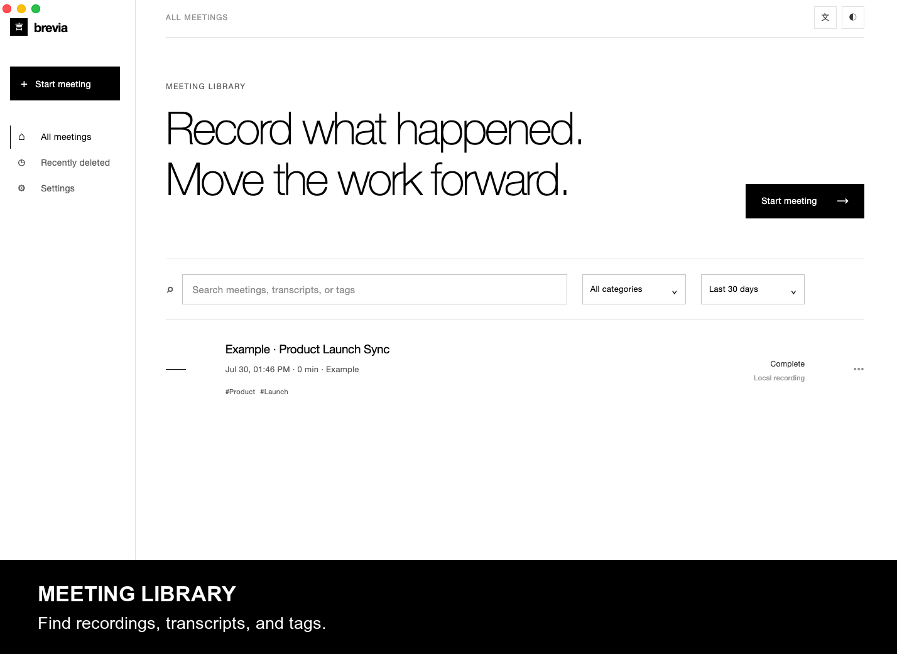
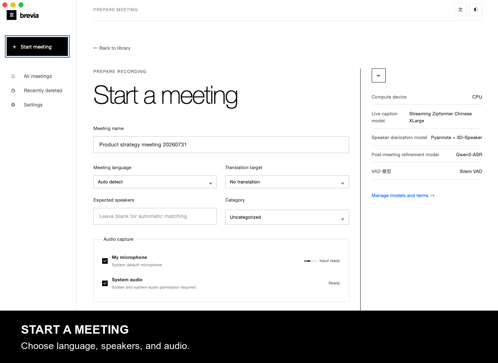
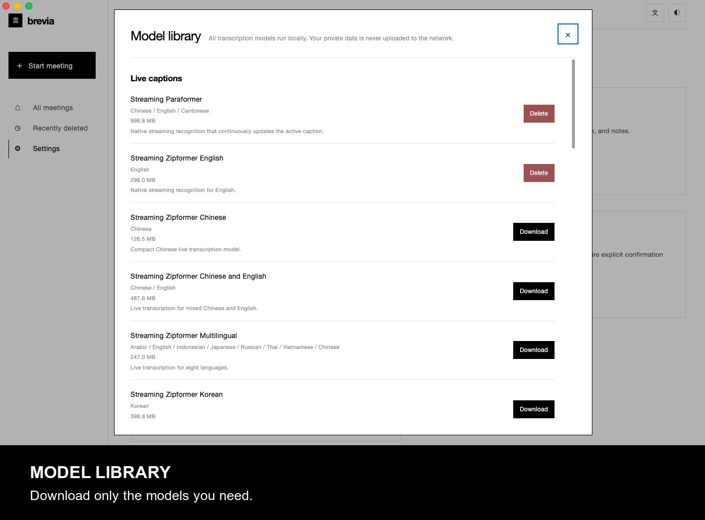
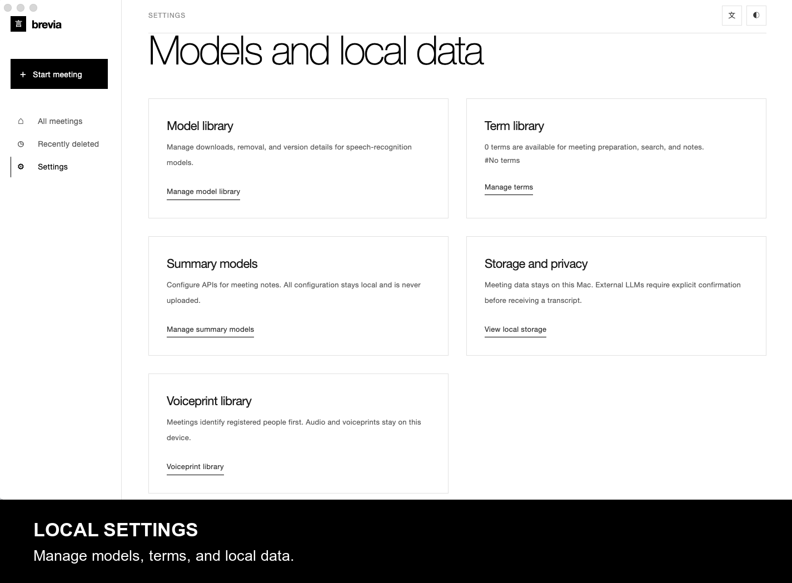
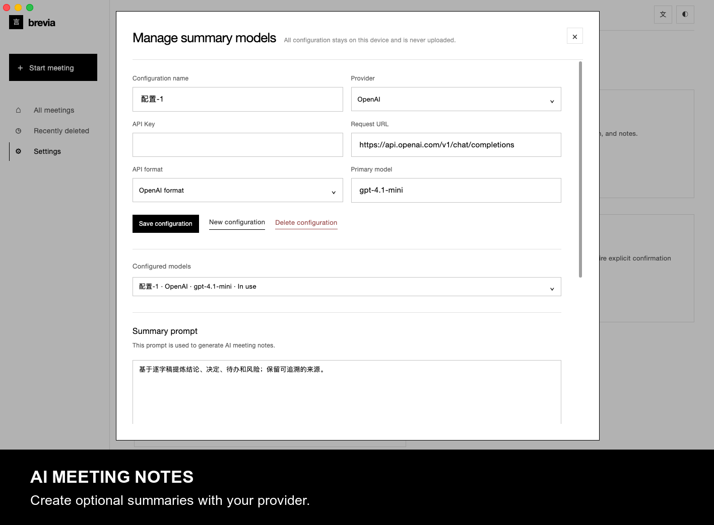

<p align="center"></p>

<p align="center"><strong>Приватная, локальная память о встречах.</strong><br />Записывайте разговор, следите за ним в реальном времени и сохраняйте проверяемую расшифровку.</p>

<p align="center"><a href="../README.md">English</a> · <a href="README.zh-CN.md">简体中文</a> · <a href="README.es.md">Español</a> · <a href="README.ja.md">日本語</a> · <a href="README.ko.md">한국어</a> · <a href="README.fr.md">Français</a> · <a href="README.de.md">Deutsch</a> · <strong>Русский</strong></p>

## Product tour

| | |
| --- | --- |
|  |  |
|  |  |



## Возможности

- Запись микрофона и системного аудио с субтитрами в реальном времени.
- Локальные потоковый ASR, пунктуация, постобработка, VAD и разделение говорящих через **sherpa-onnx**.
- Загрузка моделей по языку, до 200 локальных терминов, распознавание и переименование участников.
- Импорт аудио; экспорт расшифровок/заметок в Markdown, TXT, JSON, SRT, DOCX, PDF и аудио в FLAC, WAV, M4A.
- Перевод и структурированное резюме необязательны и доступны только после явного согласия и настройки провайдера.

## Архитектура и стек

`Electron-интерфейс ↔ IPC с проверкой Zod ↔ Python JSONL Worker → sherpa-onnx / локальные SQLite, аудио и экспорты`. Серверный порт не открывается. Используются Electron 43, нативные HTML/CSS/JS, Python 3, SQLite, ONNX Runtime и `sherpa-onnx==1.13.2`; для говорящих применяются Pyannote-сегментация и модели голосовых эмбеддингов sherpa-onnx.

## Требования и запуск

- Node.js 20+, npm и Python 3.10+ (примеры диагностики используют Python 3.12).
- Текущая живая запись рассчитана на macOS и требует прав на микрофон и запись экрана. Импорту аудио они не нужны.
- Нужен диск для моделей: стандартная китайская потоковая модель занимает ~570 МиБ. Для части аудиоэкспорта нужен `ffmpeg`.

```bash
npm install
python3 -m pip install -r backend/requirements.txt
npm start
```

После первого запуска загрузите модели в **Settings → Model library**. Для разработки задайте `BREVIA_DATA_DIR` и `BREVIA_MODELS_DIR`; проверка изменений — `npm test`.

## Развёртывание

Сейчас репозиторий запускается как неупакованное Electron-приложение. Для дистрибутива выполните `npm ci && npm run build`, включите `backend/`, `frontend/`, Python и зависимости. Используйте `.venv/bin/python` либо `BREVIA_PYTHON`; загружайте модели по необходимости и сохраняйте их лицензии.

## Contributing

Делайте небольшие целевые изменения, запускайте `npm test` и относящиеся к речи диагностики. Не коммитьте модели, записи, экспорты, ключи или локальные данные. Поддерживайте все восемь языков и указывайте в PR влияние на модели, разрешения и платформы.

## License

Brevia распространяется по [ISC License](../LICENSE); модели и зависимости сохраняют собственные условия.

## Acknowledgments

[sherpa-onnx](https://github.com/k2-fsa/sherpa-onnx) — основной runtime для локальных ASR, VAD, пунктуации и обработки говорящих; лицензия — [Apache-2.0](https://github.com/k2-fsa/sherpa-onnx/blob/master/LICENSE). Спасибо авторам, Electron, ONNX Runtime, Python и сообществу открытых речевых технологий.
