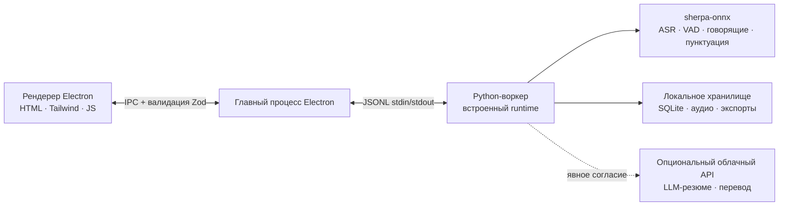

<p align="center"></p>

<p align="center"><strong>Минималистичный ИИ-ассистент встреч с приоритетом локальной работы.</strong><br />ИИ-заметки · живая транскрипция · многоязычность · идентификация говорящих · проверяемые ИИ-резюме — аудио не покидает ваше устройство.</p>

<p align="center">
  <a href="https://github.com/zerolovesea/Brevia/releases"></a>
  <a href="https://github.com/zerolovesea/Brevia/blob/main/LICENSE"></a>
  <a href="https://github.com/zerolovesea/Brevia/releases"></a>
  
  
  
</p>

<p align="center"><a href="../README.md">English</a> · <a href="README.zh-CN.md">简体中文</a> · <a href="README.es.md">Español</a> · <a href="README.ja.md">日本語</a> · <a href="README.ko.md">한국어</a> · <a href="README.fr.md">Français</a> · <a href="README.de.md">Deutsch</a> · <strong>Русский</strong></p>

---

## О проекте

Brevia — это настольный ИИ-ассистент встреч, который передаёт самую трудоёмкую часть любой встречи — фиксацию, упорядочивание и повторный просмотр — локальному ИИ на вашем устройстве. Он одновременно записывает микрофон и системный звук, транслирует живые субтитры и превращает завершённый разговор в структурированные заметки. Всё распознавание речи работает локально; записи, транскрипции и профили голоса по умолчанию остаются на вашей машине.

Дизайн намеренно спокойный: интерфейс, который не мешает встрече, набор функций, следующий единой линии — **захват → понимание → поиск** — и твёрдое правило: то, что можно сделать локально, должно делаться локально.

<p align="center"></p>

## Возможности

### ИИ-заметки с проверкой каждого предложения

ИИ-заметки следят за живой транскрипцией и могут выделять решения, задачи, ключевые числа, риски, вопросы и смену тем. Выберите запуск по запросу, ненавязчивые подсказки или автоматическую организацию. Все предложения можно проверить: добавляйте в заметки только полезное и продолжайте писать в форматированном тексте или Markdown.

ИИ-заметки и ИИ-резюме встречи настраиваются отдельно: у каждого могут быть свои провайдер, модель и API Key. При работе с удалённым провайдером отправляются только текст транскрипции и текущий контекст заметок; аудио никогда не покидает устройство. Локальные модели загружаются по требованию, поэтому отдельные настройки не держат в памяти две модели одновременно.


### Выбор модели распознавания

Первоначальная настройка перечисляет доступные для загрузки речевые модели и отмечает рекомендованную для вашего **языка интерфейса** (Silero VAD, разделение говорящих и голосовые отпечатки входят в комплект и всегда установлены); остальные можно снять перед загрузкой.

Далее для каждой встречи Brevia выбирает модель распознавания по умолчанию исходя из **языка встречи**; соответствие объявлено в `backend/models.json`:

| Язык встречи | Модель по умолчанию | Почему |
| --- | --- | --- |
| Китайский, кантонский | FunASR Nano int8 | Наибольшая точность для китайского и его диалектов |
| Японский, корейский | Qwen3-ASR 0.6B int8 | Единственная доступная модель, покрывающая оба языка |
| Английский, испанский, французский, немецкий, русский, смешанная речь | Parakeet TDT 0.6B v3 | 25 европейских языков в одной модели, с пунктуацией и метками времени |
| Любой другой язык | Qwen3-ASR 0.6B int8 | Самое широкое покрытие среди остальных моделей |

Если модель по умолчанию ещё не скачана, Brevia использует **уже установленную** модель, поддерживающую этот язык, вместо требования новой загрузки. На экране подготовки есть выбор **модели распознавания** (незагруженные тоже показаны, с размером), и тот же выбор доступен во время встречи — модель переключается через `meeting.reconfigure`. В разделе **Настройки → Дополнительно → Распознавание в реальном времени** параметр `live_asr.max_speech_seconds` ограничивает длину одного сегмента субтитров; фактически действует минимум из этого значения, языковой конфигурации VAD и собственной ёмкости модели.

На менее производительных устройствах используйте локальную модель ИИ-заметок 2B или онлайн-провайдера.

### Тихий экран встречи с живой транскрипцией и переводом

Откройте, нажмите запись — и наблюдайте, как появляются субтитры. Brevia одновременно захватывает микрофон и системный звук, поэтому обе стороны удалённого звонка оказываются в одной транскрипции. Опциональный живой перевод отображается рядом с потоком субтитров для многоязычных разговоров.


### 30+ языков транскрипции и резюме встреч

Brevia транскрибирует речь на 30+ языках — английский, китайский, японский, корейский, французский, немецкий, испанский, русский, арабский, тайский, вьетнамский, индонезийский и другие. По окончании встречи подключите любого LLM-провайдера, и Brevia составит резюме, ключевые решения и задачи на основе проверенной транскрипции.

Встроенный ИИ запускает входящую в состав модель прямо на вашем устройстве, либо можно подключить Claude, OpenAI, OpenRouter или любой сервис с форматом чата OpenAI или Anthropic. Отправляется только текст, никогда — аудио.

### Регистрация голосового отпечатка и распознавание говорящих между встречами

Зарегистрируйте короткий образец голоса каждого коллеги, и Brevia будет узнавать их по имени на всех будущих встречах — не как «Говорящий 1, Говорящий 2», а как реальных людей. Распознавание работает между записями, так что найти «что сказала Алиса?» в встречах прошлой недели — один клик.

Работает на базе сегментации Pyannote и моделей эмбеддингов говорящего, всё выполняется на устройстве.


### Курируемая локальная библиотека моделей

Загружаемые модели охватывают распознавание фраз, обработку после встречи, детекцию речевой активности, разделение говорящих, голосовые отпечатки, ИИ-заметки и сводку, а также перевод субтитров. Комбинируйте по языку и точности — всё работает на вашем устройстве.


### И это ещё не всё

- **Импорт аудио** — принесите существующие записи для офлайн-транскрипции через тот же речевой конвейер.
- **Богатый экспорт** — транскрипции и заметки в Markdown, TXT, JSON, SRT, DOCX или PDF; аудио в FLAC, WAV или M4A.
- **Проверяемые заметки** — пишите в форматированном тексте или Markdown и принимайте только полезные предложения ИИ.
- **Библиотека встреч и рабочие пространства** — ищите по названиям, транскрипциям, говорящим и тегам; распределяйте встречи по рабочим пространствам и восстанавливайте недавно удалённые в течение 30 дней.
- **Сфокусированный просмотр** — светлая и тёмная темы, встроенное редактирование транскрипции и сводки, а также опциональное плавающее окно субтитров не загромождают экран встречи.
- **Многоязычный интерфейс** — английский, упрощённый китайский, испанский, японский, корейский, французский, немецкий и русский.

## Установка

Скачайте последнюю версию с [GitHub Releases](https://github.com/zerolovesea/Brevia/releases):

| Платформа | Установщик |
| --- | --- |
| macOS (Apple Silicon) | `Brevia-<version>-arm64.dmg` |
| Windows (x64) | `Brevia-<version>-x64-setup.exe` |
> В Windows при первом запуске может появиться предупреждение **Microsoft Defender SmartScreen**. Нажмите **«Подробнее» → «Выполнить в любом случае»**, убедившись, что загрузка получена с официальной страницы Releases.

При первом запуске предоставьте разрешения на микрофон и запись экрана, затем откройте **Настройки → Библиотека моделей**, чтобы загрузить нужные модели.

## Архитектура



Brevia следует строгой local-first архитектуре:

- **Рендерер не открывает сетевых портов**, и каждое IPC-сообщение валидируется главным процессом Electron через схему Zod.
- **Главный процесс — тонкая оболочка.** Он запускает один Python-воркер через JSONL stdin/stdout; воркер отвечает за управление моделями, обработку аудио, профили голоса, локальное хранилище и экспорты.
- **Данные по умолчанию живут в `~/brevia`** — SQLite, сырое аудио, экспорты, кэш моделей и профили голоса.
- **Облачные вызовы — по согласию.** LLM-резюме и перевод требуют явной настройки провайдера пользователем, и отправляется только текст.

Запись работает по схеме **сегментация Silero VAD → одно офлайн-распознавание → готовая строка субтитров**. После паузы (китайский — 0,7 с, другие языки — 0,8 с) появляется предложение; непрерывная речь режется на 30 / 20 с (настраивается в `vad`). Сегмент VAD может содержать несколько предложений, а соседние предложения объединяются в абзац (китайский — около 110 символов, максимум 150; латиница — около 280, максимум 380). Конец сегмента VAD — **не** граница абзаца: новый абзац начинает только настоящая длинная пауза (≥1,2 с), а слишком короткий абзац отправляется не позже чем через 8 с. На стыках следующее декодирование отступает на 400 мс и убирает повторы на шве. Остановка обрабатывает последнее предложение; при сбое распознавания исходная запись сохраняется.

См. [методику и результаты бенчмарка](../backend/benchmarks/vad-2026-09-05/REPORT.md).

## Технологический стек

| Слой | Технология |
| --- | --- |
| Настольная оболочка | Electron 43 — preload-мост, изоляция контекста, песочница рендерера |
| Фронтенд | Ванильный HTML/CSS/JS, Tailwind CSS 4, встроенная i18n (8 локалей) |
| Бэкенд | Python 3.10+, протокол воркера JSONL, хранилище SQLite |
| Речевой движок | [sherpa-onnx](https://github.com/k2-fsa/sherpa-onnx) 1.13.2, ONNX Runtime |
| Обработка говорящих | Сегментация Pyannote + эмбеддинги 3D-Speaker ERes2Net Base |
| LLM-клиент | Встроенный llama.cpp (GGUF) и Chat-API, совместимые с OpenAI / Anthropic |
| Ввод-вывод аудио | ffmpeg (входит в релизы) |
| Сборка и упаковка | electron-builder, PyInstaller (встроенный Python-runtime) |
## Поддерживаемые модели

Каждая модель загружается по требованию из **Настройки → Библиотека моделей**. Манифест находится в [`backend/models.json`](../backend/models.json).

| Категория | Представительные модели | Языки |
| --- | --- | --- |
| Распознавание фраз / обработка после встречи | FunASR Nano int8, Qwen3-ASR 0.6B, Parakeet TDT 0.6B v3 | Китайский / многоязычный / 25 европейских языков |
| Детекция речевой активности | Silero VAD | Универсальный |
| Разделение говорящих | Pyannote Segmentation 3.0 | Универсальный |
| Эмбеддинги говорящего | 3D-Speaker ERes2Net Base | Китайский |
| ИИ-заметки и сводка встречи | Qwen 3.5 2B, Qwen 3.5 4B | Китайский / английский |
| Перевод субтитров | Tencent Hy-MT2 1.8B | 33 языка |

Для LLM-резюме можно выбрать **Встроенный ИИ** и запустить входящую в состав модель GGUF локально (Qwen 3.5 2B / 4B) либо указать Claude, OpenAI, OpenRouter или свой сервис с форматом OpenAI Chat Completions или Anthropic Messages — Gemini (OpenAI-совместимый endpoint), DeepSeek, Kimi, Qwen и другие.

## Локальная разработка

Требования: Node.js 18+, Python 3.10+, Git и ffmpeg (для импорта аудио).

```bash
git clone https://github.com/zerolovesea/Brevia.git
cd Brevia
npm install
python3 -m pip install -r backend/requirements.txt
npm start
```

При первом запуске предоставьте разрешения на микрофон и запись экрана, затем загрузите нужные модели из **Настройки → Библиотека моделей**.

### Полезные скрипты

```bash
npm test                    # Шлюз мёртвого кода + поведение Electron + UI + E2E-смоук + бэкенд
npm run test:e2e            # Запускает реальное приложение и проверяет через CDP
npm run build               # Сборка Tailwind CSS
npm run test:model          # Диагностика ASR-моделей
npm run test:diarization    # Диагностика диаризации
npm run start:fresh         # Сбросить онбординг и запустить
```

### Переменные окружения

```bash
BREVIA_DATA_DIR=/path/to/data       # Пользовательская директория данных (записи, экспорты, SQLite)
BREVIA_MODELS_DIR=/path/to/models   # Пользовательская директория моделей
BREVIA_FFMPEG=/path/to/ffmpeg       # Бинарник ffmpeg (если не в PATH)

BREVIA_DATA_DIR=~/brevia-dev BREVIA_MODELS_DIR=~/brevia-models npm start
```
### Сборка установщиков

```bash
npm ci
npm run build
python3 -m pip install -r backend/requirements-build.txt
npm run dist:mac   # macOS ARM64 DMG
npm run dist:win   # Windows x64 EXE
```

Артефакты попадают в `dist/`. Каждая сборка для платформы включает нативный Python-воркер; модели не встраиваются — они остаются загрузками по требованию.

## FAQ

<details>
<summary><strong>Windows показывает предупреждение Microsoft Defender SmartScreen</strong></summary>

Релизные сборки не подписаны платным сертификатом подписи кода, и SmartScreen по умолчанию блокирует впервые встреченные исполняемые файлы. Нажмите **«Подробнее» → «Выполнить в любом случае»**, убедившись, что загрузка получена с официальной страницы [Releases](https://github.com/zerolovesea/Brevia/releases).
</details>

<details>
<summary><strong>Нужно ли устанавливать Python отдельно?</strong></summary>

Нет. Релизные сборки включают Python-runtime и все необходимые зависимости. Отдельная установка Python нужна только для запуска из исходников.
</details>

<details>
<summary><strong>Где хранятся мои данные?</strong></summary>

По умолчанию в `~/brevia` — записи, транскрипции, экспорты, кэш моделей, профили голоса и база SQLite. Установите `BREVIA_DATA_DIR`, чтобы переопределить.
</details>

<details>
<summary><strong>Какие языки транскрипции поддерживаются?</strong></summary>

Более 30 языков, включая китайский, английский, японский, корейский, французский, немецкий, испанский, русский, арабский, тайский, вьетнамский и индонезийский. Выберите соответствующую модель в Библиотеке моделей.
</details>
<details>
<summary><strong>Отправляет ли Brevia аудио в облако?</strong></summary>

Нет. Распознавание речи и диаризация работают полностью локально. Только LLM-резюме и перевод обращаются к сети, и только после того, как вы настроите провайдера — исключительно текст, никогда — аудио.
</details>

<details>
<summary><strong>Сколько места на диске требуют модели?</strong></summary>

Зависит от того, что вы установите. Типовая конфигурация (распознавание фраз + обработка + разделение говорящих) занимает 1–2 ГБ. Самая компактная модель распознавания занимает около 487 МБ; крупные модели превышают 1 ГБ.
</details>

<details>
<summary><strong>Можно ли импортировать существующие записи?</strong></summary>

Да. Импортируйте аудиофайлы из библиотеки встреч, и Brevia транскрибирует их офлайн через тот же речевой конвейер. Требуется `ffmpeg` в PATH (или установите `BREVIA_FFMPEG`).
</details>

<details>
<summary><strong>Как сменить язык интерфейса?</strong></summary>

**Настройки → Общие → Язык интерфейса.** Доступны английский, упрощённый китайский, испанский, японский, корейский, французский, немецкий и русский.
</details>

<details>
<summary><strong>Как хранятся образцы голосового отпечатка?</strong></summary>

Эмбеддинги голоса (небольшой вектор чисел с плавающей точкой) и референсное аудио живут в локальной базе SQLite и файловой системе. Ничто не покидает устройство, и удаление профиля удаляет связанные данные.
</details>

## Обратная связь и вклад

### Сообщить о проблеме

Нашли баг или есть идея функции? Заведите тикет в [GitHub Issues](https://github.com/zerolovesea/Brevia/issues). Тикеты сортируются быстрее, если содержат:

- ОС и версию (например, macOS 14.5 / Windows 11 23H2)
- Версию Brevia (**Настройки → О программе**)
- Используемые модели и язык
- Шаги воспроизведения / ожидаемый результат / фактический результат
- Соответствующие логи (**Настройки → Расширенные → Открыть папку логов**) — перед прикреплением проверьте на предмет конфиденциального содержимого

**Проблемы безопасности:** не открывайте публичный тикет. Свяжитесь с сопровождающим по email.

### Как вложиться в проект

Pull request-ы приветствуются. Чтобы дерево оставалось чистым:

1. Отделяйте ветку от `main` с узким фокусом — один вопрос на PR.
2. Перед отправкой запускайте `npm test`; при изменении ASR или диаризации — также `npm run test:model` и `npm run test:diarization`.
3. Не коммитьте загруженные модели, записи, экспорты, API-ключи или что-либо из `~/brevia`.
4. При изменении пользовательского текста обновляйте все восемь локалей в `frontend/i18n-data.js` — добавляйте английскую строку-исходник вместе с её переводами.
5. Указывайте влияние на модели, платформу или разрешения в описании PR.

## Лицензия

Brevia выпускается под [ISC License](../LICENSE). Файлы моделей и сторонние пакеты сохраняют собственные лицензии и условия.

## Благодарности

- [sherpa-onnx](https://github.com/k2-fsa/sherpa-onnx) — локальный runtime, обеспечивающий ASR, VAD, пунктуацию и обработку говорящих. Лицензирован под [Apache-2.0](https://github.com/k2-fsa/sherpa-onnx/blob/master/LICENSE).
- Спасибо авторам и сопровождающим моделей, чьи загружаемые артефакты заявлены в [`backend/models.json`](../backend/models.json), включая Qwen3-ASR, FunASR, Parakeet (NeMo), Pyannote, 3D-Speaker, Silero и Tencent Hy-MT2.
- Electron, ONNX Runtime, Python и открытое сообщество распознавания речи делают этот local-first рабочий процесс возможным.
