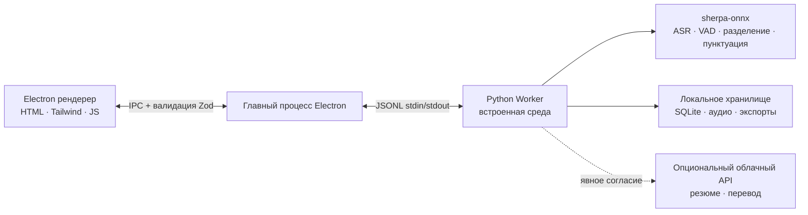

<p align="center"></p>

<p align="center"><strong>Минималистичный рекордер встреч, который остаётся на вашем устройстве.</strong><br />Транскрибируйте, резюмируйте с ИИ, запоминайте — без облака, полная приватность.</p>

<p align="center">
  <a href="https://github.com/zerolovesea/Brevia/releases"></a>
  <a href="https://github.com/zerolovesea/Brevia/blob/main/LICENSE"></a>
  <a href="https://github.com/zerolovesea/Brevia/releases"></a>
  
  
  
</p>

<p align="center"><a href="../README.md">English</a> · <a href="README.zh-CN.md">简体中文</a> · <a href="README.es.md">Español</a> · <a href="README.ja.md">日本語</a> · <a href="README.ko.md">한국어</a> · <a href="README.fr.md">Français</a> · <a href="README.de.md">Deutsch</a> · <strong>Русский</strong></p>

## Обзор продукта

| | |
| --- | --- |
|  |  |
|  |  |


## Возможности

- **Транскрипция в реальном времени** — одновременный захват микрофона и системного аудио с живыми субтитрами.
- **Полностью локальный речевой ИИ** — потоковый ASR, пунктуация, постобработка, VAD и разделение говорящих работают на устройстве через sherpa-onnx. Аудио не покидает вашу машину.
- **27 загружаемых моделей** — Zipformer, Paraformer, Whisper, SenseVoice, FireRedASR, FunASR и другие, покрывая 30+ языков.
- **Идентификация говорящих** — сегментация Pyannote + модели голосовых эмбеддингов; переименование и отслеживание участников между записями.
- **Богатый экспорт** — расшифровки и заметки в Markdown, TXT, JSON, SRT, DOCX или PDF; аудио в FLAC, WAV или M4A.
- **Импорт аудио** — импортируйте существующие записи для офлайн-транскрипции и обработки.
- **Необязательные ИИ-резюме** — переводы и структурированные заметки только после явного согласия и настройки провайдера.
- **Многоязычный интерфейс** — английский, упрощённый китайский, испанский, японский, корейский, французский, немецкий и русский.

## Установка

Скачайте последнюю версию с [GitHub Releases](https://github.com/zerolovesea/Brevia/releases):

| Платформа | Файл |
| --- | --- |
| macOS (Apple Silicon) | `Brevia-<version>-arm64.dmg` |
| Windows (x64) | `Brevia-<version>-x64-setup.exe` |

> **Неподписанная сборка:** macOS может показать предупреждение «повреждено» или заблокировать запуск. Перейдите в **Системные настройки → Конфиденциальность и безопасность → Открыть всё равно**, или выполните:
>
> ```bash
> xattr -dr com.apple.quarantine "/Applications/Brevia.app"
> ```
>
> В Windows Microsoft Defender SmartScreen может предупредить — продолжайте после проверки источника загрузки.

## Архитектура



Brevia следует строго локальному дизайну. Рендерер не открывает сетевых портов. Electron валидирует все IPC-сообщения Zod-схемами. Главный процесс запускает один Python Worker, который управляет моделями, обработкой аудио, локальным хранилищем и экспортом файлов. Данные хранятся в `~/Library/Application Support/Brevia` (macOS) или `%APPDATA%/Brevia` (Windows).

## Технологический стек

| Уровень | Технология |
| --- | --- |
| Оболочка | Electron 43 — preload-мост, изоляция контекста, sandbox-рендерер |
| Фронтенд | Нативные HTML/CSS/JS, Tailwind CSS, встроенная i18n (8 языков) |
| Бэкенд | Python 3.10+, JSONL Worker-протокол, хранилище SQLite |
| Речевой движок | sherpa-onnx 1.13.2, ONNX Runtime, 27 моделей (Zipformer / Paraformer / Whisper / SenseVoice / FireRedASR / FunASR) |
| Обработка говорящих | sherpa-onnx Pyannote-сегментация + модели голосовых эмбеддингов |
| Сборка и упаковка | electron-builder, PyInstaller (встроенная среда Python) |

## Запуск из исходного кода

```bash
npm install
python3 -m pip install -r backend/requirements.txt
npm start
```

При первом запуске разрешите доступ к микрофону и записи экрана. Откройте **Settings → Model Library** и скачайте модели для вашего языка перед записью.

Команды разработки:

```bash
npm test                    # UI + бэкенд-тесты
npm run build               # Сборка Tailwind CSS
npm run test:model          # Диагностика ASR-моделей
npm run test:diarization    # Диагностика разделения говорящих
```

Переопределение каталогов данных/моделей для разработки:

```bash
BREVIA_DATA_DIR=/path/to/data BREVIA_MODELS_DIR=/path/to/models npm start
```

## Сборка установщика

```bash
npm ci
npm run build
python3 -m pip install -r backend/requirements-build.txt
npm run dist:mac   # macOS ARM64 DMG
npm run dist:win   # Windows x64 EXE
```

Установщик создаётся в `dist/`. Каждая платформенная сборка включает нативный Python Worker; модели не включены и загружаются по требованию.

## Часто задаваемые вопросы

<details>
<summary><strong>macOS сообщает, что приложение «повреждено» или не может быть открыто</strong></summary>

Это происходит потому, что сборка не подписана. Выполните в Терминале:

```bash
xattr -dr com.apple.quarantine "/Applications/Brevia.app"
```

Затем откройте приложение как обычно.
</details>

<details>
<summary><strong>Нужно ли устанавливать Python отдельно?</strong></summary>

Нет. Релизные сборки включают среду Python и все зависимости. Python нужен только при запуске из исходного кода.
</details>

<details>
<summary><strong>Где хранятся мои данные?</strong></summary>

- macOS: `~/Library/Application Support/Brevia`
- Windows: `%APPDATA%/Brevia`

Записи, расшифровки и профили говорящих остаются на устройстве. Задайте `BREVIA_DATA_DIR` для изменения расположения.
</details>

<details>
<summary><strong>Какие языки поддерживаются для транскрипции?</strong></summary>

Более 30 языков, включая китайский, английский, японский, корейский, французский, немецкий, испанский, русский, арабский, тайский, вьетнамский, индонезийский и другие. Выберите подходящую модель в Библиотеке Моделей.
</details>

<details>
<summary><strong>Отправляет ли Brevia аудио в облако?</strong></summary>

Нет. Всё распознавание речи работает локально через sherpa-onnx. Опциональная функция резюме/перевода требует явного согласия и настройки собственного API-провайдера — отправляется только текст, никогда аудио.
</details>

<details>
<summary><strong>Сколько места на диске занимают модели?</strong></summary>

Зависит от выбранных моделей. Типичная конфигурация (потоковая + обработка + разделение говорящих) занимает около 1–2 ГБ. Компактные потоковые модели начинаются от ~80 МБ; крупные достигают ~1 ГБ.
</details>

<details>
<summary><strong>Можно ли импортировать существующие записи?</strong></summary>

Да. Импортируйте аудиофайлы из библиотеки встреч. Brevia выполнит офлайн-транскрипцию тем же речевым движком. Требуется `ffmpeg` в PATH (или задайте `BREVIA_FFMPEG`).
</details>

<details>
<summary><strong>Как сменить язык интерфейса?</strong></summary>

Перейдите в **Settings → General** и выберите предпочтительный язык. Поддерживаются английский, упрощённый китайский, испанский, японский, корейский, французский, немецкий и русский.
</details>

## Участие в разработке

1. Создавайте целевые ветки и делайте изменения небольшими.
2. Запускайте `npm test`; при изменениях ASR или разделения говорящих — также диагностику моделей.
3. Не коммитьте модели, записи, экспорты, API-ключи или локальные данные.
4. Поддерживайте тексты UI согласованными на всех восьми языках.
5. Описывайте влияние на модели, платформу или разрешения в pull request.

## Лицензия

Brevia выпускается под [ISC License](../LICENSE). Модели и сторонние пакеты сохраняют свои лицензии и условия.

## Благодарности

- [sherpa-onnx](https://github.com/k2-fsa/sherpa-onnx) — основной runtime для локального ASR, VAD, пунктуации и обработки говорящих. Лицензия [Apache-2.0](https://github.com/k2-fsa/sherpa-onnx/blob/master/LICENSE).
- Спасибо авторам моделей, объявленных в `backend/models.json`.
- Electron, ONNX Runtime, Python и сообщество открытых речевых технологий делают этот локальный рабочий процесс возможным.