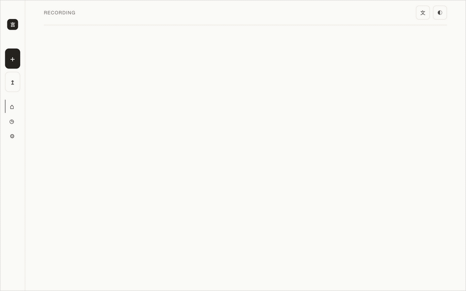
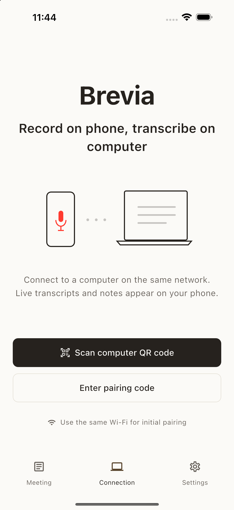
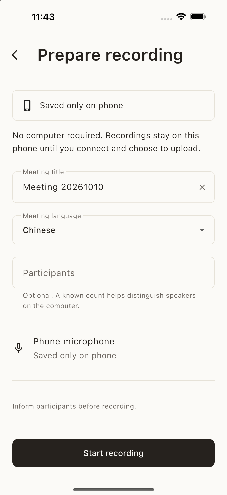
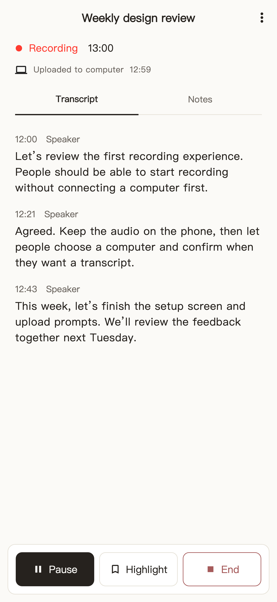

<strong>Сосредоточьтесь на разговоре. Сохраните главное.</strong> Записывайте на компьютере или телефоне и превращайте разговоры в расшифровки, решения и задачи с помощью локального ИИ.

<a href="../README.md">English</a> · <a href="README.zh-CN.md">简体中文</a> · <a href="README.es.md">Español</a> · <a href="README.ja.md">日本語</a> · <a href="README.ko.md">한국어</a> · <a href="README.fr.md">Français</a> · <a href="README.de.md">Deutsch</a> · <strong>Русский</strong>

## Скачать

| Устройство                | Установить Brevia                                                                                                            |
| ------------------------- | ---------------------------------------------------------------------------------------------------------------------------- |
| macOS 14+ · Apple Silicon | [DMG](https://github.com/zerolovesea/Brevia/releases/latest) · `arm64.dmg`                                                   |
| Windows · x64             | [Установщик](https://github.com/zerolovesea/Brevia/releases/latest) · `x64-setup.exe`                                        |
| Android 7+                | [Скачать APK](https://modelscope.cn/models/zyaztec/brevia-release/resolve/master/android/Brevia-android.apk)                 |
| iPhone · iOS 15+          | App Store: на проверке. TestFlight — только по приглашению. [Статус выпуска](https://github.com/zerolovesea/Brevia/releases) |

## Возможности

### ИИ-заметки с проверкой каждого предложения

ИИ-заметки следят за живой транскрипцией и могут выделять решения, задачи, ключевые числа, риски, вопросы и смену тем. Выберите запуск по запросу, ненавязчивые подсказки или автоматическую организацию. Все предложения можно проверить: добавляйте в заметки только полезное и продолжайте писать в форматированном тексте или Markdown.

### Тихий экран встречи с живой транскрипцией и переводом

Откройте, нажмите запись — и наблюдайте, как появляются субтитры. Brevia одновременно захватывает микрофон и системный звук, поэтому обе стороны удалённого звонка оказываются в одной транскрипции. Опциональный живой перевод отображается рядом с потоком субтитров для многоязычных разговоров.

### 30+ языков транскрипции и резюме встреч

Brevia транскрибирует речь на 30+ языках — английский, китайский, японский, корейский, французский, немецкий, испанский, русский, арабский, тайский, вьетнамский, индонезийский и другие. По окончании встречи подключите любого LLM-провайдера, и Brevia составит резюме, ключевые решения и задачи на основе проверенной транскрипции.

### Определение говорящих после встречи

Запишите короткий образец голоса каждого участника. После завершения встречи Brevia разделяет говорящих при уточнении расшифровки и сопоставляет их с сохранёнными голосовыми профилями, чтобы подписать реплики именами. Субтитры в реальном времени не различают говорящих. Голосовые профили можно использовать на следующих встречах.

Работает на базе сегментации Pyannote и моделей эмбеддингов говорящего, всё выполняется на устройстве.

### И это ещё не всё

- **Импорт аудио** — принесите существующие записи для офлайн-транскрипции через тот же речевой конвейер.
- **Богатый экспорт** — транскрипции и заметки в Markdown, TXT, JSON, SRT, DOCX или PDF; аудио в WAV.
- **Проверяемые заметки** — пишите в форматированном тексте или Markdown и принимайте только полезные предложения ИИ.
- **Библиотека встреч и рабочие пространства** — ищите по названиям, транскрипциям, говорящим и тегам; распределяйте встречи по рабочим пространствам и восстанавливайте недавно удалённые в течение 30 дней.
- **Сфокусированный просмотр** — светлая и тёмная темы, встроенное редактирование транскрипции и сводки, а также опциональное плавающее окно субтитров не загромождают экран встречи.
- **Многоязычный интерфейс** — английский, упрощённый китайский, испанский, японский, корейский, французский, немецкий и русский.

## Поддерживаемые модели

Скачивайте модели распознавания, ИИ-заметок и перевода по необходимости в **Настройки → Библиотека моделей**. Модели речевой активности и обработки говорящих включены в приложение. Все модели работают на компьютере; телефону они не нужны. Варианты и размеры указаны в приложении.

| Назначение              | Модель                    | Языки / функция                                                |
| ----------------------- | ------------------------- | -------------------------------------------------------------- |
| Расшифровка / доработка | FunASR Nano               | Китайский, кантонский, английский                              |
| Расшифровка / доработка | Qwen3-ASR 0.6B            | 30 языков, включая китайский, английский, японский и корейский |
| Расшифровка / доработка | Parakeet TDT 0.6B v3      | 25 европейских языков                                          |
| ИИ-заметки / итоги      | Qwen 3.5 2B / 4B          | Китайский / английский                                         |
| Перевод субтитров       | Tencent Hy-MT2 1.8B       | Многоязычный перевод                                           |
| Речевая активность      | Silero VAD                | Определение речи и пауз                                        |
| Разделение говорящих    | Pyannote Segmentation 3.0 | Разделение участников после встречи                            |
| Голосовые профили       | 3D-Speaker ERes2Net Base  | Сопоставление сохранённых профилей                             |

## Запись на телефоне

[**Скачать APK для Android**](https://modelscope.cn/models/zyaztec/brevia-release/resolve/master/android/Brevia-android.apk) · iPhone: проверка App Store; TestFlight по приглашению ([Новости выпусков](https://github.com/zerolovesea/Brevia/releases))

Берите Brevia на встречи, интервью и повседневные обсуждения. Откройте приложение и начните запись без регистрации. Подключите свой компьютер, чтобы читать расшифровку и заметки прямо во время записи.

  
  
  

- **Записывайте без компьютера под рукой.** Сопряжение и интернет не нужны. Ставьте запись на паузу, продолжайте и отмечайте важные моменты. Аудио остаётся на телефоне, пока вы не выберете компьютер и не подтвердите загрузку для распознавания.
- **Телефон записывает, компьютер обрабатывает.** После сопряжения компьютер распознаёт речь и возвращает текущую расшифровку и заметки. Модели и настройки ИИ остаются на компьютере; скачивать большие модели на телефон не требуется.
- **Переслушивайте и делитесь.** Находите записи в библиотеке, возвращайтесь к разговору, экспортируйте WAV или делитесь заметками в Markdown и расшифровками в текстовом виде. Удаление копии с телефона не удаляет встречу с компьютера.

При временной потере сети аудио продолжает сохраняться на телефоне; разрешённые загрузки возобновляются после подключения. Фоновая запись поддерживается, но звонки, принудительное закрытие и ограничения системы могут её прервать. Проверьте состояние при возвращении; для загрузки после записи может потребоваться оставить приложение открытым.

## Как связаны телефон и компьютер

В локальной сети телефон отправляет аудио сопряжённому компьютеру по **HTTPS** и получает расшифровки и заметки. Аудио сначала сохраняется на телефоне; позиция загрузки продвигается только после подтверждения сохранения на компьютере. После разрыва связи передача продолжается с этой позиции. Копия на телефоне автоматически не удаляется.

При настройке собственного сервиса сигнализации/TURN сопряжённые устройства могут связываться между сетями через **WebRTC DataChannel**. Предпочтительно прямое соединение; иначе сервер ретранслирует зашифрованный трафик. Оператор видит сетевые адреса и объём трафика, но не может прочитать зашифрованное содержимое встречи через ретранслятор. [Подключение между сетями требует дополнительной настройки; первое сопряжение выполняется в локальной сети.](mobile-remote.md)

Распознавание речи выполняется на компьютере. Офлайн-записи остаются на телефоне до подтверждения загрузки; текущая расшифровка отправляет аудио на сопряжённый компьютер. Brevia не передаёт встречи разработчику автоматически. После скачивания моделей можно использовать локальный ИИ. Выбранный вами онлайн-сервис ИИ получает соответствующий текст, но не аудио. Дополнительные службы удалённой связи могут ретранслировать зашифрованный трафик. [Конфиденциальность](https://brevia.work/privacy.html).

Аудиозапись на телефоне занимает около **115 МБ за час записи**, без учёта экспорта и кеша. Удалённая загрузка также расходует трафик с дополнительными сетевыми накладными расходами.

## Начало работы

1. Установите Brevia на компьютер, разрешите доступ к аудио и скачайте предложенную модель распознавания. Для заметок без интернета также выберите локальную модель ИИ.
2. Начните встречу или импортируйте запись, затем проверьте и экспортируйте результат.
3. Для подключения телефона используйте одну сеть Wi-Fi. На компьютере откройте **Настройки → Подключение устройств → Подключить новое устройство**. Сканируйте QR или введите адрес и PIN, сравните проверочный код и разрешите подключение на компьютере.

## FAQ

<strong>Windows показывает предупреждение Microsoft Defender SmartScreen</strong>

Релизные сборки не подписаны платным сертификатом подписи кода, и SmartScreen по умолчанию блокирует впервые встреченные исполняемые файлы. Нажмите **«Подробнее» → «Выполнить в любом случае»**, убедившись, что загрузка получена с официальной страницы [Releases](https://github.com/zerolovesea/Brevia/releases).

<strong>Нужно ли устанавливать Python отдельно?</strong>

Нет. Релизные сборки включают Python-runtime и все необходимые зависимости. Отдельная установка Python нужна только для запуска из исходников.

<strong>Сколько места на диске требуют модели?</strong>

Начните с рекомендованной модели распознавания для языка встречи. Локальные модели ИИ и перевода добавляйте по необходимости. Размеры загрузок указаны в библиотеке; скачивать все модели не нужно.

## Помощь и участие

[GitHub Issues](https://github.com/zerolovesea/Brevia/issues) — Сообщая о проблеме, укажите версию приложения, устройство и шаги воспроизведения. Удалите личные данные и учётные сведения из снимков экрана и журналов.

[Разработка (английский)](DEVELOPMENT.md) · [Мобильная разработка (китайский)](../mobile/README.md) · [CONTRIBUTING](../CONTRIBUTING.md).

## Лицензия

Brevia выпускается под [ISC License](../LICENSE). Файлы моделей и сторонние пакеты сохраняют собственные лицензии и условия.

## Благодарности

- [sherpa-onnx](https://github.com/k2-fsa/sherpa-onnx) — локальный runtime, обеспечивающий ASR, VAD, пунктуацию и обработку говорящих. Лицензирован под [Apache-2.0](https://github.com/k2-fsa/sherpa-onnx/blob/master/LICENSE).
- Спасибо авторам и сопровождающим моделей, чьи загружаемые артефакты заявлены в [`backend/models.json`](../backend/models.json), включая Qwen3-ASR, FunASR, Parakeet (NeMo), Pyannote, 3D-Speaker, Silero и Tencent Hy-MT2.
- Electron, ONNX Runtime, Python и открытое сообщество распознавания речи делают этот local-first рабочий процесс возможным.
