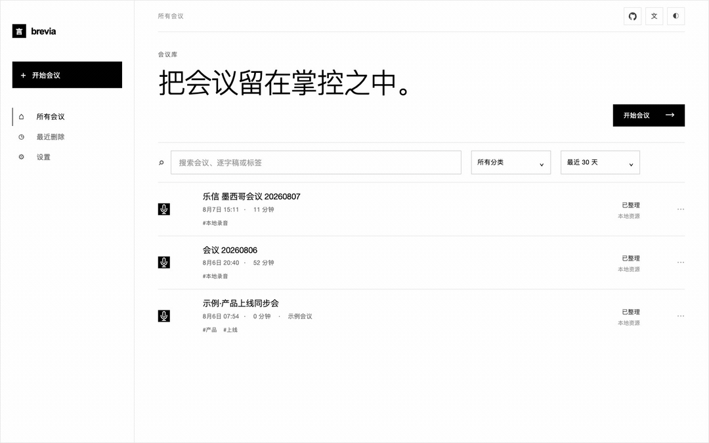
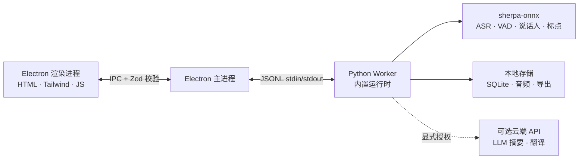

<p align="center"></p>

<p align="center"><strong>极简设计，本地部署的 AI 会议助手。</strong><br />实时转写 · 多语言 · 说话人识别 · AI 总结 — 音频不出本机。</p>

<p align="center">
  <a href="https://github.com/zerolovesea/Brevia/releases"></a>
  <a href="https://github.com/zerolovesea/Brevia/blob/main/LICENSE"></a>
  <a href="https://github.com/zerolovesea/Brevia/releases"></a>
  
  
  
</p>

<p align="center"><a href="../README.md">English</a> · <strong>简体中文</strong> · <a href="README.es.md">Español</a> · <a href="README.ja.md">日本語</a> · <a href="README.ko.md">한국어</a> · <a href="README.fr.md">Français</a> · <a href="README.de.md">Deutsch</a> · <a href="README.ru.md">Русский</a></p>

---

## 项目简介

言录是一款桌面端 AI 会议助手，把会议里最耗时间的部分——记录、整理、复盘——交给设备上的 AI。它同时录制麦克风和系统音频，实时生成字幕，会后自动整理成结构化笔记。所有语音识别都在本机运行，录音、文字稿、说话人档案默认保存在你自己的电脑上。

设计上追求"少即是多"：界面尽可能安静，不打扰会议本身；功能围绕"记录 → 理解 → 检索"这条主线展开；能本地做的绝不发到云端。

<p align="center"></p>

## 功能介绍

### 极简的会议界面，实时转写和翻译

打开就录，边说边出字幕，无需切窗口。同时抓取麦克风与系统音频，远程会议里你和对方的声音都能被完整记录。可选的实时翻译在字幕旁并列显示，方便跨语言协作。


### 多语言支持 + AI 会议纪要

言录支持 30+ 种语言的语音转写，涵盖中文、英语、日语、韩语、法语、德语、西班牙语、俄语、阿拉伯语、泰语、越南语、印尼语等。会议结束后，可连接大模型自动生成结构化纪要——会议摘要、关键决策、待办事项，一次成稿。

内置 AI 可在本机直接运行捆绑模型，也可以接入 Claude、OpenAI、OpenRouter，或任意兼容 OpenAI / Anthropic 格式的自建服务。摘要只发送文本，不上传音频。


### 声纹注册 + 跨会议说话人识别

给团队成员录一段声音样本，言录就能在之后的每一场会议里认出他们——不只是"说话人 1、说话人 2"，而是真实的姓名。跨录音识别、自动归档，回看时一眼就能找到"张三上周说过什么"。

底层用 Pyannote 分段 + 声纹嵌入模型，全部在本机运行。


### 丰富的本地模型库

可下载模型覆盖流式转写、离线精修、标点恢复、语音活动检测、说话人分离、声纹嵌入和人声分离。可以按语言和精度自由组合，全部在设备上运行。


### 更多能力

- **人声分离** — Spleeter 把录音拆成人声与非人声两轨，方便二次剪辑。
- **音频导入** — 已有的会议录音可直接导入离线转写，共用同一套语音管线。
- **多格式导出** — 逐字稿 / 笔记支持 Markdown、TXT、JSON、SRT、DOCX、PDF；音频支持 FLAC、WAV、M4A。
- **多语言界面** — 英语、简体中文、西班牙语、日语、韩语、法语、德语、俄语。

## 安装

从 [GitHub Releases](https://github.com/zerolovesea/Brevia/releases) 下载最新版本：

| 平台 | 安装包 |
| --- | --- |
| macOS (Apple Silicon) | `Brevia-<version>-arm64.dmg` |
| Windows (x64) | `Brevia-<version>-x64-setup.exe` |

> Windows 首次运行可能弹出 **Microsoft Defender SmartScreen** 提示。点击 **"更多信息" → "仍要运行"**，确认下载来源是官方 Releases 页面后继续即可。

首次启动请授予麦克风与屏幕录制权限，并进入 **设置 → 模型库** 下载所需语言的模型。

## 架构



言录采用严格的本地优先架构：

- **渲染进程不打开任何网络端口**，所有跨进程通信由 Electron 主进程用 Zod schema 校验。
- **主进程只是壳**，启动一个 Python Worker，通过 JSONL over stdin/stdout 通信；Worker 负责模型管理、音频处理、说话人档案、本地存储、导出等所有重逻辑。
- **数据默认存放在 `~/brevia`**，包括 SQLite 数据库、原始音频、导出文件、模型缓存和声纹档案。
- **云端调用是可选的**，仅用于 LLM 摘要和翻译，需要用户显式配置服务商并授权后才启用，且只发送文本。

## 技术栈

| 层级 | 技术 |
| --- | --- |
| 桌面外壳 | Electron 43 — preload 桥接、context isolation、渲染器沙箱 |
| 前端 | 原生 HTML/CSS/JS、Tailwind CSS 4、内置 i18n（8 种语言） |
| 后端 | Python 3.10+、JSONL Worker 协议、SQLite 存储 |
| 语音引擎 | [sherpa-onnx](https://github.com/k2-fsa/sherpa-onnx) 1.13.2、ONNX Runtime |
| 说话人处理 | Pyannote 分段 + 3D-Speaker ERes2Net Base 声纹嵌入 |
| LLM 客户端 | 内置 llama.cpp（GGUF）+ 兼容 OpenAI / Anthropic 的标准 API |
| 音频 I/O | ffmpeg（发行版内置） |
| 构建打包 | electron-builder、PyInstaller（打包原生 Python 运行时） |

## 支持的模型

所有模型都可在应用内 **设置 → 模型库** 按需下载。模型清单声明在 [`backend/models.json`](../backend/models.json)。

| 类型 | 代表模型 | 语言 |
| --- | --- | --- |
| 流式 ASR | Zipformer（中/英/法/韩/多语言）、Nemotron 3.5 | 30+ |
| 精修 ASR | Qwen3-ASR 0.6B / 1.7B、Whisper Large v3、FunASR Nano | 多语言 |
| 标点恢复 | CT-Transformer 中英标点、Online Punct 英文标点与大小写 | 中/英 |
| 语音活动检测 | Silero VAD | 通用 |
| 语音增强 | GTCRN Live Denoiser | 通用 |
| 说话人分离 | Pyannote Segmentation 3.0、Reverb Diarization v1 | 通用 |
| 声纹嵌入 | 3D-Speaker ERes2Net Base | 通用 |
| 人声分离 | Spleeter 2 Stems | 通用 |

LLM 摘要可以选「内置 AI」在本机运行捆绑的 GGUF 模型（Qwen 3.5 2B / 4B、Gemma 3 1B / 4B），也可以接入 Claude、OpenAI、OpenRouter，或任意兼容 OpenAI Chat Completions / Anthropic Messages 的自建服务——例如 Gemini（OpenAI 兼容端点）、DeepSeek、Kimi、通义千问等。

## 本地开发

前置依赖：Node.js 18+、Python 3.10+、Git、ffmpeg（用于音频导入）。

```bash
git clone https://github.com/zerolovesea/Brevia.git
cd Brevia
npm install
python3 -m pip install -r backend/requirements.txt
npm start
```

首次启动按提示授予麦克风和屏幕录制权限，然后进入 **设置 → 模型库** 下载所需模型。

### 常用脚本

```bash
npm test                    # UI + 后端测试
npm run build               # 构建 Tailwind CSS
npm run test:model          # ASR 模型诊断
npm run test:diarization    # 说话人分离诊断
npm run start:fresh         # 重置引导流程后启动
```

### 环境变量

```bash
# 自定义数据目录（录音、导出、SQLite）
BREVIA_DATA_DIR=/path/to/data

# 自定义模型目录
BREVIA_MODELS_DIR=/path/to/models

# 指定 ffmpeg 路径（如未在 PATH 中）
BREVIA_FFMPEG=/path/to/ffmpeg

BREVIA_DATA_DIR=~/brevia-dev BREVIA_MODELS_DIR=~/brevia-models npm start
```

### 构建安装包

```bash
npm ci
npm run build
python3 -m pip install -r backend/requirements-build.txt
npm run dist:mac   # macOS ARM64 DMG
npm run dist:win   # Windows x64 EXE
```

产物输出到 `dist/`。每个平台构建都会打包原生 Python Worker；模型不包含在安装包中，由应用按需下载。

## 常见问题

<details>
<summary><strong>Windows 打开时弹出 Microsoft Defender SmartScreen 警告</strong></summary>

发布构建未做付费代码签名，SmartScreen 会对新出现的可执行文件默认拦截。点击 **"更多信息" → "仍要运行"**，确认下载来源是官方 [Releases](https://github.com/zerolovesea/Brevia/releases) 页面后继续即可。
</details>

<details>
<summary><strong>需要单独安装 Python 吗？</strong></summary>

不需要。发布版内置了 Python 运行时和所有依赖。只有从源码运行时才需要本机 Python 环境。
</details>

<details>
<summary><strong>数据存储在哪里？</strong></summary>

默认在 `~/brevia`，包含录音、逐字稿、导出文件、模型缓存、声纹档案和 SQLite 数据库。设置 `BREVIA_DATA_DIR` 可自定义位置。
</details>

<details>
<summary><strong>支持哪些语言的转写？</strong></summary>

30+ 种语言，包括中文、英语、日语、韩语、法语、德语、西班牙语、俄语、阿拉伯语、泰语、越南语、印尼语等。在应用内「模型库」中选择对应语言的模型即可。
</details>

<details>
<summary><strong>言录会把音频发送到云端吗？</strong></summary>

不会。所有语音识别和说话人分离都在本机运行。只有 LLM 摘要 / 翻译需要联网，且必须由用户显式配置服务商——只发送文本，不上传音频。
</details>

<details>
<summary><strong>模型需要多少磁盘空间？</strong></summary>

取决于所选模型。典型组合（流式转写 + 精修 + 说话人分离）约占 1–2 GB。轻量流式模型最小约 80 MB，大模型可达 1 GB 以上。
</details>

<details>
<summary><strong>可以导入已有的会议录音吗？</strong></summary>

可以。从会议库导入音频，言录会用同一套语音管线离线转写。需要系统 PATH 中有 `ffmpeg`（或设置 `BREVIA_FFMPEG`）。
</details>

<details>
<summary><strong>如何切换界面语言？</strong></summary>

**设置 → 通用 → 界面语言**。目前提供英语、简体中文、西班牙语、日语、韩语、法语、德语、俄语。
</details>

<details>
<summary><strong>声纹样本是怎么存储的？</strong></summary>

声纹嵌入向量（几百维浮点数组）和参考音频保存在本地 SQLite 与文件系统中，不会离开本机；删除档案时对应数据也会一并清除。
</details>

## 反馈与贡献

### 提交 Issue

发现 Bug 或有新功能建议？欢迎前往 [GitHub Issues](https://github.com/zerolovesea/Brevia/issues) 提交。为了让问题更快得到定位，请尽量提供：

- 操作系统与版本（如 macOS 14.5 / Windows 11 23H2）
- 言录版本号（**设置 → 关于**）
- 使用的模型和语言
- 复现步骤 / 期望结果 / 实际结果
- 相关日志（**设置 → 高级 → 打开日志目录**），提交前请自行确认不含敏感信息

安全类问题请**不要公开发 Issue**，请通过邮件联系维护者。

### 参与贡献

欢迎 PR。为了保持代码质量，请遵循几点约定：

1. 从 `main` 切出聚焦分支，保持改动精简；一个 PR 只做一件事。
2. 提交前运行 `npm test`；涉及 ASR 或说话人分离时额外跑 `npm run test:model` 和 `npm run test:diarization`。
3. 不要提交模型文件、录音、导出文件、API 密钥或 `~/brevia` 目录里的任何本地数据。
4. 修改界面文案时，请同步维护所有八种语言（`frontend/i18n-data.js`）；添加英文源字符串时把翻译一起补上。
5. 在 PR 描述中说明改动对模型、平台或系统权限的影响，方便审阅。

## License

言录使用 [ISC License](../LICENSE) 发布。模型文件与第三方依赖遵循各自的许可证条款。

## 致谢

- [sherpa-onnx](https://github.com/k2-fsa/sherpa-onnx) — 本地 ASR、VAD、标点和说话人处理的核心运行时，采用 [Apache-2.0](https://github.com/k2-fsa/sherpa-onnx/blob/master/LICENSE) 许可。
- 感谢 [`backend/models.json`](../backend/models.json) 中声明的所有模型作者与维护者，包括 Zipformer、Whisper、Qwen3-ASR、FunASR、Pyannote、3D-Speaker、Silero、Spleeter 和 Tencent Hy-MT2。
- Electron、ONNX Runtime、Python 以及整个开源语音社区，让本地优先的会议工作流成为可能。
