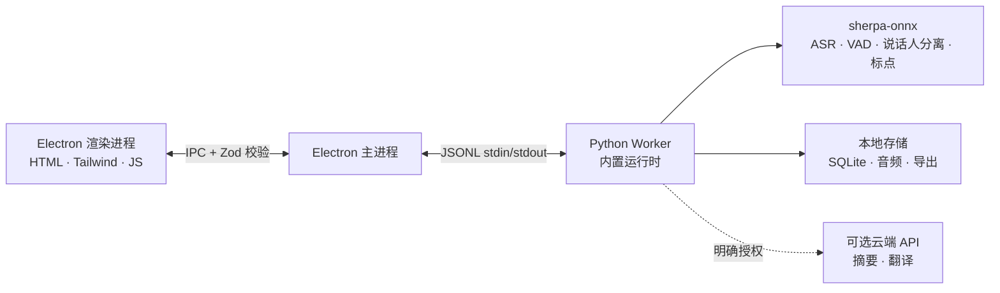

<p align="center"></p>

<p align="center"><strong>极简设计，本地部署的会议录音工具。</strong><br />转录、AI 总结、记忆留存 — 无需云端，完全私密。</p>

<p align="center">
  <a href="https://github.com/zerolovesea/Brevia/releases"></a>
  <a href="https://github.com/zerolovesea/Brevia/blob/main/LICENSE"></a>
  <a href="https://github.com/zerolovesea/Brevia/releases"></a>
  
  
  
</p>

<p align="center"><a href="../README.md">English</a> · <strong>简体中文</strong> · <a href="README.es.md">Español</a> · <a href="README.ja.md">日本語</a> · <a href="README.ko.md">한국어</a> · <a href="README.fr.md">Français</a> · <a href="README.de.md">Deutsch</a> · <a href="README.ru.md">Русский</a></p>

## 界面导览

| | |
| --- | --- |
|  |  |
|  |  |


## 功能特性

- **实时转写** — 同时录制麦克风和系统音频，会议中显示实时字幕。
- **完全本地语音 AI** — 流式 ASR、标点恢复、会后精修、VAD 和说话人分离全部在本机运行（sherpa-onnx），音频不会离开你的设备。
- **27 个可下载模型** — 涵盖 Zipformer、Paraformer、Whisper、SenseVoice、FireRedASR、FunASR 等，支持 30+ 种语言。
- **说话人识别** — Pyannote 分段 + 声纹嵌入自动区分说话人，支持跨录音重命名和追踪。
- **丰富导出** — 逐字稿/笔记导出为 Markdown、TXT、JSON、SRT、DOCX、PDF；音频导出为 FLAC、WAV、M4A。
- **音频导入** — 导入已有录音进行离线转写和精修。
- **可选 AI 摘要** — 仅在明确同意并配置服务商后生成翻译和结构化笔记。
- **多语言界面** — 支持英语、简体中文、西班牙语、日语、韩语、法语、德语和俄语。

## 安装

从 [GitHub Releases](https://github.com/zerolovesea/Brevia/releases) 下载最新版本：

| 平台 | 文件 |
| --- | --- |
| macOS (Apple Silicon) | `Brevia-<version>-arm64.dmg` |
| Windows (x64) | `Brevia-<version>-x64-setup.exe` |

> **未签名构建提示：** macOS 可能提示应用"已损坏"或无法打开。前往 **系统设置 → 隐私与安全性 → 仍要打开**，或在终端执行：
>
> ```bash
> xattr -dr com.apple.quarantine "/Applications/Brevia.app"
> ```
>
> Windows 可能弹出 Microsoft Defender SmartScreen 提示，确认下载来源后继续即可。

## 架构



Brevia 采用严格的本地优先设计。渲染进程不打开网络端口。Electron 使用 Zod 验证所有 IPC 消息。主进程启动一个 Python Worker，统一管理模型下载、音频处理、本地存储和文件导出。数据默认存储在 `~/Library/Application Support/Brevia`（macOS）或 `%APPDATA%/Brevia`（Windows）。

## 技术栈

| 层级 | 技术 |
| --- | --- |
| 桌面外壳 | Electron 43 — preload 桥接、上下文隔离、沙箱渲染 |
| 前端 | 原生 HTML/CSS/JS、Tailwind CSS、内置 i18n（8 种语言） |
| 后端 | Python 3.10+、JSONL Worker 协议、SQLite 存储 |
| 语音引擎 | sherpa-onnx 1.13.2、ONNX Runtime、27 个模型（Zipformer / Paraformer / Whisper / SenseVoice / FireRedASR / FunASR） |
| 说话人处理 | sherpa-onnx Pyannote 分段 + 声纹嵌入模型 |
| 构建打包 | electron-builder、PyInstaller（内置 Python 运行时） |

## 从源码运行

```bash
npm install
python3 -m pip install -r backend/requirements.txt
npm start
```

首次启动时按提示授予麦克风和屏幕录制权限。打开 **设置 → 模型库** 下载所需语言的模型后即可录音。

开发常用命令：

```bash
npm test                    # UI + 后端测试
npm run build               # Tailwind CSS 构建
npm run test:model          # ASR 模型诊断
npm run test:diarization    # 说话人分离诊断
```

自定义开发数据/模型目录：

```bash
BREVIA_DATA_DIR=/path/to/data BREVIA_MODELS_DIR=/path/to/models npm start
```

## 构建安装包

```bash
npm ci
npm run build
python3 -m pip install -r backend/requirements-build.txt
npm run dist:mac   # macOS ARM64 DMG
npm run dist:win   # Windows x64 EXE
```

安装包输出到 `dist/`。每个平台构建包含原生 Python Worker；模型不包含在内，由用户按需下载。

## 常见问题

<details>
<summary><strong>macOS 提示应用"已损坏"或无法打开</strong></summary>

这是因为构建未经过代码签名。在终端运行：

```bash
xattr -dr com.apple.quarantine "/Applications/Brevia.app"
```

然后正常打开应用即可。
</details>

<details>
<summary><strong>需要单独安装 Python 吗？</strong></summary>

不需要。发布版已内置 Python 运行时和所有依赖。只有从源码运行时才需要单独的 Python 环境。
</details>

<details>
<summary><strong>数据存储在哪里？</strong></summary>

- macOS：`~/Library/Application Support/Brevia`
- Windows：`%APPDATA%/Brevia`

录音、逐字稿和说话人档案全部保存在本地。设置 `BREVIA_DATA_DIR` 可自定义存储位置。
</details>

<details>
<summary><strong>支持哪些语言的转写？</strong></summary>

支持 30+ 种语言，包括中文、英语、日语、韩语、法语、德语、西班牙语、俄语、阿拉伯语、泰语、越南语、印尼语等。在应用内「模型库」中选择适合你会议语言的模型即可。
</details>

<details>
<summary><strong>Brevia 会把音频发送到云端吗？</strong></summary>

不会。所有语音识别通过 sherpa-onnx 在本地运行。可选的摘要/翻译功能需要明确同意并配置 API 服务商 — 且仅发送文本，绝不上传音频。
</details>

<details>
<summary><strong>模型需要多少磁盘空间？</strong></summary>

取决于选择的模型。典型配置（流式转写 + 精修 + 说话人分离）约占 1–2 GB。轻量流式模型最小约 80 MB，大模型可达 ~1 GB。
</details>

<details>
<summary><strong>可以导入已有录音吗？</strong></summary>

可以。从会议库中导入音频文件，Brevia 会使用相同的语音引擎进行离线转写。需要 `ffmpeg`（加入 PATH 或设置 `BREVIA_FFMPEG`）。
</details>

<details>
<summary><strong>如何切换界面语言？</strong></summary>

前往 **设置 → 通用**，选择偏好语言。应用支持英语、简体中文、西班牙语、日语、韩语、法语、德语和俄语。
</details>

## 贡献指南

1. 创建聚焦的分支，保持改动精简。
2. 运行 `npm test`；涉及 ASR 或说话人分离时运行模型诊断。
3. 不要提交模型文件、录音、导出文件、API 密钥或本地数据。
4. 修改界面文案时同步维护八种语言。
5. 在 PR 中说明模型、平台或权限的影响。

## 许可证

Brevia 使用 [ISC License](../LICENSE) 发布。模型文件与第三方依赖遵循各自的许可证条款。

## 致谢

- [sherpa-onnx](https://github.com/k2-fsa/sherpa-onnx) — 本地 ASR、VAD、标点和说话人处理的核心运行时，采用 [Apache-2.0](https://github.com/k2-fsa/sherpa-onnx/blob/master/LICENSE) 许可。
- 感谢 `backend/models.json` 中声明的模型作者和维护者。
- Electron、ONNX Runtime、Python 与开源语音社区让本地优先的工作流成为可能。