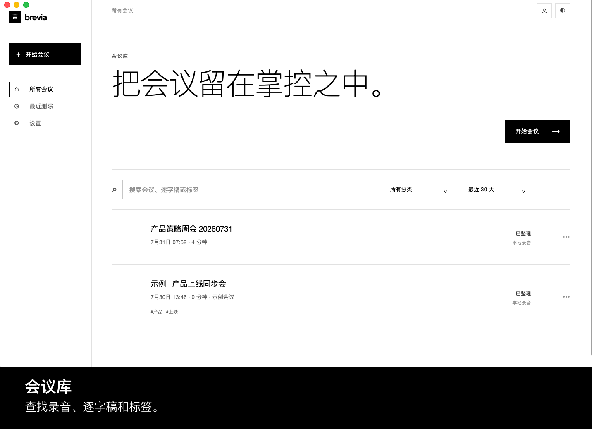
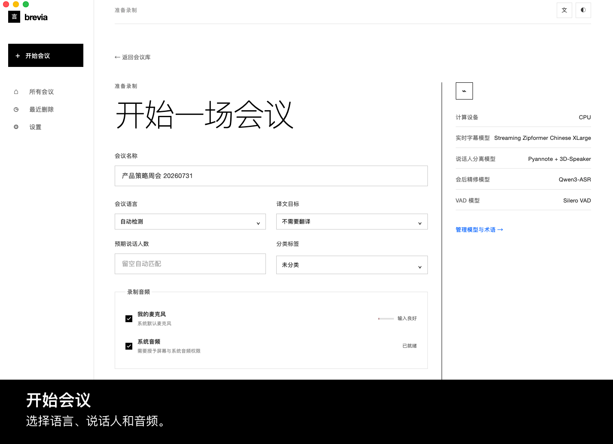
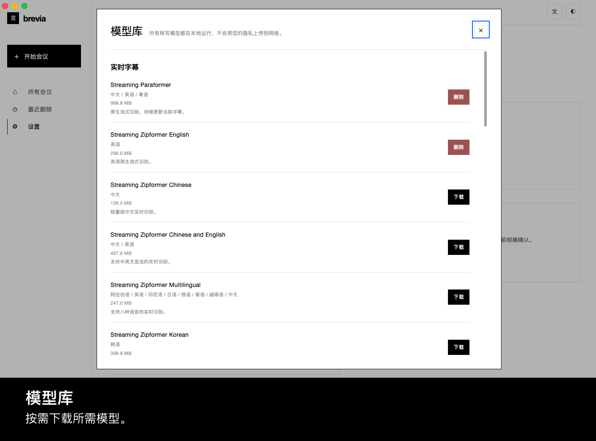
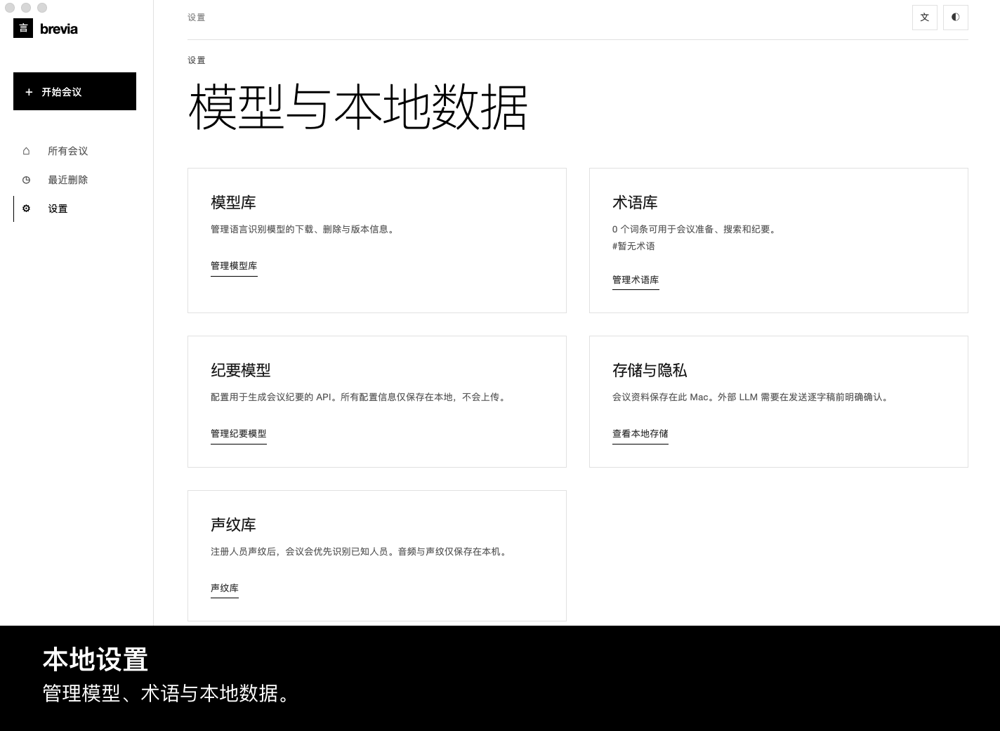
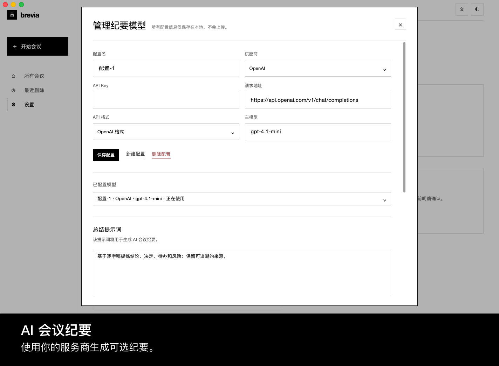

<p align="center"></p>

<p align="center"><strong>本地优先的会议记忆。</strong><br />记录对话、实时跟进，并留下可追溯的逐字稿。</p>

<p align="center"><a href="../README.md">English</a> · <strong>简体中文</strong> · <a href="README.es.md">Español</a> · <a href="README.ja.md">日本語</a> · <a href="README.ko.md">한국어</a> · <a href="README.fr.md">Français</a> · <a href="README.de.md">Deutsch</a> · <a href="README.ru.md">Русский</a></p>

## 界面导览

| | |
| --- | --- |
|  |  |
|  |  |



## 功能

- 录制麦克风与系统音频，并在会议中查看实时字幕。
- 通过 **sherpa-onnx** 在本机运行流式 ASR、标点、会后精修、VAD 与说话人分离。
- 按会议语言下载模型，并使用最多 200 个本地术语热词。
- 精修已结束的录音、识别并重命名说话人，录音与逐字稿版本均保留在设备内。
- 导入音频；导出 Markdown、TXT、JSON、SRT、DOCX、PDF 逐字稿/笔记，以及 FLAC、WAV、M4A 音频。
- 仅在明确同意并配置服务商后，生成可选翻译与结构化摘要。

## 架构与技术栈

`Electron 界面 ↔ 经 Zod 校验的 IPC ↔ Python JSONL Worker → sherpa-onnx / 本地 SQLite、音频与导出`。界面不监听后端端口；Worker 统一负责模型下载、处理与本地数据。技术栈为 Electron 43、原生 HTML/CSS/JS、Python 3、SQLite、ONNX Runtime 与 `sherpa-onnx==1.13.2`；说话人处理使用 sherpa-onnx 的 Pyannote 分段与声纹嵌入模型。

## 配置要求与运行

- Node.js 20+、npm、Python 3.10+（诊断示例使用 Python 3.12）。
- 当前实时捕获流程面向 macOS：需授予麦克风与屏幕录制权限；导入音频不需要捕获权限。
- 模型按需占用磁盘；默认中文流式模型约 570 MiB。部分音频导出需要 `ffmpeg`。

```bash
npm install
python3 -m pip install -r backend/requirements.txt
npm start
```

首次启动后，在 **设置 → 模型库** 下载所需模型。开发数据可通过 `BREVIA_DATA_DIR` 和 `BREVIA_MODELS_DIR` 指向其他绝对路径；运行 `npm test` 验证改动。

## 部署

当前仓库以未打包 Electron 应用运行。发布时先执行 `npm ci && npm run build`，随包提供 Python 运行时和依赖，并包含 `backend/` 与 `frontend/`。打包版可将 Python 放在 `.venv/bin/python` 或设置 `BREVIA_PYTHON`；模型建议由用户按需下载，并保留每个上游模型的许可信息。

## Contributing

创建小而聚焦的分支；运行 `npm test`（改动语音链路时也运行诊断）；不要提交模型、录音、导出文件、密钥或本地数据。修改界面文案时，请同时维护八种语言，并在 PR 中说明模型、权限或平台影响。

## License

Brevia 使用 [ISC License](../LICENSE)。模型与第三方依赖遵循各自的许可证与条款。

## Acknowledgments

[sherpa-onnx](https://github.com/k2-fsa/sherpa-onnx) 是 Brevia 本地 ASR、VAD、标点及说话人处理的核心运行时，采用 [Apache-2.0](https://github.com/k2-fsa/sherpa-onnx/blob/master/LICENSE) 许可。感谢模型作者、Electron、ONNX Runtime、Python 与开源语音社区。
