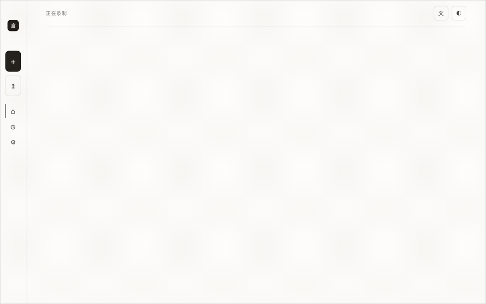
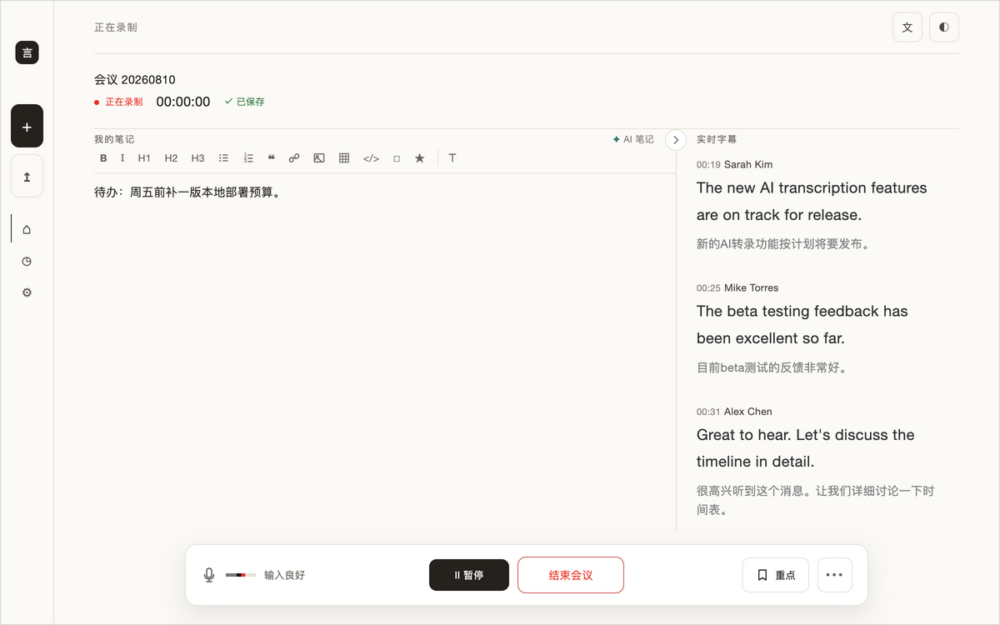
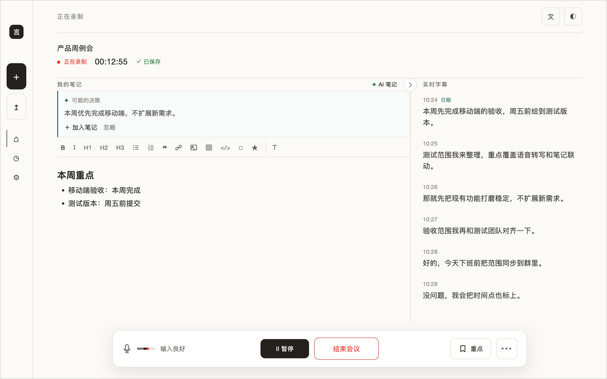
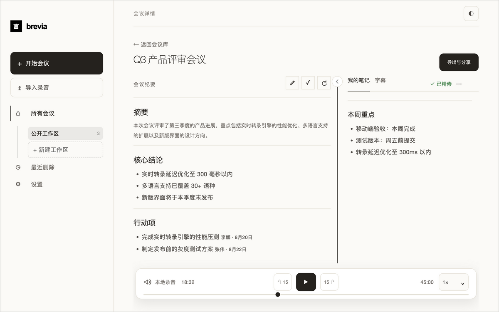
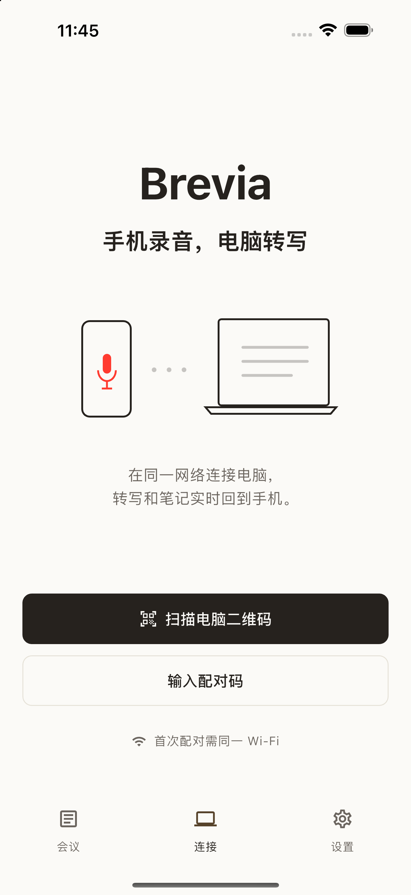
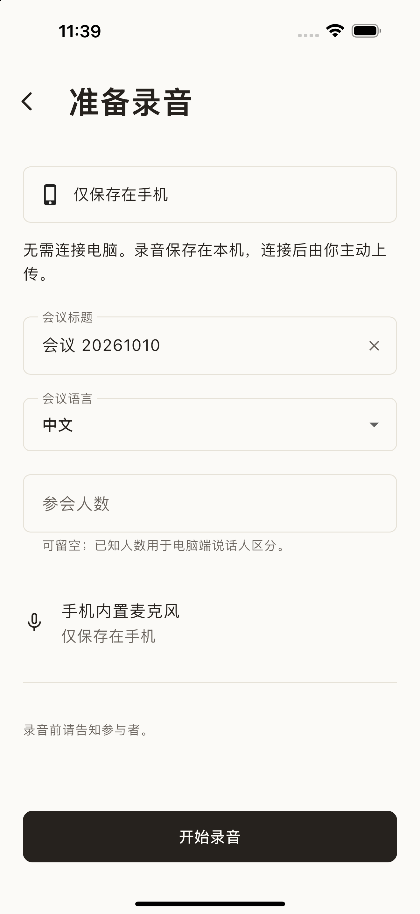
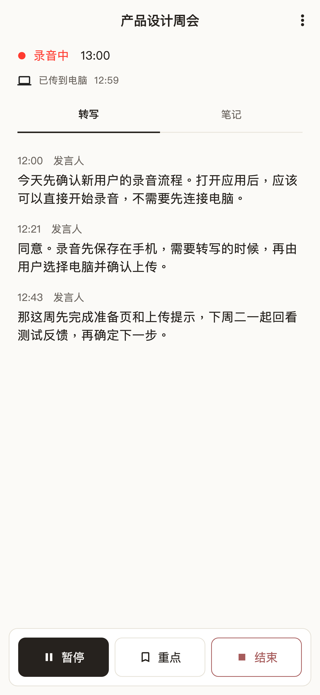
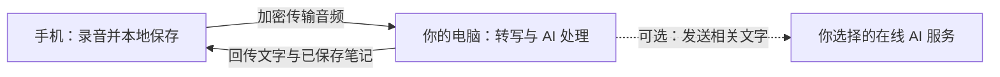

<strong>本地优先的 AI 会议助手，电脑与手机协同使用。</strong> 实时转写 · AI 笔记 · 字幕翻译 · 会议纪要，把处理留在自己的电脑上。

  
  
  

<a href="../README.md">English</a> · <strong>简体中文</strong> · <a href="README.es.md">Español</a> · <a href="README.ja.md">日本語</a> · <a href="README.ko.md">한국어</a> · <a href="README.fr.md">Français</a> · <a href="README.de.md">Deutsch</a> · <a href="README.ru.md">Русский</a>

<a href="https://brevia.work">官网</a> · <a href="#下载">下载</a> · <a href="#用手机录音">手机应用</a> · <a href="#常见问题">常见问题</a>

言录帮你记录、整理和回看会话。线上会议时，同时录制电脑麦克风与系统声音；采访或面谈时，用手机随手录音。会中查看字幕、审核 AI 建议，会后得到可编辑、可分享的笔记。语音识别在自己的电脑上运行，在线 AI 由你选择是否启用。

## 下载

| 设备                      | 下载与可用状态                                                                                                                                |
| ------------------------- | --------------------------------------------------------------------------------------------------------------------------------------------- |
| macOS 14+ · Apple Silicon | [下载最新桌面版](https://github.com/zerolovesea/Brevia/releases/latest)，选择 `Brevia-<version>-arm64.dmg`                                    |
| Windows · x64             | [下载最新桌面版](https://github.com/zerolovesea/Brevia/releases/latest)，选择 `Brevia-<version>-x64-setup.exe`                                |
| Android 7+                | [下载签名 APK](https://modelscope.cn/models/zyaztec/brevia-release/resolve/master/android/Brevia-android.apk)，后续可在应用「设置」中检查更新 |
| iPhone · iOS 15+          | App Store 审核中，TestFlight 仅限受邀测试者。[查看发布动态](https://github.com/zerolovesea/Brevia/releases)                                   |

## 功能介绍

### 实时转写与翻译

同时录制麦克风和电脑系统声音，在线会议里双方的发言都能进入同一份文字稿。言录在发言停顿后生成字幕，可按需在旁边显示翻译；也可开启悬浮字幕，在其他应用中工作时继续跟进会议。

转写支持 **30+ 种语言**，包括中文、英语、日语、韩语、西班牙语、法语、德语、俄语、阿拉伯语、泰语、越南语、印尼语等。选择会议语言后，言录会推荐适用的识别模型。已有录音也能直接导入转写。

### 由你审核的 AI 笔记

会议进行中，AI 笔记可提示关键决定、待办、重要数字、风险和待确认问题。按需请求、轻量提示、自动整理三种方式自由选择；只采纳有用的建议，也能在电脑端用富文本或 Markdown 同时记下自己的想法。

会后可根据审核后的文字稿生成纪要。AI 笔记与会议纪要支持分别配置：使用本地 AI，或接入 Claude、OpenAI、OpenRouter 及兼容服务。

查看 AI 笔记与会议纪要界面

### 方便回看、查找与分享

- **会后识别说话人。** 精修时区分说话人，并可匹配已保存的声纹档案；实时字幕暂不区分说话人。
- **可搜索的会议库。** 搜索标题、逐字稿、说话人与标签，用工作区归类；桌面端最近删除的会议可在 30 天内恢复。
- **可编辑、多格式导出。** 修改逐字稿与摘要，将文字和笔记导出为 Markdown、TXT、JSON、SRT、DOCX 或 PDF，音频导出为 WAV。
- **适合日常使用的界面。** 电脑与手机均提供深浅色主题，以及中文、英语、西班牙语、日语、韩语、法语、德语和俄语界面。

## 支持的模型

识别、AI 笔记和翻译模型可在 **设置 → 模型库** 按需下载；语音活动检测与说话人模型随应用安装。下列模型均在电脑运行，手机录音无需在手机上下载模型。具体版本和大小以应用内模型库为准。

| 用途              | 模型                      | 语言／作用                  |
| ----------------- | ------------------------- | --------------------------- |
| 转写／会后精修    | FunASR Nano               | 中文、粤语、英语            |
| 转写／会后精修    | Qwen3-ASR 0.6B            | 30 种语言，含中、英、日、韩 |
| 转写／会后精修    | Parakeet TDT 0.6B v3      | 25 种欧洲语言               |
| AI 笔记／会议纪要 | Qwen 3.5 2B / 4B          | 中文／英语                  |
| 字幕翻译          | Tencent Hy-MT2 1.8B       | 多语言翻译                  |
| 语音活动检测      | Silero VAD                | 检测发言与停顿              |
| 说话人分离        | Pyannote Segmentation 3.0 | 会后区分不同说话人          |
| 声纹匹配          | 3D-Speaker ERes2Net Base  | 匹配已保存的说话人档案      |

## 用手机录音

[**下载 Android APK**](https://modelscope.cn/models/zyaztec/brevia-release/resolve/master/android/Brevia-android.apk) · iPhone：App Store 审核中，TestFlight 仅限受邀测试者（[查看发布动态](https://github.com/zerolovesea/Brevia/releases)）

把言录带到会议室、采访现场或日常讨论中。手机端无需注册账号，打开即可录音；连接自己的电脑后，还能一边录制，一边查看转写和笔记。

  
  
  

- **随时记录，不必带着电脑。** 无需配对或联网即可录音，支持暂停、继续和标记重要时刻。录音先保存在手机，需要转写时，再选择电脑并确认上传。
- **手机收音，电脑整理。** 配对后，电脑完成语音识别，并将字幕和笔记实时回传到手机。模型和 AI 设置留在电脑上，手机无需下载大模型。
- **会后回听，方便分享。** 在会议库查找录音、回听讨论，将音频导出为 WAV，或把笔记和转写分享为 Markdown、文本。删除手机副本不会删除电脑上的会议。

网络暂时中断时，音频继续在手机保存，恢复连接后续传已授权的录音。支持后台录音，但来电、强制退出和系统限制仍可能中断；回到应用后请检查状态，结束后的补传可能需要保持应用在前台。

## 手机与电脑如何协作

```mermaid
flowchart LR
  Phone[手机：录音并本地保存] -->|加密传输音频| PC[你的电脑：转写与 AI 处理]
  PC -->|回传文字与已保存笔记| Phone
  PC -. 可选：发送相关文字 .-> AI[你选择的在线 AI 服务]
```

- **首次在同一 Wi-Fi 配对。** 电脑打开 **设置 → 设备连接 → 连接新设备**，手机扫码或输入地址和 PIN，核对校验码后在电脑允许连接。后续连接使用已保存的设备身份。
- **默认通过局域网通信。** 手机通过 HTTPS 向已配对电脑发送音频，电脑回传转写和笔记。实时处理需要电脑保持唤醒、网络可达；手机本身不运行识别模型。
- **先保存，再确认。** 音频先落在手机，电脑确认保存后才推进上传位置；断线后从已确认的位置继续，不因上传成功自动删除手机副本。
- **可选跨网络连接。** 配置自有信令／TURN 服务后，已配对设备可通过 WebRTC DataChannel 跨网通信；优先直连，无法直连时中继加密流量。首次配对仍需局域网，详见[跨网连接与恢复](mobile-remote.md)。

语音识别和说话人处理在电脑本地执行；下载所需模型后，AI 笔记、纪要与翻译也可在本机完成。选择在线 AI 时，相关转写与笔记文字会发给所选服务商，音频不会发给 AI 服务商。跨网中继运营方可看到网络地址、连接时间和流量大小等信息，但不能通过中继读取加密会议内容。详见[隐私政策](https://brevia.work/privacy.html)。

手机原始录音约占 **115 MB／小时**，导出与缓存会额外占用空间。跨网上传还会消耗相应流量及通信开销，较长录音建议使用 Wi-Fi 传输。

## 开始使用

1. **准备电脑端。** 安装言录，按提示授权麦克风与系统音频录制，下载推荐的识别模型；需要离线笔记和纪要时，再选择本地 AI 模型。
2. **开始会议或导入录音。** 选择会议语言、录制，结束后审核并导出结果。
3. **按需加入手机。** 按上面的步骤配对即可实时转写；也可以先离线录音、稍后上传。仅完成配对不会自动上传离线录音。

## 常见问题

<strong>没有互联网也能用吗？</strong>

可以。下载所需模型后，电脑端转写和本地 AI 可离线运行。手机独立录音不需要电脑，也不需要账号；手机转写需要已配对电脑，但同一局域网连接不依赖互联网。在线 AI 和跨网连接需要互联网。

<strong>应该下载哪些模型？</strong>

先下载适合会议语言的推荐识别模型。需要笔记和纪要时再添加本地 AI 模型，需要翻译时添加翻译模型。模型库会显示下载大小；性能较弱的电脑可优先选择较小的 AI 模型，不必下载全部模型。

<strong>录音和数据存在哪里？</strong>

电脑端默认存放在 `~/brevia`，模型与录音文件夹可在首次设置时选择，之后在设置中更改。手机录音和缓存文字保存在应用内；删除手机副本不会删除电脑副本。卸载手机应用会清除其本地数据，请先导出或同步尚未上传的录音。

<strong>Windows 提示 SmartScreen 怎么办？</strong>

先确认安装包来自官方[发布页面](https://github.com/zerolovesea/Brevia/releases)，信任该下载后再选择「更多信息 → 仍要运行」。

## 反馈与贡献

遇到问题或有建议？欢迎[提交 Issue](https://github.com/zerolovesea/Brevia/issues)，附上设备、应用版本、会议语言和复现步骤。截图与日志请去掉会议隐私及凭据；安全问题请私下联系维护者。

开发、架构、模型细节和打包说明见[开发指南](DEVELOPMENT.zh-CN.md)、[手机开发指南](../mobile/README.md)及[贡献规范](../CONTRIBUTING.md)。

## 许可与致谢

言录使用 [ISC 许可证](../LICENSE)，模型和第三方依赖遵循各自许可。感谢 [mlx-audio](https://github.com/Blaizzy/mlx-audio)、[sherpa-onnx](https://github.com/k2-fsa/sherpa-onnx)、Electron，以及 Qwen、FunASR、Parakeet、Pyannote、3D-Speaker、Silero、Tencent Hy-MT2 的作者与维护者。模型详情见[开发指南](DEVELOPMENT.zh-CN.md#支持的模型)。
